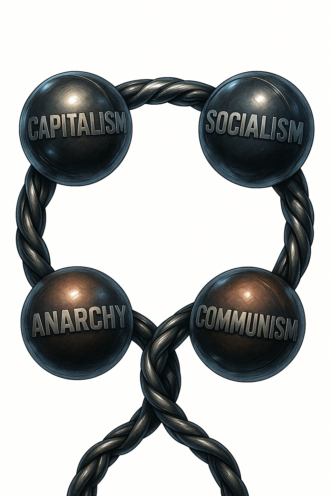
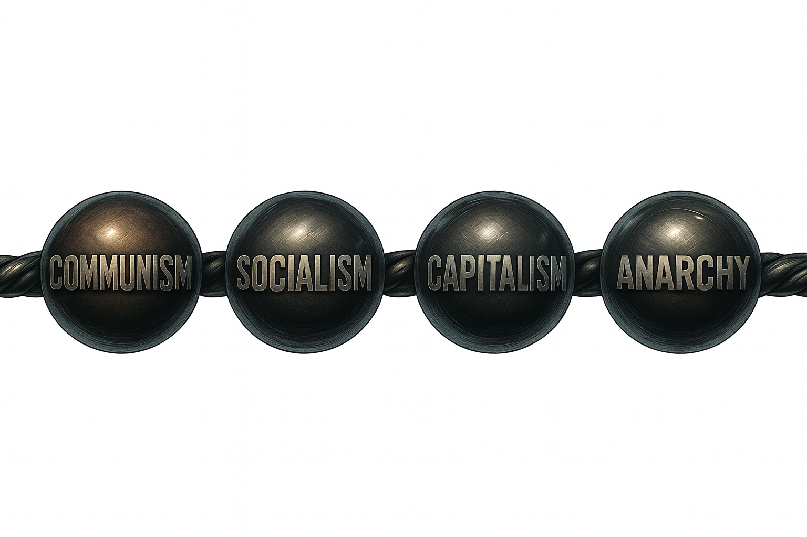

# LIFE IN THE SLUG LANE

## A Field Guide to Rethinking How Our Big and Small Human Systems Really Work

**by Joshua Jackson**

---



---

## BACK COVER

> *I'm right. You're right. And we're both wrong.*

We all fall for stories that feel true because they fit how we remember our lives, how our people expect us to think, and how our brains are wired. Generous, self-interested, socially minded, opportunistic, agreeable, disagreeable... pick your mix, your favorite explanation is waiting for you.

Behavioral economics blew up the idea that we're simple, rational creatures. In a world this tangled, almost nothing we do is for the reason we think we did it.

**This book is about what happens when we finally notice the ring of systems we're already living in:** capitalist markets that make surplus, socialist safety nets that keep us from falling apart, communist generosity at the family table, and anarchic order in our friendships and informal networks.

Starting from a strange little "slug line" commute outside the Pentagon, it shows how seeing those systems working together might actually help us see them (and each other) more clearly.

---

**What readers will discover:**

- Why the left/right political spectrum keeps failing us
- How you're already navigating four different economic systems every day
- The diagnostic tool for recognizing when the "right" solution becomes the wrong disaster
- Why excellence generates obligation, and what to do with your excess
- What becomes possible when we stop fighting the wrong fight

---

**For readers who:**
- Feel politically homeless, agreeing with "both sides" on different issues
- Want frameworks that explain reality instead of demanding loyalty
- Are ready to build something better than endless ideological warfare

---

## PRAISE FOR LIFE IN THE SLUG LANE

*[Space for endorsements]*

---

## ABOUT THE AUTHOR

Joshua Jackson has spent decades navigating the intersection of systems thinking, organizational design, and human behavior. *Life in the Slug Lane* emerged from years of observing how people actually coordinate (in families, workplaces, communities, and markets) versus how we think they should.

---

---

# TABLE OF CONTENTS

**PROLOGUE**

**CHAPTER 1: One Size Fits None**

**CHAPTER 2: The Broken Line**

**CHAPTER 3: First Little Commune**

**CHAPTER 4: Commons of Safety**

**CHAPTER 5: Surplus Engine**

**CHAPTER 6: Friendship, Anarchy, Order**

**CHAPTER 7: When Systems Touch**

**CHAPTER 8: The Ring Compass**

**CHAPTER 9: Obligation to Excess**

**CHAPTER 10: Stewardship**

**EPILOGUE: What We Can Build**

**APPENDIX: 25 Years Forward**

---

---


---


# PROLOGUE

By the time the green Acura pulled up beside me, I had already resigned myself to the slow way home.

It was late enough that the evening light had given up and the office towers in Crystal City were doing most of the work. The wind coming down from the river had that particular D.C. talent for finding the gap between your collar and your neck. I was walking along the north edge of Crystal City toward the Pentagon bus stop, chewing on the mildly bitter taste of a missed ride home and an overlong workday.

The HOV lanes on I-395 had just opened up to everyone. That magical window for commuters in northern Virginia (three people in a vehicle and you fly past the endless lines of traffic headed south) was over. It was past the witching hour.

The rules are simple. During the restricted period, three people in the car gets you into the fast lane. After, the gates swing open and anyone can dive in. From 3:30PM till just before 6:00PM on week days, drivers cruise the commuter lots and bus stops hunting for extra passengers. After? No reason to bother.

At least, that's how the math is supposed to work.

I had dawdled just long enough at the office. I rushed down the elevator and out of the building to see the lines at 23rd were empty. I walked north toward the lines at 12th in vain hope, but those had dried up too. The slug lines had naturally dissipated. The buses at the Pentagon run late and would still get me home, but they'd take their time doing it, stopping at every well-meaning opportunity to remind me that punctuality is a virtue.

I had accepted my fate. I was going to earn this commute.

That's when the green Acura TL eased over, window down.

"You know it's past the witching hour," the driver called out.

He said it like we were co-conspirators in some small, shared secret. It wasn't quite a question, not quite a warning. It was more like a diagnosis: you're out here late, and you know what that means.

I knew exactly what he meant. Once the HOV lanes open to general traffic, the incentives change. No one needs extra passengers. No more reason to pick up strangers.

"Yeah, I'm headed to the Pentagon for the bus," I said, pointing down the street as if he didn't already know the whereabouts of the massive five-sided building glowing a short distance away.

He shrugged.

"Don't worry about it. Jump in. I can get you to Tackett's Mill."

He must have seen it on the tell-tale, printed slug sign I carried as I walked toward my fate.

In that moment I did the quick calculus every slug in northern Virginia does dozens of times a year. The math is not written on any sign, but you learn it by heart: risk, reward, vibe check.

Was he sober? Did he sound sane? Did the car look roughly as if it had passed a recent inspection and had not been used for anything an FBI agent might ask about later? At that time there were no five-star ratings on a phone screen, no app making soft chimes of reassurance. It was just two humans eyeing each other across a small gulf of uncertainty.

The car looked fine. The driver sounded normal.

I pulled the door handle and got in.

## The Strange Economics

We drove off into traffic, joining the stream of red and white lights feeding toward the river and then onto I-395. Overhead, the big electronic signs announced the HOV rules no longer applied. Traffic in the normal lanes flowed a little looser now that anyone who could find an on-ramp was allowed to swim in the fast current.

For him, with the restriction lifted, there was no special advantage left in having me in the passenger seat.

Which is what made his offer so strange.

From a certain kind of economics (the kind we distill into neat diagrams and multiple-choice questions), what he was doing didn't make much sense. Let's do the obvious math.

He was paying for gas. Adding a full-grown adult to the vehicle meant more weight, more fuel burned, more wear and tear on the car. I was not reimbursing him. There was no cash exchanged, no formal carpool, no government voucher to be redeemed.

He was paying in time, too. Picking up a stranger at the curb takes seconds, but seconds add up.

Socially, there was no point system, no punch card, no cosmic ledger where he could log this as a credit against future favors. We were strangers. The odds that we would recognize each other in a grocery store a year later were close to zero.

On paper, the whole move was irrational.

If you built your view of human behavior on the idealized creature beloved in basic economics (homo economicus, the perfectly self-interested rational actor), this interaction didn't fit. No direct benefit. No obvious indirect benefit. Just cost.

And yet, in the D.C. area, this kind of thing happened more often than to be a mistake, nor than I could make sense of.

## The Slug Line

To see why, we have to step back and look at the strange little ecosystem that produced this moment: the world of slug lines.

If you don't live in the orbit of the Pentagon, "slugging" sounds like something involving either baseball or garden pests. In reality, it's a form of guerrilla carpooling.

It started simply enough.

When the high-occupancy vehicle lanes were first opened on I-95 and I-395, they came with a rule: three people in the car and you get to fly past the parking lot on the other side of the barrier. Drivers who faced an hour-plus commute began looking for ways to find those extra warm bodies.

Where do you find people who are definitely headed to the same place every morning?

At the bus stop.

Drivers started pulling over near commuter lots and Pentagon-bound stops, rolling down windows, and asking the most trustworthy-looking people in Washington, D.C. (which, if we're being honest, usually meant uniformed service members) "You going to the Pentagon?" If the answer was yes, everyone won. The driver got to qualify for the HOV lane. The passengers got a quieter, faster ride instead of a crowded bus.

This wasn't organized by a task force. There was no charter, no budget line, no branding campaign. It just happened, the way certain simple rules interacting with human ingenuity almost inevitably produce something new.

Then something predictable but important occurred.

Bus drivers started pulling up to their stops and finding their passengers missing. People were still at the stop, but not where the buses were supposed to pull in. Instead, they clustered a bit further down, near the spot where private cars would peel off the main road to scoop up riders.

These people looked like bus passengers. They had been waiting like bus passengers. But when the official bus opened its doors, they waved off the driver.

They weren't "real" passengers anymore. They were something else.

Driver slang for non-paying riders is "slugs": from fake coins or tokens that trick vending machines and toll booths. The label stuck. Those improvised carpoolers, willing to wait for a faster free ride instead of a slower paid one, became slugs.

Over time, the system evolved.

Unwritten rules hardened into reliable habits. Certain lots developed clearly understood queues for specific destinations: this line is for the Pentagon, that one for L'Enfant Plaza, that one for the Navy Yard or State Department. Without anyone issuing a memo, people learned how many riders a particular off-ramp could realistically support.

A complete stranger could walk up to a slug line for the first time, watch for five minutes, and figure out what to do. Later, signs, websites, and forums emerged to facilitate this adjacent ecosystem, but not initially. The pieces were there. Human ingenuity put them to use.

There are no uniforms, no official badges, no ticket machines. There is no central dispatcher, no posted schedule. If a line gets too long and drivers for that destination are scarce, people quietly adjust their plans.

The whole thing looks, from a distance, remarkably like a formal transportation system. It moves thousands of people each day. It has norms, expectations, and feedback loops. It can respond to changes in traffic, policy, and demand.

But there is no "slug line authority."

**No one is in charge.**

## The Four Ingredients

As an engineering challenge, slugging is fascinating. As a social phenomenon, it's even more interesting.

Consider the ingredients that make it possible.

First, there is **public infrastructure**: the highway itself, built and maintained with tax dollars; the HOV lanes with their rules; the commuter lots and bus stops that provide natural gathering points. Without roads, without the HOV policy, without the park-and-ride lots, no slug line. The common infrastructure makes it possible.

Second, there is **marketplace of surplus**: the innovative and prolifically available cars, bought and maintained by drivers who want to efficiently exchange their own time and fuel for effective access to work; these commuters, each with a personal schedule, a job, a family rhythm they are trying to protect. Everyone is calculating. Everyone is optimizing. The marketplace logic is present: savings, efficiency, individual benefit driving participation.

Third, there is **from-each-to-each trust**: the feeling that these aren't truly strangers but fellow slugs, neighbors in this daily gathering. Parents swap tips about how to get home in the middle of the day for an emergency. Drivers make detours to drop someone closer during storms or take an extra slug because its too cold. People help each other not from obligation or payment but because they see a need. It's trust that transcends transaction, care without contract, the sense that we're all in this together trying to get home.

Fourth, there is **voluntary order**: no boss, no rules committee, no enforcement authority. Slugging is anarchic in the original sense; it's self-organizing coordination without formal hierarchy. The unspoken norms weren't negotiated. They emerged. You don't pay cash. You don't hassle the driver. You don't make things weird. Violate these rules and you simply don't get picked up anymore. That's not chaos. That's emergent order enforced through reputation and the possibility of exit. No one has to participate. Anyone can leave. And yet thousands coordinate daily through nothing more than habit, trust, and aligned incentives.

Four systems. All present. All necessary. None sufficient alone.

## The Embarrassment of Ideologues

Try to drop this into the categories we usually argue about, and it starts misbehaving.

**Is slugging capitalist?** No one is forced to participate. Everyone is pursuing their own self-interest: a faster commute, a cheaper trip, a more predictable schedule. There is private property, voluntary exchange, and a kind of informal marketplace of rides. Yes: market logic is clearly present.

**Is slugging socialist?** It emerges from a backbone of shared public investment. The highways, ramps, and lots are financed collectively. The HOV incentive is a policy decision: a deliberate choice to trade lane space for fewer cars and faster trips for high-occupancy vehicles. Yes: common wealth, common benefit logic is clearly present.

**Is slugging anarchic?** There is no boss, no central committee, no formal enforcement. People queue and ride based on a web of customs and habits they could, in theory, ignore without fear of written penalty. Yet by and large, they don't. Yes: voluntary network logic is clearly present.

**Is slugging familial, tribal, charitable?** Strangers often go out of their way to help. Riders share tips and unwritten rules. Friendships form. There is a quiet ethic of looking out for one another during snowstorms, emergencies, or breakdowns. Yes: from-each-to-each logic appeared where you didn't expect it.

If you are very committed to one ideology, you can squint hard and claim slugging as a victory for your team. You can focus on the voluntarism and call it capitalism in action, or focus on the public infrastructure and call it proof that socialism works. You can point to the self-organization and invoke anarchy, or highlight the selfless giving to a community and call it a triumph of communism's core principle.

But the truth is less satisfying to partisans and more interesting to everyone else.

**Slugging is not any one of these things. It is all of them at once.**

It is public and private, selfish and generous, structured and improvised. It relies on a municiplatity to set broad conditions, on marketplaces to make cars available and gas worth saving, on interpersonal dependancy to make stepping into a stranger's sedan feel normal, and on emergent order to keep thousands of daily interactions from dissolving into chaos.

In other words, it is a **system of systems**.

## The Crack in the Map

Sitting in the passenger seat that evening, sliding past the red glow of slower lanes, I found my attention drifting away from small talk and toward that driver's decision.

He had picked me up after the witching hour.

He had already gotten what the policy promised him: unrestricted access to the fast lane. I was now, in purely instrumental terms, unnecessary cargo. Yet he still rolled down his window and invited me in.

Why?

Maybe he just wanted the company. Maybe he was in the habit and didn't think much about it. Maybe he remembered what it felt like to be the guy stuck at the bus stop.

The truth is, I don't know his reasons.

What I do know is that his simple, slightly irrational act forced a crack in the way I had been taught to think about social and economic systems.

Like most of us, I had absorbed a mental map in which capitalism, socialism, communism, and anarchy were rival teams on a straight line that ran from "Left" to "Right." Each team came with a starter pack of heroes and villains, historical examples to celebrate or condemn, and standard talking points.

On that map, the first duty of a responsible grown-up was to pick a side.

If you saw the creative power of markets, you learned to flinch at the word "socialism." If you were moved by stories of solidarity and shared sacrifice, you learned to distrust "capitalism." If you admired rugged individualism, you grew suspicious of the state. If you feared chaos, you grew suspicious of anything labeled "anarchy."

In that framework, systems compete for the right to run everything.

You are supposed to choose one as the answer to the question, "How should we live together?" and then spend the rest of your political life defending that choice.

Yet here I was, in a car ride that only existed because all of those systems were entangled.

## What I Saw

The ride worked because the state had paved highways, public safety officers exist, and written HOV rules are enforced. It worked because car manufacturers had innovated to build more and more advanced vehicles with greater efficiency and utility, they were born from and supported by a marketplace if specialization and were employed by a population of individuals to suit their individual goals and values. It worked because strangers trusted one another enough to get in and drive together consistently experincing something more personal, more familiar, than just the requirement to exist in a shared space. It worked because informal norms had emerged and been honored. And it worked, that particular evening, for me, because a stranger decided to be generous when he didn't have to be.

No single ideology could claim it. No single system could have produced it alone.

And once I saw that on my commute, I started seeing it everywhere.

I saw it at home, where we raised children in a tiny world built on radically unequal giving and receiving. I saw it whenever a neighbor called 911 and a whole apparatus of publicly funded safety swung into motion. I saw it in grocery stores and gas stations and workplaces, where prices and paychecks and competition shaped decisions. I saw it in the way friends organized help when someone got sick, or lost a job, or had their house flood.

We weren't living under a single system. We were living inside a layered, overlapping system of systems.

**Think of something similar in your own life: a system that works without anyone in charge.** Maybe it's the neighborhood carpool that somehow organizes itself every school year without any formal structure. Maybe it's the community garden where people show up and share tools and nobody tracks hours or assigns plots or enforces rules. It just works because everyone understands the unspoken agreements. Maybe it's the way your street handles snow removal, or the way your office handles coffee supplies, or the way your friends coordinate who brings what to the potluck.

Nobody's in charge. And it works. Not perfectly. Not without friction. But it works, and you've seen it work, and if you tried to map it onto our usual political categories (left or right, market or state, individual or collective), you'd run into the same problem I did. It doesn't fit.

**Think of a time someone helped when they didn't have to.** Not because they were being paid. Not because they owed you. Not because anyone was watching or anyone would ever know. Just because they saw you needed something and they could provide it. You've felt that moment. The stranger who stopped to help you change your tire on the side of the highway. The neighbor who brought over soup when you were sick, even though you'd barely ever spoken. The colleague who stayed late to help you finish a project that wasn't their responsibility and wouldn't show up on their performance review.

You couldn't send them an invoice. You couldn't map it onto a market transaction. Something else was happening there. Some other logic was at work. And if you're like me, you didn't have language for it. You just knew it was real.

**What box would you put this in?**

## Limits Acknowledged

I'm not saying the slug line is a policy blueprint. I'm not claiming it scales to healthcare or resolves the climate change arguement or proves anything definitive about human nature. This is just an evening commute that thousands of people figured out without anyone writing a manual.

And I'm not saying that every system that seems to "just work" is actually working well. Emergent order can produce beautiful coordination. It can also produce exclusion, inefficiency, even harm. The fact that something happens without central planning doesn't make it good. The fact that people follow unwritten rules doesn't mean those rules are fair.

But I am saying this: the categories I had didn't fit. The laissez-faire capital market underpinnings of the slug lines which had self-organized into efficient value exchanges should not have produced this.  This was a 'from each according to the ability, to each according to their need' kinda of action. I'd been using a spectrum to make sense of politics, policy, human organization that couldn't hold what I was seeing. 

The real behavior and human relationship phenomena within the slug line refused to cooperate with my spectrum.  As a purist, it wasn't capitalism. It wasn't socialism. It wasn't libertarianism or communitarianism or any other -ism I'd been taught to organize the world with.

It was something more complex. Four systems, connected to each other, working together, none of them reducible to any of the others.

## The Broken Map

The more I looked, the more one suspicion grew: maybe the problem is not that we picked the wrong team on that ideological line.

**Maybe the problem is the line itself.**

Maybe, we need to redraw the map.

Is it possible that many of the systems we treat as mortal enemies (communism, socialism, capitalism, and anarchy) are each appropriate at specific scales of human life? They are not competitors in a winner-take-all tournament. They are different tools for different jobs.

At the scale of the family, something like "from each according to their ability, to each according to their need" is not a dystopian slogan. It's a pretty good description of what love looks like around a kitchen table.

At the scale of municipalities, public safety and national defense, something like socialism (collectively funded, universally available services) has turned out to be a remarkably effective way to make sure fires get put out, ambulances show up, and our liberty is defended, regardless of your income.

At the scale of society-wide exchange, something like capitalism (market-driven specialization and exchange that generate surplus) is an astonishingly powerful engine for coordinating strangers and turning individual effort into pervasive abundance.

At the scale of friendships, neighborhoods, and voluntary associations, something like anarchy (emergent order arising from voluntary cooperation without central command) is how we actually organize most of what matters to us outside of work and family.

Different tools. Different scales. Different jobs.

## The Pattern

This book is about what I found. It's about a different framework, one that doesn't collapse complexity into a binary, that doesn't force you to choose between markets and governments, between self-interest and generosity, between efficiency and care. One that lets you see all four systems at once, understand how they work, recognize when you're standing in the intersection where they touch.

I call it The Ring.

I'm not going to explain it yet. That comes in the next chapter. But I want you to know it's coming. I want you to know that the frustration you might be feeling right now (the frustration of trying to fit something complex into categories that don't quite work, of being told you have to pick a side when both sides are seeing something real) has a name. And it has a solution.

The next time someone tells you that people are fundamentally selfish, you'll be able to point to the green Acura driver and say: "Selfish where? Under what conditions? At what scale?" The next time someone insists we need more government or less government, more market or less market, you'll be able to ask: "For what? In which domain? To coordinate what kind of activity?"

You'll have a map that fits the territory. You'll be able to see the slug line for what it actually is: not an argument for any particular ideology, but a demonstration that humans navigate multiple systems simultaneously, that we're capable of self-interest and generosity, of following rules and making up new ones, of coordinating through prices and through trust and through shared resources and through love.

We do all of it. Every day. We just haven't had language to see it clearly.

There's a pattern here. Let me show you what I found.

---


# CHAPTER 1: One Size Fits None

Imagine calling a family meeting at the dining room table. You've printed out a stapled packet for each person with their name in the top-right corner. There are bullet charts and trend lines. Your youngest has a coloring sheet and a cup of crayons because, as you explained, you want to be age-appropriate about this.

You clear your throat.

"Alright team," you begin, in the voice of a mid-level manager who has read exactly one leadership book. "Let's walk through last quarter's performance."

You turn to your four-year-old. The one who's currently trying to see if a crayon fits up their nose.

"In Q2, you consumed thirty-seven juice boxes, two and a half gallons of milk, and roughly a metric ton of chicken nuggets. In return, you contributed zero dollars of revenue. We need to see improvement here."

Your child blinks at you. Removes the crayon from their nostril. Asks if they can have another chicken nugget.

You push on.

"Going forward, we're implementing a family pay-for-performance plan. You'll receive basic room and board, but additional snacks and bedtime stories will be tied to your household productivity. Any questions?"

There is a long silence. It's broken only by the sound of a crayon rolling off the table and your spouse staring at you like you've completely lost your mind.

---

You don't need an economics degree to know that something has gone terribly wrong in this imaginary scene. You can feel it in your bones. This is not just bad parenting. It's categorically wrong. Treating your child like an underperforming sales rep doesn't merely violate some unwritten social code. It violates something deeper about what a family is for.

We don't run families as if they were sales teams. Most of us don't sit down and articulate why. We don't formulate a formal theory of "household political economy." We simply know, at a level below words, that a home is not supposed to work that way. Parents give more than they receive. Small children receive more than they give. The accounting books are gloriously uneven, and we would be horrified if they weren't.

But consider the reverse.

Picture a president stepping up to a podium and speaking to three hundred million citizens as if they were all his children. He explains that he loves everyone very much, and because of that love, he will personally decide what jobs people take, where they live, and what they are allowed to say in public, "for their own good." He will decide what information they are mature enough to handle. He will correct them sternly when they misbehave. He'll send them to bed early if they get out of line.

If you grew up in a relatively free society, everything in you recoils at this. We don't want to be "parented" by distant officials. Whatever kind of care a nation owes its citizens, it is not the intimate, boundary-crossing, all-encompassing care of a mom or dad. A government large enough to act like a parent in that way would also be large enough to confiscate your car keys, monitor your conversations, and ground you indefinitely for your own protection.

Again, we rarely spell this out in philosophical language. We just know it doesn't fit. The scale is wrong. The tools are wrong. The relationship is wrong. Families and nations are both real. Both matter. But they live at different scales of human life, and they need different operating systems.

One more.

Imagine your closest group of friends deciding that, in the name of "professionalizing" your time together, all future hangouts will be scheduled via a mandatory app. To join the group, you'll need to sign a multi-page code of conduct, complete with signature blocks and a checkbox acknowledging you've read the privacy policy. Every game night will begin with a short safety briefing. If two people have a disagreement, they will be assigned a neutral third-party reviewer who will file a report. Mike's been kind of distant lately, so at the next quarterly review, the group will discuss whether his engagement scores warrant a Performance Improvement Plan.

Nobody is against safety. Nobody is against clear expectations. But at some point, the bureaucracy itself suffocates the friendship it is supposed to protect. What makes a friend group work is something looser, stranger, harder to chart in Excel. People drift in and out. Different people lead depending on the topic. The "rules" are mostly unspoken but strongly felt. Turn that into a formal Human Resources process and you don't get a better friendship. You get a very bad workplace.

Here again, our instincts are doing quick pattern-recognition. We know, without drafting a white paper, that friendships and offices operate in different ways. They call for different kinds of priorities, tools structure, different expectations, different kinds of authority while still having many shared elements of each other. Copying and pasting the same prioritization from one habitat into the other doesn't just feel awkward. It feels wrong.

---

These aren't just funny scenarios. They're diagnostic. Each one points to the same pattern: whatever rules we think should govern the wider world, they cannot simply be copied and pasted into every corner of life. The four-year-old with the quarterly performance review. The president treating three hundred million people like his toddlers. The friend group with HR policies. They're all committing the same error.

There's a name for what's happening here.

It's called a scale error.

## The Broken Map

Remember the slug line? The commuter system in Northern Virginia that coordinated thousands of strangers every morning without anyone in charge? The one with the Green Acura driver who stopped to help after the incentive structure had collapsed?

The slug line didn't break our politics. It just revealed something we've been ignoring: the map doesn't fit the territory.

You already know this. You've felt it every time you've tried to explain your actual beliefs to someone who wanted to put you in a box.

You want public schools funded properly AND you want less bureaucratic overhead strangling teachers. You want police accountability AND you want safe neighborhoods where people can walk at night. You want strong labor protections for each employee AND you don't want regulations that make it impossible for your neighbor to start a small business. You want borders that mean something AND you don't want children separated from their parents and locked in cages.

And every time you try to explain that you hold all of these positions simultaneously, someone tells you you're confused. Or a hypocrite. Or a "centrist" who can't pick a side. Or that you haven't thought it through. Or that you're trying to have it both ways.

But here's the thing: You're not confused. You're not a hypocrite. You're not a "moderate" who can't make up their mind.

The map is broken.



The left-right political spectrum (the one we've been using to organize every political conversation for the last two hundred years) was built to describe something much simpler than what we're actually navigating. It was designed to capture a fight between monarchy and republicanism, between aristocracy and democracy. It had a clear purpose: describe who sits where in the French National Assembly in 1789.

It was never designed to be a map of human social organization. It was never meant to describe every system, every scale, every relationship, every kind of coordination humans engage in across every domain of life. But we've been trying to make it do that anyway. We've been trying to flatten the complexity of human cooperation onto a single axis, and then we wonder why nothing fits.

**Do your beliefs fit neatly on the left/right line?**

Most people's don't. Most people navigate a more complex terrain. Most people believe different things at different scales, in different domains, for different kinds of problems. And when the map doesn't match the territory, the problem isn't you.

It's the map.

## The Ring: A Better Map

What if the systems we fight about aren't competing teams, but complementary tools that work at different scales?

What if the real question isn't "Which ideology is correct?" but "Which tool fits this scale?"

Here's the map I've been using. I call it The Ring.


It runs a bit like this:
| Habitat | Scale | Core Logic | You Know It As |
|---------|-------|-----------|----------------|
| **Family** | Intimate (2-150 people) | "From each according to ability, to each according to need" | Communism |
| **Commons** | Community (neighborhood to nation) | "Shared resources, shared burden" | Socialism |
| **Market** | Anonymous exchange | "Voluntary trade, price signals" | Capitalism |
| **Network** | Peer relationships | "Voluntary association, emergent order" | Anarchy |

Before you recoil at any of those labels in the right column, I know. I felt the same way. Communism? Anarchy? Those are fighting words. Those are ideologies that failed spectacularly, that killed millions, that we're supposed to have moved beyond.

But here's what changed my mind: You already use all four of these systems. Every single day. You navigate all four without thinking about it.

And the catastrophes (the ones that make us recoil when we hear those words) weren't failures of the logic itself. Those were failures of scale. Those were people taking a tool that works beautifully at one scale and trying to force it to work everywhere. Those were scale errors.

Let me show you what I mean.

## Morning Navigation

**Test this against a typical morning.**

You wake up in a home. If you live with family, the people around you don't send you invoices. Your four-year-old doesn't pay rent. You don't charge your spouse for the coffee you made or keep a running tab on who did more dishes. The family operates on "from each according to ability, to each according to need," whether you'd ever use that phrase or not. 

Your teenager ate breakfast without contributing to household income. Your elderly parent is living with you and receiving more care than they can repay. The accounting books are gloriously uneven. You don't experience this as exploitation. You experience it as family. You're navigating the family habitat. You're using what Marx called communist logic, and it works because it's at the right scale.

You drive to work on public roads. You expect the traffic lights to function. If your house caught fire this morning, you'd call 911 and expect firefighters to show up, not because you paid a subscription, but because everyone chips in and everyone benefits. You're using infrastructure that everyone pays into and everyone can access. That's the municipality habitat. That's socialist logic (shared resources, shared burden), and it works because some things function better when they're public.

You stop for coffee on the way to work. You hand over money, you receive a latte, and neither of you needs to know each other's name, life story, or political affiliation. The transaction is clean, voluntary, and mediated by price. You didn't need to prove you deserved the coffee. The barista didn't need to verify your social credit score. You had money, they had coffee, and you traded. That's the marketplace habitat. That's capitalist logic, and it works because prices coordinate information across millions of strangers who will never meet.

At work, you have a job. Maybe you like it, maybe you don't, but you're there because someone is willing to pay you for your labor and you're willing to exchange your time for money. The price you're paid is a signal about supply and demand for your particular skills. If you don't like the price, you can look for a different buyer for your labor. The market coordinates this without anyone needing to plan it centrally. Again: capitalist logic, doing what it's designed to do.

During lunch, you text a friend to confirm dinner plans. There's no contract. No one's in charge of your friendship. You don't have a manager reviewing your friend group's performance metrics. You coordinate through trust, reputation, and shared interest. If the friendship stops working, either of you can exit. No formal process required. That's the friendship habitat. That's anarchist logic (voluntary association, emergent order, no central authority), and it works because friendship operates on trust, not enforcement.

One morning. Four systems. You navigated all of them without thinking about it.

You're a communist at the breakfast table, a socialist on shared roadways, a capitalist at work, and an anarchist with your friends.

You're not confused. You're navigating.

## The Hammer Fallacy

The problem isn't that these systems exist. The problem is that we've been taught to think of them as competing ideologies, as if you have to pick one and apply it everywhere. As if choosing capitalism means you have to run your family like a business. As if choosing socialism means you have to run your friendships like a government program. As if you have to pick a team and wear the jersey and defend every application of your chosen system at every scale.

That's not navigation. That's what we call the Hammer Fallacy.

If all you have is a hammer, everything looks like a nail.

If all you have is market logic, every problem looks like it needs price signals and voluntary exchange. If all you have is municipality logic, every problem looks like it needs collective provision and shared rules. If all you have is family logic, every problem looks like it needs unconditional care. If all you have is network logic, every problem looks like it needs voluntary coordination and distributed trust.

But here's the thing: These aren't hammers. They're tools in a complete toolkit. You wouldn't use a screwdriver to pound in a nail. You wouldn't use a hammer to tighten a bolt. Different tools for different jobs. Different systems for different scales.

The catastrophes happen when people commit the Hammer Fallacy at every scale. When they take one tool and try to use it for everything.

## The Relief

Before we go any further, I need you to feel something: relief.

If you've ever felt like you don't fit neatly into any political category, if you've ever been accused of being wishy-washy or unable to commit or trying to have it both ways, if you've ever had the experience of agreeing with one group on one issue and a completely different group on another issue and feeling like you're somehow failing at politics, I need you to know something.

You're not failing. You're seeing something the old map can't show you.

You're recognizing that different problems exist at different scales and call for different tools. You're recognizing that the same logic that works beautifully in your living room might be catastrophic at national scale. You're recognizing that the mechanisms that coordinate millions of strangers don't work the same way as the bonds that hold a family together.

You’re not confused. The old map is broken. Life looks less like a line and more like a circle…or for our purposes, a ring.

## Scale Errors: The Diagnostic

A scale error is when you apply a good tool (or logic) in the wrong setting (or habitat). The logic isn't broken. The fit is wrong.

Think back to the quarterly performance review of a four-year-old. Market logic isn't bad. It's incredibly useful in the right context. When adults with options are negotiating compensation for their labor, price signals and performance metrics can coordinate complex activity across strangers who will never meet. But apply it to a family (a scale where people are bound by biology, history, and unconditional obligation), and it becomes monstrous. It turns love into transaction. It turns care into invoice. It takes the thing that makes family work (uneven giving without scorekeeping) and destroys it.

Or the president treating citizens like children. Family logic isn’t wrong. It’s the most beautiful logic we have for raising kids, serving each other, and caring for our parents.  The parent who gives more than they receive, who loves sacrificially and unconditionally, who provides without demanding payment, that's not exploitation. That's what makes childhood possible. But scale it up to three hundred million strangers, and it becomes tyranny. It becomes paternalism. It becomes the state telling adults what they're allowed to say, think, read, do, "for their own good." A government large enough to parent you is large enough to control you.

Or the friend group with an HR department. Uniform accountability isn't wrong. It's essential in workplaces where strangers coordinate complex tasks with real stakes, where people need to rely on each other but don't have the trust that comes from years of relationship. Rules, procedures, documentation: these things make coordination possible when you can't depend on a trusted network of friendships. But apply them to voluntary relationships where trust and flexibility are the entire point, and you suffocate what you're trying to protect. You turn friendship into work. You kill spontaneity. You make people want to exit.

Each ideology makes the same mistake. Each one takes a logic that works beautifully at one scale and insists it should work in all of life's habitats.

The free-market purist who insists you should charge your young children or elderly mother rent is making a scale error. The socialist who wants to nationalize every industry (including your local coffee shop and the guy who mows lawns in your neighborhood) is making a scale error. The communitarian who wants every relationship formalized in shared governance under the centralized authority of an expert is making a scale error. The libertarian who thinks every public good should be privatized (including the fire department and the roads and the military) is making a scale error.

They're all pointing at something real. They're all identifying a logic that works somewhere. But they're all trying to hammer nails with screwdrivers, trying to tighten bolts with a water glass which is effective for a completely different function, and then blaming the tool when it doesn't work.

## Limits Acknowledged: What This Framework Doesn't Do

Before we go further, let's be clear about what The Ring is and isn't.

This is a map, not the territory. It's a tool for navigation, not a vehicle itself. It won't tell you the correct tax rate or the right healthcare system or whether your city should zone for more housing. Those are questions that require local knowledge, democratic deliberation, and trade-offs that this framework will not perform for you.

The Ring won't settle every argument. It won't make difficult choices easy. It won’t eliminate legitimate disagreements about which habitat is primary with the others supporting in a given situation. Where exactly does family scale end and community scale begin? When should something be provided collectively versus left to voluntary coordination? How much market is too much in contexts that aren't pure exchange? These are real questions. They're hard for good reasons.

What The Ring does is this: It gives you a way to diagnose scale errors. It lets you spot when someone is using the wrong logic in the wrong situation and then wondering why everything breaks. It lets you recognize that you're already navigating multiple systems, that this is normal and healthy, and that the problem isn't your complexity. It’s a broken map that can’t navigate it.

## Limits Acknowledged: What About the Gray Areas?

Real life doesn't always fit neatly into four categories. Most of the interesting questions happen at the boundaries, in the hybrid spaces where two or more systems touch each other.

Is healthcare a market service or a public good? It has elements of both. Should education be publicly provided, left to markets, or organized through voluntary networks? Different aspects might fit different models. What about the internet: infrastructure like roads, or voluntary network like friendship, or marketplace like a shopping mall?

These aren't failures of The Ring. They're features of reality. The world is complex. These aren’t failures of The Ring. They’re features of reality. The world is complex. Most things exist at multiple scales simultaneously, operating multiple logics in different aspects.

The Ring doesn’t resolve those tensions. But it lets you see them and start to name them.  It lets you ask: What part of this situation is coordination among volunteers but someone is trying to centralize authority and decision making for everyone?  What part is pooling risk we all face but someone is offering to pay more for customized services? Once you can see which systems are touching, you can think more clearly about which tools apply where.

And sometimes the answer is: we need multiple tools at once. That's not confusion. That's sophistication.

## Recognition Equipped

Once you can recognize scale errors, you'll start seeing them everywhere.

You'll notice when politicians promise to run the government "like a business," and you'll catch the scale error. Government isn't a business. It operates in the Commons, with different obligations, serving people who can't exit the way customers can.

You'll catch when activists demand that companies act "like a family," and you'll see the mismatch. Companies aren't families. They operate on different logic, in the Market, with voluntary participation and price signals instead of unconditional obligation.

You'll spot when bureaucracies try to formalize what should stay informal, or when markets try to price what should stay priceless, or when voluntary networks try to handle what requires mandatory coordination.

You'll have language for something you've always felt but couldn't quite name. You'll be able to say: "I see what you're pointing at is the priority. And I see the three other systems that are contributing outcomes that you're ignoring."

The next time someone tells you that people are fundamentally selfish, you can point to your family and your friendships and ask: "Selfish where? At what scale?" The next time someone insists we need more government, you can ask: "For what? At which scale? To coordinate what kind of activity?" The next time someone demands we privatize everything, you can ask: "Including what? At every scale? Even the things that fail when organized by markets?"

You'll have a way to see that most political disagreements aren't really about values. They're about scale (habitat we're in + logic we're using). Both sides are often pointing at something real: a logic that works somewhere. But they're fighting because they can't see that the other person is looking at a different habitat, maybe a different part of the context, a different kind of coordination problem.

## Three Questions to Ask

Here are three diagnostic questions you can use to spot a scale error:

1. **What habitat(s) are we in?** (Family, Commons, Market, or Network?)
2. **What logic are we using?** (Family, Commons, Market, or Network?)
3. **Are we dealing with a scale error?** (Multiple habitats but single logic, mismatched habitat to logic, shifted habitat but kept previous logic?)

These questions don't give you the answer. But they let you see the terrain. They let you diagnose when someone is trying to use the wrong tool at the wrong scale. And they let you navigate toward solutions that fit the scale you're actually operating in.

You already do this. You already know not to run your family like a business or treat your friends like employees. You already know that some things work better at the neighborhood level and some things need to be national. The Ring just gives you language for what you're already doing.

It also gives you permission to be complex. To believe different things at different scales. To recognize that human social organization isn't a line from left to right, but a set of complementary systems that work together when they're each used at the right scale.

You're not confused. You're a Ring navigator. And the world needs more of those.

## Looking Forward

We don't have an ideology problem. We have a scale problem.

We've been trying to flatten multiple dimensions onto one axis. We've been forcing people to pick teams when they should be picking tools. We've been treating complementary systems as competing ideologies, and then wondering why nothing works.

The Ring shows us something different. It shows us that humans have developed multiple systems for multiple scales. That we navigate all of them every day. That the question isn't which system is right. It's which system fits which scale.

But questions remain. Where did the broken map come from? Why does it persist? Why do we keep trying to flatten complexity onto a single line when that line clearly doesn't work?

That's what we'll explore next. We'll look at the history of the left-right spectrum, see why it made sense in its original context, and understand why it keeps winning even when it keeps failing. We'll see how the broken map became so dominant that we forgot we were using a map at all.

And then we'll come back to The Ring. We'll dive into each habitat: see how it works, where it works, and what happens when it tries to escape its boundaries. We'll look at real examples, test the framework against your experience, and build a navigation system you can actually use.

But first, the broken map. Let's see where it came from.

---


# CHAPTER 2: The Broken Line

Sarah and Lauren have walked together every morning at 6 AM for three years. Same loop through the neighborhood, same four miles, same easy rhythm of conversation that comes when you've known someone long enough that silence isn't awkward and disagreement doesn't mean disaster.

This morning, the argument started with a news story. A man had been arrested trying to enter an evacuation zone during a wildfire. He'd been trying to reach a disabled friend who'd refused to leave. Emergency teams had stopped him at a checkpoint. He'd tried to push through anyway. They'd arrested him for obstruction and endangering public safety.

Sarah thought the arrest was outrageous.

"He's a grown man," she said, her breath coming out in small clouds in the cold morning air. "He knew what he was doing. He took the risk on himself. He was trying to help someone who needed help. And they arrested him for it. Like he's a child who can't assess risk. Like he's incompetent to make his own decisions."

Lauren thought the arrest was obviously correct.

"But the system needs to be able to function," she said, speeding up slightly the way she always did when she was working through something. "Emergency teams can't do their jobs if random people are wandering into active fire zones. His good intentions don't change the chaos he could have caused. Rescue workers have protocols. You can't just have everyone making their own rules in the middle of a crisis."

"But he's a grown man..."

"But the system needs to..."

They went back and forth for half a mile. Neither could understand how the other didn't see it. Sarah kept coming back to individual autonomy, to the competence of adults to make calculated risks, to the dignity of not being treated like a child. Lauren kept coming back to coordination requirements, to the impossibility of verifying competence in the middle of a crisis, to the way one person's exception becomes everyone's precedent.

The argument had that particular quality of feeling stuck. Not hostile. These were two people who agreed on almost everything. Same church. Similar politics. Kids in the same schools. They'd navigated a hundred disagreements over the years and usually found common ground within a few blocks. But this one wasn't moving. They kept circling back to the same points, kept restating the same positions, kept feeling like the other person just wasn't getting it.

They'd been walking together for three years. This was the first time they couldn't find each other.

By the time they got back to Sarah's driveway, they were both frustrated in a way that felt weird. Not angry. Just... stuck. Like they'd both been speaking clearly but somehow neither had been heard. Like the words were right but the meaning wasn't getting through.

"I don't know," Sarah said finally. "I just think there's got to be room for someone to make their own call."

"I hear you," Lauren said. "I just don't see how that works when a hundred other people might want to make the same call."

They parted without resolving it. Without being sure they were right. Without the usual sense that they'd worked their way to something resembling mutual understanding.

The problem wasn't that one of them was wrong. The problem was that they were both right, at different scales.

Sarah was thinking about the individual: a competent adult making a calculated risk to help someone he loved. At that scale, she was absolutely right. Autonomy matters. Competence should be recognized. Not everyone in an evacuation zone is helpless or incompetent. Some people can assess risk accurately and should be free to act on their assessment.

Lauren was thinking about the system: emergency management that can't function if everyone makes their own rules. At that scale, she was absolutely right too. Coordination requires compliance. Exceptions create precedent. You can't verify who's actually competent in the middle of a crisis. You have to treat everyone the same or the entire system breaks down. Rescue teams can't do their jobs if they also have to sort civilians into "competent enough to ignore the rules" and "needs to be protected from themselves."

Neither of them was wrong. But the argument was unresolvable because they weren't arguing about values. They weren't even arguing about policy, really. They were arguing about scale. And they didn't know it.

This is what the left/right line does to us. It takes two people who actually agree on their values (both believed in individual dignity AND collective safety) and turns them into opposing camps. Because the line says you have to pick: either you're on the side of individual liberty, or you're on the side of collective order. The line can't hold the possibility that both are right, at different scales, for different reasons.

That map (the left/right line) feels natural, permanent, inevitable. Like it's describing something fundamental about the structure of reality itself. Like it's always been there. Like it's the only way to organize political thought.

But it isn't. It hasn't. And it's not.

It started as furniture arrangement.

## Section 1: The Accidental Architecture

The year is 1789. The place is Versailles, just outside Paris. The Estates-General (the closest thing France has to a parliament) is meeting for the first time in 175 years. The kingdom is broke. The people are hungry. Revolution is building in the streets, but nobody in that hall knows it yet.

The room is arranged the way you'd expect for an 18th-century legislative body: nobles and clergy clustered together, commoners off to one side. But when the first major vote comes (whether the king should have veto power over the new assembly), something shifts. People don't vote by estate. They vote by conviction. And when the vote is counted, something has happened that nobody planned.

The people who support the king (mostly nobles, some conservative clergy) have ended up sitting predominantly on the right side of the chamber. The people who support limiting royal power (mostly commoners, some radical clergy, a few reform-minded nobles) have ended up sitting predominantly on the left.

A seating chart became a spectrum.


That's it. That's the origin. The most powerful political framework of the last 200 years (the organizing principle for virtually every political conversation in the democratic world) started because people who thought similarly gravitated toward each other in a room, and someone noticed that they'd sorted themselves spatially.

**Does that origin match how fundamental the line feels?** Does "where people happened to sit in a French assembly in 1789" sound like the basis for organizing every political position on every issue in every country for the next two centuries? Does it sound like the kind of framework that should determine whether you're allowed to have a complex mix of views, or whether having that mix means you're confused?

Because that's what happened. The furniture arrangement stuck. It spread. It hardened. It became ideology.

By the Industrial Revolution, the line had morphed into something new. Now it wasn't about monarchy versus republicanism, wasn't about whether kings should have veto power. It was about class. About economics. About who owned what and who worked for whom. The left became associated with labor, with unions, with collective action to restrain capital. The right became associated with property rights, with capital, with individual enterprise free from collective restraint.

The same line (still left, still right), but now carrying completely different content. Now it was about the means of production. Now it was about whether you stood with workers or owners. Now it was about whether you thought individual economic freedom or collective economic security mattered more.

The line had transformed. But it was still a line. Still binary. Still forcing complexity into two camps.

By the Cold War, the line had become survival itself. The West was on the right: capitalism, democracy, individual freedom, market economies. The East was on the left: communism, totalitarianism (dressed up as collective will), command economies. The entire world was being forced to pick a side. Not just in terms of policy preference or political philosophy, but in terms of whose nuclear umbrella you'd stand under if, when, the bombs started falling.

The binary was existential now. Nuance felt like treason. Complexity felt like you hadn't understood what was at stake. Saying "both systems have valid insights and catastrophic blindspots" sounded like you hadn't picked a team. And not picking a team felt like gambling with human survival.

The line hardened into concrete. It calcified. It became not just a way of organizing political thought but a test of loyalty, a marker of identity, a question of whose side you were on when the stakes were ultimate.

And then the Cold War ended, but the line didn't.

Instead, it found a new home: cable news.

Twenty-four-hour news cycles needed content. Needed drama. Needed winners and losers, heroes and villains, us and them. Policy analysis doesn't generate ratings. Complexity doesn't keep people watching through the commercial break. But team sports? Scoreboards? Someone winning and someone losing every single night? That works.

Every issue (healthcare, climate, taxes, immigration, education, policing, foreign policy, pandemic response) got sorted onto the line. If you knew someone's position on one issue, you could predict their position on everything else. Not because the issues were logically connected. Because the teams were locked in. Because the jerseys had been distributed. Because line-thinking had become the water we swim in, so ubiquitous we'd stopped noticing it was there.

The left/right spectrum (born as furniture arrangement, hardened through industrial class conflict, calcified during nuclear standoff, monetized by media) had become the only map most people knew how to read.

And it's breaking down. Has been for years. We just haven't noticed because we don't have a replacement.

## Section 2: Four Dimensions, One Axis

The left/right line doesn't just simplify. It flattens. It takes four distinct dimensions of political and social organization (four real, independent questions that humans face across every scale of cooperation) and compresses them into one.

When you flatten four dimensions into one, you create the illusion of a single axis. Left or right. More or less. Us or them. It feels clean. It feels clear. It feels like everyone who disagrees with you is pointing in the opposite direction, toward some unified alternative position.

And it's completely wrong.

Here are the four dimensions that got flattened:

### Dimension 1: Scale

**The Question:** What scale of organization are we talking about? Family? Neighborhood? City? State? Nation? Global? A decision made for two people? Twenty? Two hundred? Two million? Two hundred million?

**What Happens When You Ignore It:** You get Sarah and Lauren's stuck argument. You get people arguing about whether "individual freedom" or "collective coordination" matters more, without asking AT WHAT SCALE. Both matter. The question is where each one applies.

You get people saying "government should stay out of people's lives" while simultaneously demanding government protection for certain industries. You get people saying "we need collective solutions" while simultaneously insisting on individual choice in their own domains. And then everyone accuses everyone else of hypocrisy, when the real issue is that different scales call for different tools.

**Think of a political position you hold strongly. Does it apply the same way at family scale as it does at national scale?**

Most people's don't. Most people believe in unconditional care for their own children AND believe that nations can't operate on the same principle. Most people believe in maximum individual freedom in their friendships AND recognize that large organizations need structure. Most people think some things should be handled locally and some things should be handled nationally, depending on the nature of the problem.

That's not inconsistency. That's recognizing that scale matters. But the line can't see it. The line reads you as confused, as not having made up your mind, as trying to have it both ways, when really you're just recognizing that the same principle doesn't apply the same way at every scale.

### Dimension 2: Authority

**The Question:** Who gets to decide? Individuals making their own choices? Communities deliberating together? Markets coordinating through price? Governments setting rules? Voluntary networks organizing through trust?

**What Happens When You Ignore It:** You bundle authority with scale and with ideology. You assume that if you're "on the left," you always want government in charge. If you're "on the right," you always want individuals or markets deciding. But those are separable questions.

You might want government running fire departments AND want individuals choosing their own careers. You might want markets setting prices for consumer goods AND want public provision of healthcare. You might want communities deciding local land use AND want courts protecting individual rights against community overreach. These are different kinds of decisions, calling for different kinds of authority.

**Have you ever been accused of inconsistency because you wanted government to handle one thing but not another?** Have you ever been told you can't be a "real" free-market advocate because you think some things shouldn't be markets? Or told you can't be a "real" progressive because you think some things shouldn't be government programs?

That's not inconsistency. That's recognizing that different kinds of decisions call for different kinds of authority. A parent should decide what their four-year-old eats. A market should decide what price to charge for coffee. A government should decide whether to go to war. A voluntary network should decide who joins the friend group. These aren't the same kind of decision, and they shouldn't all be made the same way.

But the line bundles them. It acts like "more government" or "less government" is a coherent position across all domains. It's not. It's a category error disguised as political philosophy.

### Dimension 3: Moral Vision

**The Question:** What kind of society are we trying to build? What do we value most? Freedom, equality, security, innovation, tradition, community, individual autonomy, collective flourishing?

**What Happens When You Ignore It:** You assume that everyone on "your side" of the line shares your moral priorities, and everyone on "the other side" is wrong about theirs. You assume that if someone cares about equality, they must not care about freedom. Or that if someone prioritizes freedom, they must not care about equality.

But moral vision doesn't map neatly onto left/right. You can value both equality and freedom. You can prioritize security in some domains and risk-taking in others. You can want innovation in technology and tradition in family life. You can care about individual autonomy AND collective flourishing, not as a compromise between opposites, but as complementary goods that don't actually conflict most of the time.

**What do you value most?** If you're like most people, the answer is "it depends." It depends on context. It depends on scale. It depends on what's at stake. It depends on which values are in tension and which ones complement each other.

That's not moral confusion. That's moral sophistication. That's recognizing that human flourishing is complex and multidimensional, that different goods matter in different contexts, that trade-offs are real but not always necessary.

But the line makes you pick. It makes you declare: Are you about freedom or equality? About tradition or progress? About individual or collective? About security or liberty? And once you pick, it assumes it knows everything else about you.

### Dimension 4: Tribe

**The Question:** Who are your people? Who do you trust? Who do you see yourself as part of? Who are you loyal to?

**What Happens When You Ignore It:** You mistake tribal affiliation for ideological coherence. You think you believe a set of ideas because you've reasoned your way to them, when often you believe them because they're the beliefs of your tribe. And the line encourages this. It makes politics into team sports. It makes loyalty the test of belonging. It makes changing your mind feel like betrayal.

You believe a certain package of positions not because they're logically connected, not because they all flow from the same underlying principles, but because that's what people like you believe. That's what your friends believe. That's what the thought leaders you respect believe. That's the jersey you're wearing.

And once you're wearing the jersey, it's very hard to say "I disagree with my team on this one." Because disagreeing feels like disloyalty. Feels like you're letting the side down. Feels like you're giving ammunition to the other team. So you stay quiet. Or you rationalize. Or you convince yourself you agree even when you don't.

**Have you ever felt bundled against your will?** Like you're supposed to believe a whole package of things because you believe one thing? Like agreeing with your "side" on Issue A means you're expected to agree on Issues B, C, and D even though you don't see how they're connected?

That's bundling. That's Dimension 4 (tribe) being conflated with Dimensions 1, 2, and 3 (scale, authority, moral vision). You're not confused. You're being flattened.

## The Jersey Metaphor

Here's what the flattening did: It turned four complex, independent systems of social organization into team uniforms.

Imagine walking into a room where everyone is wearing jerseys. Red team. Blue team. You're handed a jersey based on your answer to one question: "Do you think the government should do more, or less?"

Your answer determines your uniform. And once you're wearing the jersey, everyone assumes they know what else you believe.

Red jersey? You must want lower taxes, fewer regulations, strong borders, traditional family structures, more guns, less welfare, and you probably don't believe in climate change. You're skeptical of government, trusting of markets, protective of individual liberty, and suspicious of collective action.

Blue jersey? You must want higher taxes, more regulation, open borders, progressive social values, fewer guns, more welfare, and you probably think capitalism is the root of all evil. You're suspicious of markets, trusting of government, protective of collective rights, and skeptical of individual autonomy.

The jerseys bundle. They package. They take dozens of separable questions and tie them together as if they're logically connected, when most of them aren't.

Why would your view on tax rates predict your view on gun rights? Why would your stance on abortion predict your stance on trade policy? Why would your belief about climate change predict your belief about foreign intervention? Why would your preference for government healthcare predict your preference for strict border enforcement, or predict against it?

These are separate questions. They involve different scales, different kinds of authority, different moral considerations, different practical trade-offs. But the jerseys bundle them into two packages: the Red Bundle and the Blue Bundle. And you're supposed to pick one package and wear it proudly and defend every position in the package as if they're all connected by some underlying logic that makes them inseparable.

They're not inseparable. They're bundled. And once you see that bundling is artificial (that it's a product of the line, not a product of logic), you can start to unbundle.

Systems became team uniforms. And we stopped seeing the systems themselves.

## Caricature Definitions

The line doesn't just bundle. It distorts. Because once you've divided everyone into two teams, you need to define what each team stands for. And the easiest way to define your team is to caricature the other one.

Ask someone on the left to define capitalism, and you'll often hear something like: "A system where the rich exploit the poor, corporations destroy the planet for profit, workers are treated as disposable resources, and greed is the only value that matters."

Ask someone on the right to define socialism, and you'll often hear something like: "A system where the government controls everything, nobody works because there's no incentive, innovation dies, and everyone ends up equally poor (except for the corrupt officials at the top)."

Ask someone on the right to define communism, and you'll hear: "Totalitarian dictatorship that murdered a hundred million people in the 20th century. Gulags, secret police, breadlines, and neighbors informing on each other."

Ask someone on the left to define anarchy, and you'll hear: "Chaos. Warlords. Mad Max. Every man for himself. Society collapses. The strong prey on the weak."

These aren't neutral definitions. They're hostile ones. They're the definitions you create when your goal is to win an argument, not to understand a system. They're the definitions you get when you let the other team's worst implementation define the entire concept.

And here's the trap: When you define the other team's system by its worst implementation, its catastrophic failures, its most extreme versions, you make it impossible to see what the system is actually FOR. You make it impossible to ask: "Where might this logic work? At what scale? Under what conditions? What problem is it actually trying to solve?"

You can't see that markets are incredibly good at coordinating activity across strangers through price signals, if you've defined capitalism as "greed and exploitation." You can't see that some things work better as public goods, if you've defined socialism as "government control and equal poverty." You can't see that family operates on "from each according to ability, to each according to need," if you've defined communism as "totalitarian murder." You can't see that friendship networks organize themselves without central authority, if you've defined anarchy as "violent chaos."

The line doesn't just flatten complexity. It poisons understanding.

## Section 3: Recognizing Line-Thinking

Now that you can see what the line does (how it flattens four dimensions into one, how it bundles unrelated positions, how it turns systems into team jerseys), you'll start recognizing it in real time.

Here are three patterns to watch for:

### Pattern 1: The Forced Choice

Someone presents two options as if they're the only options. As if the universe of possibilities has been reduced to a binary, and you have to pick one.

"Do you support individual freedom or collective wellbeing?"

"Do you trust markets or governments?"

"Are you pro-business or pro-worker?"

The question itself is the trap. It assumes these are opposites. It assumes you have to pick one. It assumes that if you choose one, you're rejecting the other.

But most of life doesn't work that way. You can support individual freedom in some domains and collective coordination in others. You can trust markets to set prices and governments to provide safety nets. You can be pro-business for small startups trying to get off the ground and pro-worker for gig economy regulation. You can believe in strong unions AND believe that some union demands are unreasonable. You can support police reform AND want safe neighborhoods.

The forced choice is line-thinking. It's asking you to pick a jersey. You don't have to play.

When someone offers you a forced choice, you can decline it: "Those aren't opposites. I want both, in different contexts." Or: "That's not the right question. The question is: which tool for which scale?"

### Pattern 2: Ideological Bundling

Someone assumes that because you believe X, you must also believe Y and Z. They've bundled positions together and assume the bundle is indivisible.

"If you support universal healthcare, you must also support open borders and wealth redistribution and abolishing police."

"If you believe in lower taxes, you must also support deregulation and oppose climate action and want to cut all social programs."

The bundle assumes all your beliefs are logically connected, that they're all downstream of one underlying ideology. But that's rarely how people actually think. Most people hold a mix of positions that don't fit neatly into any ideological package.

When someone tries to bundle you, you can name it: "Those are separate questions. Let me answer each one independently." You don't have to accept the package deal. You can buy the parts you want and leave the rest.

### Pattern 3: The Loyalty Test

Someone questions your commitment to "the cause" because you won't endorse the full bundle. They're testing whether you're really one of them.

"You say you care about social justice, but you won't support this specific policy, so you must not really care."

"You say you support free markets, but you think some industries should be regulated, so you're not a real capitalist. You're a closet socialist."

The loyalty test is tribe enforcement. It's saying: "If you're really one of us, you'll believe all the bundled beliefs. If you don't, you're suspect. You're not fully committed. You might be a traitor, or worse, a centrist."

This is the most insidious pattern. Because it makes independent thinking feel like betrayal. It makes nuance feel like weakness. It makes the Ring (seeing multiple systems at multiple scales) feel like you can't pick a side, like you're trying to play it safe, like you lack the courage of your convictions.

You can see through this too. When someone questions your loyalty because you won't accept the bundle, they're not defending principles. They're defending the jersey. They're enforcing team membership.

And you don't have to wear the jersey.

## Limits Acknowledged

Not every political argument is a scale mismatch. Not every disagreement comes down to line-thinking. Sometimes people genuinely disagree about values. Sometimes the trade-offs are real and hard and there's no clear answer. Sometimes reasonable people looking at the same evidence will reach different conclusions.

The Ring doesn't resolve those conflicts. It doesn't make hard choices easy. It doesn't eliminate legitimate disagreements about where one system ends and another begins, about when authority should be individual versus collective, about which moral values should take priority when they genuinely conflict.

What it does is this: It stops you from mistaking scale mismatches for value conflicts. It stops you from thinking people are evil when they're just looking at a different scale. It stops you from accepting forced choices when real options exist. And it stops you from thinking you're confused when you're actually seeing more clearly than the line allows.

## Phase 3: Galvanizing - Liberation

Recognition changes something.

Once you see the line for what it is (an accidental framework born in 1789, hardened through industrial conflict, calcified during nuclear standoff, monetized by cable news), you can't unsee it. Once you see that it flattens four dimensions into one, that it bundles unrelated positions, that it turns systems into team jerseys, you can't go back to thinking it's describing reality.

You'll notice when someone hands you a forced choice. You'll catch when they try to bundle you. You'll see when they question your loyalty for thinking independently.

And you'll have language for something you've always felt but couldn't quite name: "I'm not confused. I'm not a hypocrite. I'm not unable to commit. I'm seeing systems. And the line isn't built to hold what I'm seeing."

### You're Not a Centrist

When you step off the line, people may call you a centrist. They'll say you're "splitting the difference" or "playing both sides" or "unable to commit." They'll accuse you of being wishy-washy, of lacking conviction, of not caring enough to pick a team.

Let me be clear: You're not a centrist.

Centrism is still line-thinking. Centrism says, "Both sides have a point, so the answer must be somewhere in the middle of the line." It accepts the line as real and just tries to find a compromise position on it. It's still trapped by the assumption that politics is a one-dimensional spectrum and your job is to pick a point on it.

The Ring is different. The Ring says: "The line is the wrong map. There are four systems, not two. They operate at different scales. They're complementary, not opposed. They're all real. They're all necessary. And the question isn't where to position yourself on a line... it's which system fits which scale."

Centrism is a position on the line. The Ring is a different map entirely.

You're not choosing a middle ground. You're choosing to see systems. You're recognizing that human social organization is richer and more complex than any binary can capture. You're refusing to be flattened.

### Line-Thinking Is a Trap

Line-thinking isn't stupid. It's not a sign that people are ignorant or malicious or incapable of complexity. It's a trap. A cognitive trap. A trap so old and so ubiquitous that most people don't know they're in it.

The trap is this: Once you accept the line as the organizing framework, everything gets sorted onto it. Every new issue, every new question, every new problem immediately gets coded as left or right. And once it's coded, the teams mobilize. The jerseys get distributed. The loyalty tests begin.

And the more you engage with politics through the line, the stronger the trap becomes. Because every time you defend a "left" position, you strengthen your association with that team. Every time you criticize a "right" position, you signal your tribal affiliation. Every time you accept a bundled package without questioning whether the positions are actually connected, you reinforce the idea that the package is natural, that it's coherent, that it's the only option.

But once you see the trap, you can choose not to step in it.

You can decline the forced choice. You can unbundle the package. You can refuse the loyalty test. You can say: "I see what you're pointing at. And I see the three other systems you're ignoring."

### Looking Forward

The left/right line isn't wrong. It's incomplete. And when you use an incomplete map, you get lost.

Sarah and Lauren got stuck because they were using an incomplete map. They couldn't see that they were both right at different scales. The line forced them to pick: individual liberty OR collective safety. It couldn't hold both. It couldn't hold the truth that autonomy matters intensely at one scale and coordination matters intensely at another.

Now you can see what they couldn't: These aren't opposing values. They're values that apply at different scales. Individual liberty matters when we're talking about competent adults making informed choices about their own lives. Collective safety matters when we're talking about emergency coordination across populations where individual deviation creates systemic risk.

Both are true. The question is: which scale are we in?

That's the question the line can't ask. And that's why we need a different map.

Now that you're free of the line (now that you can see it as an accident, not as truth), we can go deep. We can explore each of the four habitats on their own terms. Not through the distorted lens of team jerseys. Not through caricature definitions. Not through loyalty tests or bundled packages.

But as systems that have their own logic, their own scale, their own beauty, and their own failure modes.

We'll start with the habitat you know best. The one you live in every day without thinking about it. The one where the accounting books are gloriously uneven, and you'd be horrified if they weren't.

We'll start with family.

---


# CHAPTER 3: First Little Commune

Marcus knocked over his water glass reaching for the breadbasket.

"Got it," Kenji said, already moving with the dish towel he'd learned to keep tucked in his back pocket at mealtimes. The water spread across the table in that slow-motion way that always seemed to happen right when everyone had just sat down.

Kai erupted in laughter. "Marcus, you're supposed to *drink* the water, not..."

"Kai," Jada said, her voice carrying that mom-warning tone even though she was trying not to smile. She had maybe four minutes before Naomi decided being held by Grandma Diane wasn't as good as being fed by Mom, and she was determined to get actual food in her mouth during those four minutes.

"I got it, I got it," Marcus muttered, face red, trying to help mop up the water with his napkin, which immediately disintegrated into wet shreds.

"Use this, baby," Diane said, somehow producing a dry kitchen towel from the diaper bag next to her chair while still holding Naomi against her shoulder, patting the baby's back in that rhythmic way that kept her calm. How Diane managed to be the most useful person in the room while sitting perfectly still and doing nothing but hold a four-month-old was a mystery Jada had stopped trying to solve.

Kenji squeezed water out of the towel into Marcus's empty glass (because why walk to the sink when you're in the middle of serving dinner) and slid a new plate in front of their older son. "There you go, bud. Fresh start. So how was school?"

"Fine."

"Fine? That's it?" Kenji loaded Marcus's plate with rice, chicken, and vegetables in portions that looked enormous to Jada but that Marcus would somehow demolish. "Come on, give me something. What'd you do in science?"

"Stuff."

Kai snorted. "He got in trouble for making armpit farts during silent reading."

"I did *not*... it was *one* time and it was an *accident*..."

"An accident?" Kai's voice went up about three octaves. "You literally..."

"Boys," Jada said around a mouthful of chicken. God, when had she last eaten something that wasn't cold or consumed while standing at the kitchen counter? She caught Kenji's eye across the table. He was trying to gauge if she was about to lose it. She wasn't. This was actually the best seventeen minutes of her day so far.

Kenji served Kai's plate next (slightly smaller portions, which Kai would complain about even though he never finished anyway) and kept going with the interrogation. "Okay, so silent reading. Were you actually reading?"

"Yeah."

"What book?"

Kai thought about this with an intensity usually reserved for math tests. "The one with the... dog?"

"Very specific, Kai. Super helpful." But Kenji was grinning. Jada loved that about him. He could never stay stern. The boys knew it too, which was probably a problem, but right now she was just grateful the house was full of laughter and the sound of her mother's voice humming softly to Naomi.

"Here, Mama." Kenji slid a full plate in front of Diane. Heaping portions, the way she used to serve him when they were first married and he was still too polite to say it was too much food.

"Baby, I don't need all this..."

"Yes you do. You've been holding her for twenty minutes. Eat."

Diane smiled but didn't argue. Just shifted Naomi slightly and started eating one-handed, which she'd been doing since Jada was a baby and apparently hadn't forgotten how.

Jada watched her mother (silver hair pulled back, reading glasses she'd forgotten to take off after helping Marcus with homework, the soft pink cardigan she always wore in the evenings). Diane had been living with them for eight months now, since Dad passed. Jada kept waiting for her to bring up getting her own place, maybe a small apartment nearby. But Diane never mentioned it. And honestly, Jada didn't want her to.

Not just because of the help (though God, the help), but because when she watched her mother with the boys, with Naomi, with Kenji... this was what it was supposed to look like. This was what her dad would have wanted. Not Diane alone in some apartment, visiting on weekends. This. The noise and the spills and Marcus's armpit farts and Kai's nonsense answers about school.

"How's my baby doing?" Diane asked, not looking up from her plate but somehow knowing Jada was watching her.

"I'm good, Mama."

"No, I mean *my* baby." Diane nodded toward Naomi, who had started making those small grunting noises that meant she was working up to a cry. "She getting hungry?"

"Probably. I can..."

"Finish your food. She's fine for another minute." Diane stood, still balancing her plate, and started that automatic walk-bounce-pat combination that every grandmother seemed to have installed at the factory. Naomi immediately quieted.

Kenji caught Jada's eye again. *Your mom is magic.*

*I know.*

"Dad," Marcus said suddenly, "can I have more chicken?"

"You haven't finished what's on your plate."

"But I'm really hungry."

"Then eat what you have."

"But what if I'm still hungry after?"

Kenji sighed the sigh of a man who'd had this exact conversation every night for nine years. "Then you can have more chicken, Marcus."

"Can I have more *now* so I don't have to get up later?"

"No, because you'll take it and not eat it and then we'll have this same fight tomorrow about wasted food."

"I won't waste it!"

"Marcus." Jada's one-word shutdown. The boy started eating.

Kai, sensing an opportunity in the chaos, made his move. "Can *I* have more chicken?"

"You haven't touched your chicken."

"Yes I have! Look!" Kai held up his fork with one small piece speared on it. "See? Touching it right now."

Diane laughed from over by the window, that sound that made Jada think of Sunday mornings when she was little, her dad making pancakes, her mom's laugh floating through the house like music.

*Her mom, who wasn't charging rent.*

*Her mom, who'd been doing laundry without being asked.*

*Her mom, who'd somehow already figured out which nights Kenji was too tired to cook and would have dinner started before he got home.*

*Her mom, who held Naomi during dinner so Jada could eat.*

*Her mom, who was giving everything and asking for nothing.*

And Kenji (working full days, coming home to chaos, serving everyone else first, keeping the boys entertained, checking if Jada was okay every five minutes even though she'd told him a hundred times she was fine).

And the boys, eating everything in sight without ever once asking who paid for it or whose paycheck this came from. Just eating. Just growing. Just being kids at dinner.

Nobody was tracking any of this. Nobody was counting.

If Jada tried to calculate it (her mother's contributions, Kenji's labor, her own invisible work, the boys' consumption), the accounting books would be gloriously uneven. Marcus was taking way more than he gave. Naomi was taking *everything* and giving back mostly crying and diapers. Diane was giving constantly and taking almost nothing. Kenji was working and serving and entertaining and asking for nothing in return except maybe four hours of sleep in a row, which he wasn't getting.

And it was perfect.

It was perfect *because* nobody was counting.

"Okay," Jada said, pushing back from the table. "Give me my baby."

Diane brought Naomi over, kissing the top of the baby's head before handing her to Jada. "She's all yours. I'll get these dishes started."

"Mama, you don't have to..."

But Diane was already collecting plates, and Kenji was already up helping, and Marcus was asking if there was dessert (there wasn't), and Kai was asking if he could be excused (he couldn't, not until he ate at least three more bites), and Naomi was rooting around looking for milk, and the kitchen smelled like ginger and soy sauce and home.

This was Tuesday.

This was just dinner.

This was all of them giving what they could because of who they were (dad, mom, grandma, sons, daughter), not because anyone was keeping score.

And if you'd told them they were living out Marx's most famous sentence, they'd have looked at you like you were crazy.

But they were. Every night. Right there at that table.

*From each according to their ability, to each according to their need.*

They didn't call it communism.

They called it family.

## Section 1: What You Just Witnessed

Let's name what just happened at that table.

Diane gave six hours. She cooked all afternoon, she held a baby through dinner, she's about to do dishes. She'll get maybe one hour of television before bed, during which she'll probably fold laundry. Her "need" tonight is minimal (some chicken, some rest, the sound of her grandchildren's laughter). Her ability is vast. And she pours it out.

Kenji gave constant motion. Serving plates, mopping spills, managing chaos, keeping conversations going, checking on Jada. His need is sleep. He won't get it. His ability right now is logistics and emotional maintenance. He's deploying all of it.

Jada gave herself last. She'll feed Naomi after everyone else is settled. She ate in four minutes. Her need is approximately forty-eight uninterrupted hours of sleep and maybe a weekend alone in a hotel room. Her ability, despite four months of sleep deprivation, is still showing up every night to hold this entire operation together. She's running on fumes. She's still running.

Marcus took more than he contributed. He's nine. That's not a moral failing. It's biology. His need right now is more food than seems physically possible for a body his size, plus attention, plus grace when he knocks things over. His ability is making everyone laugh with his ridiculousness and occasionally clearing his own plate without being asked. The ledger is wildly out of balance. Nobody minds.

Kai took even more while giving even less. He's six. His contribution to the household economy tonight was one piece of chicken on a fork and an absolutely perfect demonstration of how a six-year-old brain processes the concept of "touching food." His need is everything. His ability is joy. It's enough.

Naomi took everything and contributed crying. She's four months old. The imbalance is total. Nobody's counting.

This is the accounting system: *from each according to their ability, to each according to their need.*

That's not a slogan. That's not ideology. That's Tuesday night.

You're already doing this. You've been doing it your whole life. Every good family runs on this logic. Every healthy household has gloriously uneven books. Parents give infinitely more than they receive (for years, for decades). Children take everything (for years, rightfully). Sick family members receive care wildly disproportionate to what they can give back. Elderly grandparents are cared for long past their "economic productivity." The math never balances. The love never stops.

This is communism. Not the Soviet kind. Not the gulag kind. Not the "dictatorship of the proletariat" kind. The *family* kind. The kind that works. The kind you already trust with the people you love most.

And here's the thing that might shock you: You're already a communist. At home. You just never called it that because the word was captured by people who made a catastrophic scale error.

## Section 2: Why It Works Here

Family communism works because of four things that only exist at this scale. Take any one of them away, and the whole system collapses. Try to replicate them at national scale, and you get horror.

### Requirement 1: Intimacy

Diane knew Naomi was about to cry before Naomi did. She knew because she's held hundreds of babies. Because she's held *this* baby every day for four months. Because intimacy (deep, granular knowledge of another person) makes "according to need" actually work.

You can't give according to need if you don't know what the need is. And you can't know what the need is without intimacy. Without watching. Without pattern recognition accumulated over years. Without the ability to read silence and micro-expressions and the particular quality of a sigh that means "I'm okay" versus the one that means "I'm drowning."

Jada knew Kenji was checking on her not because she'd said she was struggling but because after twelve years of marriage she could read the frequency of his glances. Kenji knew Marcus's "really hungry" was legitimate tonight and not manipulation because he'd served that kid dinner 3,285 times and could distinguish genuine hunger from boredom.

**Think of a time you knew a family member needed something before they asked.** How did you know? What specific knowledge made that possible? Could you have done that with a stranger? Could you have done it with someone you'd met three times?

Intimacy creates the information architecture that makes "according to need" possible. Without it, you're guessing. And guessing at scale (trying to determine the needs of millions) requires bureaucracy, forms, means-testing, verification, surveillance. It requires the state apparatus that turns "according to need" into "prove you're needy enough to deserve help."

That's not communism. That's the absence of the intimacy that makes communism work.

### Requirement 2: Obligation Without Contract

There was no contract at that dinner table. No one had signed anything agreeing to their role. No one was legally obligated to serve, to clean, to hold the baby, to eat last.

They did it because of who they were: mother, father, grandmother, children. The obligation was structural, built into the relationship itself. Kenji didn't help because Jada had leverage over him. Diane didn't cook because she was getting paid. Marcus didn't eat the broccoli because of an enforceable agreement (though God knows his parents wished that worked).

The obligation was real. It was powerful. It was load-bearing. But it wasn't coercive. It was chosen, continuously, because of love. Because of identity. Because "this is what mothers do" and "this is what family means" and "I can't imagine not helping."

**Think of the most one-sided relationship in your family.** Maybe you're caring for an aging parent who can't give back the way they used to. Maybe you're raising a child who won't be able to reciprocate for twenty years. Maybe you supported a sibling through a crisis that lasted months. Was there a contract? Did you track hours? Did you expect payment?

Or did you do it because that's what you do for family?

That's obligation without contract. That's the second requirement. And it only works at intimate scale (where identity is real, where relationships are thick enough to carry weight, where obligation emerges from love rather than force).

When you try to create "obligation without contract" at national scale, you get forced labor. You get the gulag. You get coercion dressed up as collective duty. Because without intimacy, obligation can't be voluntary. It has to be enforced.

### Requirement 3: Trust in Reciprocity (Eventually)

Nobody at that dinner table was worried that Diane was exploiting them. Nobody thought Kenji was a sucker for serving everyone first. Nobody resented Marcus for taking more than he gave.

Because everyone trusted (bone-deep, unexamined, automatic) that the giving would eventually balance out. Not tonight. Not this month. Maybe not for years. But eventually.

Diane gave six hours tonight because Jada became the woman Diane always dreamed she'd be and because now that means she gets to be the grandma she herself had always wanted as a child. Kenji served everyone first because Jada's been getting up six times a night with Naomi for four months and he saw a chance to give more. Marcus takes everything now because in twenty years he'll be the one holding his own kid while serving dinner one-handed, and the cycle continues.

The reciprocity isn't transactional. It's not tit-for-tat. It's not "I gave you X so you owe me X back." It's deeper and slower and bigger than that. It's: "We take care of each other across a lifetime. We take care of each other across generations. The books balance eventually, but we're not checking them daily."

That trust only exists with intimacy and time. You can't trust eventual reciprocity with strangers. You can't trust it across populations where you'll never interact again. You can't trust it when mobility and scale mean that the person who receives tonight will be three states away in six months.

**Think about your own family's reciprocity patterns.** Are there people who gave more at one stage and are receiving more now? Are there imbalances that everyone's okay with because they trust they'll even out over time, or more importantly because the love doesn't require evening out?

That's the trust that makes family communism sustainable. It operates on timescales longer than quarterly earnings. It operates on faith built through intimacy. And it can't scale past the point where you lose track of who gave what and when.

When you try to create this trust at national scale ("We'll all contribute and we'll all receive and it'll balance out eventually"), you need enforcement mechanisms. You need surveillance to make sure people are contributing their share. You need punishment for free riders. You need bureaucracy to track and verify and allocate. And suddenly you're not running on trust. You're running on coercion pretending to be trust.

### Requirement 4: Small Enough to Know Everyone

There were six people at that table. Seven if you count Naomi, who mostly contributed drool and cuteness. Jada could hold the whole system in her head. She knew everyone's needs. She knew everyone's capacity. She knew who was giving what and who needed what and how it was all flowing.

That's possible at six. It's possible at ten. It's possible at maybe twenty if the relationships are deep and long-term. It stops being possible somewhere north of that, not because humans are bad at caring but because the brain has limits on how many complex, multi-dimensional relationships it can track simultaneously.

This is the hardest limit. The one that's not about values or trust or even logistics. It's cognitive. There's a maximum size past which "from each according to ability, to each according to need" stops being a felt reality and becomes an abstract principle that requires implementation (which means bureaucracy, which means the death of the thing itself).

**Think about the largest group you've ever been part of where everyone knew everyone.** Where you could walk in a room and know each person's name, their history, their usual patterns. Was it twelve people? Thirty? Fifty? Could you make that system work at 500? At 5,000? At 500,000?

Most people's answer is no. Not because they don't care about strangers. Because caring "according to need" requires knowledge. And knowledge requires intimacy. And intimacy has scale limits.

This is why every successful commune in history has been little. Why families work. Why intentional communities work when they stay small and fall apart when they grow past about 150 people. Why Dunbar's number matters.

The logic is real. The logic is beautiful. The logic works.

But it only works *here.* At this scale. With these requirements met.

## Section 3: The One Big Family Fallacy

The catastrophe happens when you try to stretch family logic past its limits. When you decide that because it works beautifully at dinner-table scale, it should work at city scale. At nation scale. At hemisphere scale.

This is the One Big Family Fallacy: treating strangers like family. Treating populations like households. Treating nations like communes.

It always ends in disaster. Always. Not because the values are wrong. Because the scale is impossible.

Let's be specific about how it fails:

### Failure Mode 1: Paternalism

When governments treat citizens as family members, they treat them as *children.* As people who need guidance. Protection. Management. People who don't know what's good for them and need the wise parent-state to make decisions on their behalf.

This isn't hypothetical. This is how every "we're all in this together" authoritarian state talks. They're not oppressing you. They're protecting you. They're not controlling you. They're guiding you. They're not infantilizing you. They're caring for you the way a good parent cares for a child.

The metaphor does work. That's the problem. Because at family scale, parents really do know better than four-year-olds. Parents really do have legitimate authority to override their children's preferences for their own good. "Because I said so" is a valid parenting move when your kid wants to eat candy for dinner.

But nations aren't families. Citizens aren't children. And the logic that works beautifully when Jada tells Marcus to eat his vegetables becomes totalitarian when scaled up to governance.

**Think of a government (current or historical) that used family language to justify control.** "Father of the nation." "Motherland." "We're taking care of our people." What happened when that metaphor was taken seriously? What did "taking care of" actually mean in practice?

The paternalism is built into the logic. You can't run a nation like a family without treating adults like children. And treating adults like children is another word for tyranny.

### Failure Mode 2: Nepotism and Corruption

What's love at family scale is corruption at nation scale.

At the dinner table, Diane giving more to her grandchildren than to strangers' kids is beautiful. That's how love works. That's how family works. Prioritizing your own is the whole point.

But when you try to run a government like a family, that same logic becomes: give the good jobs to your relatives. Give the contracts to your friends. Give the opportunities to people who look like you, talk like you, come from your region, share your tribe.

What's "taking care of your own" at family scale becomes kleptocracy at nation scale.

Every dynasty that treated a country as family property learned this. Every leader who installed relatives in positions of power discovered that family loyalty and national governance are different systems with different requirements. Family says: take care of your people first. Government should say: treat all citizens equally.

You can't do both. The logics contradict.

### Failure Mode 3: Outsiders as Threats

Family logic creates insiders and outsiders. At dinner-table scale, that's fine. Diane's grandchildren get more attention than the neighbor's kids. That's not unfair. It's the nature of intimacy. Family means boundaries. It means "these people are mine to care for and others aren't."

But when you scale that up to national policy, outsiders become threats. The family must be protected. The family's resources must be preserved for family members. People outside the boundary aren't just "not my priority." They become dangers to the family's wellbeing.

This is how "we take care of our own" becomes isolationism, xenophobia, ethnic nationalism. It's the same logic. The same prioritization. The same boundary between "us" and "them" that makes family love possible (except now the family is a nation, and the outsiders are other nations, other ethnicities, other religions, other languages).

The logic scales up intact. And when it does, it turns from love to hate.

### Failure Mode 4: Forced Intimacy

Remember: family communism requires intimacy. Requires knowing each other. Requires the kind of deep, granular knowledge that makes "according to need" work.

When you try to create that at scale, you get surveillance. You get the state trying to know its citizens the way Diane knows Naomi. You get monitoring, tracking, reporting, informing. You get secret police and neighborhood watchers and children reporting on parents.

Because the logic is consistent: if we're all family, we need to know each other. We need to know who's struggling, who's not contributing, who needs help, who's taking too much. The state has to manufacture the intimacy that makes the system work.

And manufactured intimacy is called surveillance.

This is what happened in every communist state that took "from each according to ability, to each according to need" seriously as national policy. They needed to know everyone's ability. They needed to know everyone's need. They needed the information architecture that exists naturally in families.

So they built it artificially. With files and informants and systems and fear.

What's love at family scale is totalitarianism at nation scale.

## Section 4: Where Family Logic Runs Out

Family is the first habitat. It's essential. It's where we learn to be human. It's where love is structural, where obligation runs deep, where the books stay gloriously uneven.

But it can't do everything.

Your family can't run a fire department. Can't build a highway. Can't negotiate a trade agreement. Can't organize a pandemic response. Can't pool risk across millions of people. Can't create enforceable rules for strangers. Can't coordinate at scale.

Not because families aren't capable. Because these aren't family-shaped problems.

A fire doesn't care that you love your kids. An epidemic doesn't pause because you have deep relationships. Infrastructure needs coordination across populations far too large for intimacy. Risk pooling requires numbers that make "knowing everyone" impossible.

Family logic (real, essential, beautiful family logic) hits walls. And when it does, you need different tools.

You need the safety commons for risks too big for any family to bear. You need markets for coordinating strangers through price. You need voluntary networks for organizing without hierarchy. You need all four systems, each in its place, each at its scale.

But here's what you don't need: a nation pretending to be a family.

The catastrophe of 20th-century communism wasn't that Marx was wrong about dinner tables. He was exactly right about dinner tables. The catastrophe was taking dinner-table logic and trying to run nations with it. Taking intimacy-scale obligation and enforcing it at population scale. Taking love and trying to legislate it. Taking family and trying to nationalize it.

Stalin didn't fail because "from each according to ability, to each according to need" is a bad principle. He failed because he tried to apply it at a scale where the principle becomes its opposite. Where obligation becomes coercion. Where care becomes surveillance. Where family becomes totalitarianism.

The logic is right. The scale is everything.

## Phase 3: You're Already In

You know this logic now. You've been living it your whole life, you just didn't have language for it.

Every time you cooked dinner for your family without checking if your contribution equaled what you received, you were doing this. Every time you helped a sick relative without calculating payback, you were doing this. Every time you gave your kid the last slice of pizza even though you were hungry too, you were doing this.

You're already a communist. At home. At the scale where it works. At the scale where love is structural and obligations don't need contracts and trust runs deep enough to carry uneven books across decades.

The word "communism" brings up gulags, breadlines, secret police, totalitarian control. But that's not communism. That's what happens when you make a catastrophic scale error. That's what happens when you try to run 300 million people like they're sitting around one dinner table.

The error wasn't the logic. The error was the scale.

And once you see that (once you can separate the logic from the scale error), you can reclaim the word. You can say: "Yes, I'm a communist at my dinner table. And a capitalist at work. And a socialist when I call 911. And an anarchist with my friends."

You can say: "I use all four systems, each at its proper scale, each with its own logic, each essential and limited."

You can say: "I'm not confused about my politics. I'm seeing systems."

Now you know the first habitat. You know its logic: from-each-to-each. You know its requirements: intimacy, obligation without contract, trust, knowable size. You know its failure mode: the One Big Family Fallacy. You know its limits: it stops working when you run out of intimacy.

And you know what comes next.

Because your family is essential, but your family can't run a fire department. Can't build roads. Can't pool risk across a whole city. Can't coordinate emergency response.

For that, you need a different habitat. A different logic. A different set of rules.

You need the safety commons. You need socialism (the real kind, not the caricature). Not "government controls everything." Not "equal poverty for all." The kind that actually works. The kind you already rely on every day without thinking about it.

We'll start with a fire.

---


# CHAPTER 4: Commons of Safety

It's 3:17 AM and the smoke alarm is screaming.

You wake up not gradually, not confused, but completely. Instantly awake in that terrifying way that means something is very wrong. The alarm isn't just beeping. It's shrieking. And underneath that sound, you hear your kids crying.

You smell it before you see it. Smoke. Not the faint whiff of something burning on the stove. Real smoke. Thick. Sharp. The kind that tells you this is not a dream and this is not a drill.

You grab your spouse (awake now too, fumbling for light, for understanding). You grab the kids. Both of them, crying and confused, asking what's happening. You don't stop to explain. You just move. Down the stairs. To the front door. Out onto the lawn in your bare feet, in your pajamas, in the cold March air that bites but doesn't matter because you're out, you're all out, and you can breathe.

And then you turn around and look at your house (the house you bought seven years ago, the house where your kids took their first steps, where you painted the kitchen, where you argued about tile patterns and celebrated small wins and lived your ordinary life), and smoke is now pouring from the second-floor window.

Your phone is somehow in your hand. You don't remember grabbing it but there it is. You dial 911.

"What's your emergency?"

"My house is on fire. We're all out but the house is..."

"What's your address?"

You give it. The street name you say every time you give someone directions, the number on the front door, the neighborhood you chose because of the school district.

"Fire trucks are on their way."

And now you wait. Standing on your lawn. Holding your kids. Watching smoke pour from your house. Watching your neighbors' lights come on. Watching the sky for something, anything, help.

And then you hear them. Sirens. Getting louder. Getting closer. And within only minutes of your call (minutes that feel like hours and seconds simultaneously), three emergency rescue vehicles turn onto your street.

Strangers in heavy gear jump out before the trucks fully stop. They don't ask your name. They don't check your insurance. They don't verify your address or your credit score or your income bracket. They just move. Hoses unroll. Water flows. Orders are shouted. A ladder goes up. Somebody asks if everyone's out and you say yes, you're all here, everyone's safe.

One of the firefighters (a woman maybe thirty years old with eyes that have seen this before) puts a blanket around your shoulders. "You're okay," she says. Not a question. A declaration. "You did the right thing. You got out. That's what matters."

You watch them work. Watch them attack the fire with a precision that looks like choreography. Watch them do something you could never do, with tools you don't have, with training you never received, with courage you can only imagine.

They don't know you. Don't know your politics or your values or whether you've ever voted to fund the fire department. Don't know if you've complained about taxes or advocated for budget cuts or believe government is wasteful. They don't know and they don't care.

They came. They will always come. Because that's the deal: *we will come, whoever you are.*

Nobody is negotiating a price per gallon of water. Nobody is discussing your deductible or your coverage limits or whether this particular fire is included in your plan. There's no shopping. No comparison. No invoice that shows up later itemizing the cost of the ladder, the hose time, the hours of six firefighters, the wear and tear on the truck.

You're standing on your lawn at 3:47 AM watching strangers save your house, and you realize: this entire system was built before you needed it. The truck was purchased in a budget meeting you didn't attend. The firefighters were trained years before tonight. The station was staffed twenty-four hours a day even though your neighborhood hasn't had a fire in three years. The water pressure was tested. The equipment was maintained. The entire apparatus sat ready (waiting, essentially) for something that might never happen.

And when it did happen, they came. Fast. Trained. Impartial. Free at the point of need.

This is socialism.

Not the kind you've been taught to fear. Not the Soviet kind. Not the "government controls everything" kind. The *municipal* kind. The kind that actually works. The kind you've relied on your entire life without thinking about it.

The kind that has rules.

## Section 1: The Four Rules of Socialism

Socialism (real socialism, the kind that works at municipal and national scale, the kind that's running while you sleep) has a specific logic. Four rules that make it work. Four requirements that make it appropriate. Four tests that tell you when you're in socialism's territory or if you're applying the wrong habitat.

These aren't ideological principles. They're diagnostic tools. Ways to recognize when collectively-funded commonwealth provision is the right answer, and when it's not.

### Rule 1: Shared Needs

Here's the first question: Is this something humans need because they're human?

Not because of their situation. Not because of their preferences. Not because of their age or culture or generation or personal taste. But because they are members of the human species, living together on this planet.

Clean water. Clean air. Safe streets. Roads to travel on. Waste that doesn't poison the ground. Protection from those who would harm us. Response when disaster strikes.

These aren't preferences. You don't decide whether you need clean water to live. You don't choose whether you'd prefer not to be invaded by a hostile army. You don't shop for your favorite style of "not drowning in sewage." These are baseline requirements of human existence, shared across every person in every community in every era of history.

**Think about what you need just to exist safely.** Water that won't kill you. Air that won't poison you. Streets where violence isn't the norm. Infrastructure that carries away waste. Some form of protection when threats arise. These aren't lifestyle choices. They're species-level requirements.

This is Rule 1: the safety commons exists to meet *shared needs*, not individual preferences. The fire department doesn't ask what color you'd like your rescue truck to be. The water treatment plant doesn't offer artisanal filtration options. The military doesn't customize its defense strategy to match your personal politics. These systems exist because humans need them, not because individuals prefer them.

The distinction matters enormously. When something is a shared need (species-level, universal, not dependent on taste or circumstance), it becomes a candidate for the commons. When something is an individual preference (varies by person, depends on context, benefits from customization), it belongs somewhere else.

Food is a shared need at the species level (humans need calories to survive), but *what* food and *how* food is an individual preference. Housing is a shared need at the species level (humans need shelter), but *what kind* of housing and *where* is deeply personal. Healthcare sits in a complicated middle ground that we'll return to later.

But clean water? Waste treatment? Roads? Defense against invasion? Emergency response? These don't vary by preference. The need is universal. The solution can be shared.

That's the qualifying question for the safety commons: Is this a shared human need, or an individual human preference? Get that distinction wrong, and you'll either leave universal needs unmet or try to standardize things that shouldn't be standardized.

### Rule 2: Resource Pooling

Here's the second question: Can individuals realistically provide this for themselves?

Some shared needs are simple enough that families or small groups can handle them. You don't need a municipal system to share meals around a dinner table. You don't need a government agency to organize your friend group's camping trip.

But some shared needs are so large, so complex, so infrastructure-intensive that no individual or family could possibly provide them alone. And yet, pooled together at commonwealth scale, they become not just possible but remarkably affordable.

Consider the fire truck that showed up at your house. The ladder truck alone costs over $800,000. The station it came from cost millions to build. The firefighters inside trained for years. The water pressure that fed the hoses required a network of pipes, pumps, and treatment facilities spanning the entire city.

Could you have built that yourself? Could your family have funded a private fire department on standby twenty-four hours a day, just in case? Could your neighborhood have pooled enough resources to staff, train, and equip a response team capable of handling a structure fire at 3 AM?

No. The math doesn't work at individual scale. But it works beautifully at commonwealth scale.

**Think about what it would cost to personally fund your share of the infrastructure you use daily.** Your portion of the road network. Your portion of the water treatment system. Your portion of the military that keeps hostile nations from invading. Your portion of the police force, the fire department, the emergency response system.

Individually, these are impossible. Collectively, they're affordable. That's the power of resource pooling: economies of scale turn the infeasible into the mundane.

This is Rule 2: the safety commons exists where shared needs are *not feasible for individuals to meet alone*, but become practical through collective investment. The fire department isn't collectively funded because government wanted to control fire response. It's collectively funded because collective funding is the only way the math works.

Your city pools resources across hundreds of thousands of households. That pooling creates capacity that no individual household could create. Fire stations positioned across the territory. Trucks maintained and ready. Crews trained and staffed around the clock. Water pressure tested and guaranteed.

The same logic applies beyond emergencies. Wastewater treatment serves a shared need (humans produce waste that must be safely processed) that individuals cannot practically meet (you're not building your own treatment plant). Roads serve a shared need (humans need to travel and transport goods) that individuals cannot practically meet (you're not paving your own highway network). National defense serves a shared need (protection from foreign threats) that individuals cannot practically meet (you're not fielding your own army).

Resource pooling isn't about ideology. It's about mathematics. Some things only work at scale.

### Rule 3: Impartiality

Here's the third question: Is this provided because we're humans together, or because you can pay?

Remember the family habitat? Remember how love around the dinner table doesn't check who paid their share? How parents give to children not because the children earned it, but because the children exist and the parents can provide?

The safety commons carries that DNA forward, at larger scale.

When the firefighters showed up at your house, they didn't ask your income. Didn't check your voting record. Didn't verify your tax payment history. Didn't care about your politics or your religion or your race or your immigration status.

They came because you called. Because you're human. Because you live here. Because the deal is: *we will come, whoever you are.*

This is different from the marketplace, where "you can pay, you can play" is the operating principle. In the market habitat, your access to goods and services depends on your ability to exchange value. That's not cruelty; it's the logic of individual preferences meeting individual contributions.

But the safety commons operates on different logic. The fire department doesn't check your net worth before responding. The water treatment plant doesn't filter your water less thoroughly because you're poor. The military doesn't defend rich neighborhoods more vigorously than poor ones. The road network doesn't have premium lanes for those who can afford them (well, it shouldn't, and when it does, something has gone wrong).

**Think about calling 911. Would you expect them to ask about your insurance? Would you expect them to verify your address is in a premium service area? Would you expect them to check if you'd paid your fees?**

The wrongness you feel at those questions tells you something important: impartiality in the commons isn't charity. It's recognition of shared humanity. We provide clean water to everyone not because everyone deserves it equally (though they do), but because everyone *needs* it equally. We respond to emergencies impartially not because we've calculated that each person has contributed their fair share, but because emergencies don't wait for accounting.

This is Rule 3: the safety commons provides *because we're humans together*, not because individuals have earned access through payment. The family DNA of "we take care of our own" scales up, but "our own" now means "everyone in this commonwealth." Not because everyone is equally productive or equally deserving by some market measure. Because everyone is equally human.

This creates a different relationship than market exchange. You don't "deserve" the fire department because you paid your taxes. You have access to the fire department because you're a member of this community and the community has decided that fire response is a shared need met through collective provision. The taxes are how we fund it, not how we earn it.

### Rule 4: Standardization

Here's the fourth question: Can this be provided the same way for everyone?

Individual preferences thrive on customization. You want your coffee a specific way. You want your home decorated to your taste. You want your career path to reflect your unique gifts and interests. Markets excel at this. They coordinate millions of individual preferences into billions of customized outcomes.

But the safety commons works differently. It provides shared needs through *standardized* solutions that work the same way for everyone.

When the firefighters showed up at your house, did you want them to improvise? Did you want them to try a creative new approach to firefighting? Did you want the crew to debate tactics or experiment with techniques?

No. You wanted them to execute. To follow the protocol they'd trained on hundreds of times. To do exactly what they'd been taught to do, without variation, without innovation, without pause.

**Would you want innovative CPR?** Or would you want the exact protocol that's been tested and verified and proven to work?

The water that comes out of your tap is standardized. It meets the same safety specifications whether you live in the wealthy part of town or the poor part. The roads are built to the same engineering standards everywhere. The military uses standardized equipment, standardized training, standardized protocols. Emergency responders follow identical procedures regardless of which crew shows up.

This is Rule 4: the safety commons provides shared needs through *standardized solutions* that can be deployed consistently across the entire population. Not because standardization is always good (it often kills innovation and ignores individual needs), but because shared needs can be met through shared solutions.

Clean water doesn't need to be customized. The treatment that makes water safe to drink is the same treatment for everyone. Wastewater processing doesn't need to reflect individual preferences. The pipes work the same way regardless of who's flushing. Roads don't need to be personalized. A lane is a lane is a lane.

Standardization enables scale. When the fire department doesn't have to customize its response for each household, it can train once and deploy everywhere. When the water treatment plant doesn't have to offer artisanal filtration options, it can serve millions of people efficiently. When the military uses standardized equipment, soldiers can operate any weapon in the arsenal.

Markets thrive on differentiation. Providers compete by offering something unique. But the safety commons thrives on the opposite: solutions so standardized that they work identically everywhere, every time, for everyone. Same CPR protocol in every cardiac arrest. Same water quality at every tap. Same road width on every highway. Same fire response at every address.

That's not stifling innovation. That's recognizing that some needs don't require innovation. They require reliable, consistent, universal provision. The innovation happens in developing the standard. After that, the job is execution.

---

### The Pattern Across the Commons

These four rules work together. They're not separate tests but aspects of a single pattern.

**National defense** meets all four: protecting the nation from external threats is a shared human need (Rule 1) that no individual could fund alone (Rule 2), provided to all citizens regardless of their contribution (Rule 3), through standardized military protocols and equipment (Rule 4).

**Wastewater treatment** meets all four: processing human waste is a shared species-level need (Rule 1) that individuals cannot practically manage at modern density (Rule 2), provided to every residence regardless of income (Rule 3), through standardized treatment processes (Rule 4).

**Road infrastructure** meets all four: transportation networks are a shared need for commerce and connection (Rule 1) that no individual could build alone (Rule 2), available to all travelers regardless of payment at point of use (Rule 3), through standardized engineering and traffic rules (Rule 4).

**Emergency response** meets all four: rescue from fires, accidents, and medical crises is a shared need (Rule 1) that individuals couldn't possibly maintain on standby (Rule 2), provided to whoever calls regardless of their circumstances (Rule 3), through standardized protocols and equipment (Rule 4).

**Police and public safety** meets all four: protection from violence and enforcement of basic order is a shared need (Rule 1) that individuals cannot provide at community scale (Rule 2), supposed to be available to all regardless of status (Rule 3), through standardized legal frameworks and procedures (Rule 4).

When something meets all four rules, it belongs in the safety commons. When something fails even one rule, you should pause and ask whether you're applying the wrong habitat's logic.

This is why the commons works so well for these domains. Not because government is inherently good at things. Not because collective provision is morally superior. But because these specific domains have specific characteristics (shared needs, infeasible individually, provided impartially, deliverable through standardization) that make collective provision the obvious right answer.

And this is also why the commons fails catastrophically when you try to stretch it beyond these domains. When you try to apply commons logic to things that aren't shared needs. When you try to collectivize things individuals could handle themselves. When you try to standardize things that benefit from customization. When you try to provide impartially what should be earned through exchange.

The four rules don't just tell you when to use the commons. They tell you when to stop.

## Section 2: Why This Scale Works

The fire department works because it operates at exactly the right scale. Big enough to pool resources across enough households that the math works. Small enough that accountability is real, that responsiveness is fast, that coordination is possible.

Your city has maybe 200,000 people. That's large enough to fund professional full-time fire crews. Large enough that fires happen often enough to maintain skills and justify equipment. Large enough that resource pooling makes sense (no single household could afford the standby capacity, but 200,000 households together can).

But it's small enough that response time matters. Small enough that you can still map the territory. Small enough that "we will come" is a real promise, not an abstract principle. Small enough that your vote on the fire department budget matters, that you can attend city council meetings if you want, that accountability isn't lost in bureaucratic distance.

Fire departments. Police departments. Sewage systems. Water treatment. Street lights. Parks. Libraries. National defense. Coast Guard. Interstate highways. These are the safety commons: the systems we fund collectively because they meet the four rules (shared needs, resource pooling, impartiality, standardization), because they operate at scales where collective funding makes sense, because they protect the ordinary functioning of daily life.

They're not glamorous. They're not ideologically charged. They're just infrastructure. The background hum of civilization. The reason you can sleep at night knowing that if something goes wrong, there's a system in place that will respond.

But notice what we're talking about here: *services*. Specific functions. Not government itself.

### Services Within Government, Not Government Itself

This distinction matters enormously, and missing it creates catastrophic confusion on both the political left and right.

The fire department is a service. The water treatment plant is a service. National defense is a service. The Coast Guard is a service. These are *functions* that government performs, and they belong in the safety commons because they meet the four rules. They're collectively funded, impartially delivered, standardized for reliability. This is where socialism works, and has always worked, at every level of government that has successfully maintained such services.

But government itself is not a service.

Government is something fundamentally different: the *political framework* within which services (and markets, and families, and voluntary networks) all operate. It's not delivered to citizens. It's *constituted by* citizens. It's the answer to the question that every population of strangers living at scale must answer: *How do we govern ourselves together?*

The political has never been about services. The *polis* predates service provision by millennia. When the Greeks invented democracy, they weren't debating fire department budgets. They were wrestling with something more fundamental: How do free people rule themselves? How do we decide together what rules to live by? How do we resolve disputes without violence? How do we hold power accountable to those it governs?

These questions aren't service questions. They're *framework* questions. And the answers constitute the political order itself:

**Legislative**: How do we decide together what rules to live by? What counts as a shared need? What services deserve collective funding? What rights deserve protection? This is deliberation. Representation. The messy, slow, often frustrating process of citizens shaping the rules under which they live. It doesn't run like a fire department. It's not supposed to.

**Judicial**: How do we resolve disputes without violence? How do we interpret the rules we've made? How do we hold each other (and the government itself) accountable to the law? This is judgment. Due process. The protection of rights against both the mob and the state. Courts are not impartial in the way fire departments are impartial. Fire departments treat everyone identically because the service is standardized. Courts treat everyone fairly because justice requires attention to particulars, to context, to the specific claims before them.

**Executive**: Yes, services live here. The fire department, the water treatment, the national defense. This is the implementation branch, the one that *executes* what the legislative has authorized and the judicial has interpreted. But the executive exists to serve the framework, not to replace it.

"Of the people, by the people, for the people" isn't a service promise. It's not saying: "We will provide services to you." It's saying: "This political order *is* you. You are not recipients of government. You are the governors."

That's a completely different relationship than the one you have with the fire department. The fire department comes when you call. It provides a service. You are the recipient. But the legislature? The constitution? The framework of rights and laws and democratic accountability? You're not the recipient of those. You're the *author* of those. You are the people from whom the government derives its just powers. You are the citizens whose consent makes the whole thing legitimate.

The fire department should be standardized. *Legislatures should not be standardized.* The water treatment plant should deliver identical service to every tap. *Courts should not deliver identical verdicts to every case.* The military should execute without debating. *Democracies exist to debate.*

Running a fire department requires standardization, impartiality, and execution without deliberation. That's the four rules in action. That's socialism at its best.

Running a *nation* requires the opposite: deliberation, judgment, the protection of rights, the accountability of power, the ongoing messy conversation through which citizens shape their common life. That's the political itself. That's not socialism. That's not any single habitat. That's the *meta-structure* within which all the habitats operate.

You can have socialist services within a democratic republic. You can have capitalist markets within a constitutional monarchy. You can have family dinners under any political order that protects the private sphere. You can have voluntary networks wherever the framework allows association. The framework is the container; the habitats are what's inside.

This is what makes the American experiment coherent (when it's working): it's not that America is capitalist or socialist or any pure system. It's that America has a constitutional framework - deliberative, rights-protecting, accountable - within which multiple habitats can coexist. Fire departments run on socialist logic. Markets run on capitalist logic. Families run on love logic. Churches and clubs run on voluntary logic. And the framework holds space for all of them without collapsing into any single one.

When the framework works, each habitat operates according to its own logic, in its own domain. When the framework fails, one habitat colonizes the others, or the framework itself gets subsumed into a single habitat's logic.

And that's where the scale errors happen.

### You're Already In

And you've been participating in both the services and the framework your entire life. You've been using socialist services since you were born. And you've been (at least nominally) a citizen of a democratic republic, with all the rights and responsibilities that entails.

The safety commons isn't optional. It's not something you choose to join. It's the deal you're born into: we fund readiness collectively, and when disaster strikes, we respond impartially.

You're already a user of socialist services. At 911. At the fire hydrant. At the public library. At the water treatment plant. At every point where shared needs, resource pooling, impartiality, and standardization converge to make collective pre-funding the obvious right answer.

And you're already a citizen of a framework. You have rights because the framework protects them. You can vote because the framework enables it. You can start a business because the framework enforces contracts. You can worship freely because the framework limits government's reach into conscience. You can speak your mind because the framework prohibits the state from silencing you.

The services and the framework are both real. They're both essential. But they're not the same thing. And confusing them is the error that creates the disasters we'll examine next.

## Section 3: Where It Fails

The safety commons works brilliantly in its domain. But trying to stretch it beyond that domain creates two kinds of disasters - and both of them involve confusing services with framework.

### Scale Error 1: Everything Is the Commons

The first failure mode starts with a true observation: the fire department works. Collective funding, impartial provision, standardized response. It works beautifully. People get protected. Lives get saved. The math makes sense.

And then comes the expansion: if the fire department works, why not apply the same logic everywhere?

Housing is a shared need. Food is a shared need. Education is a shared need. Healthcare is a shared need. Transportation is a shared need. Entertainment is a shared need. Childcare is a shared need. Employment is a shared need. Everything humans need becomes reframed as belonging in the safety commons, and therefore everything should be provided collectively, pre-funded, standardized, through the same logic as the fire department.

But these aren't the same. Not because human needs don't matter. Because the four rules don't apply.

Yes, people need housing. But housing isn't a shared species-level need that's the same for everyone. One person needs a studio apartment downtown near work. Another needs a farmhouse with acreage. Another needs a multi-generational home that fits extended family. Housing is deeply personal, shaped by individual circumstances and preferences. You don't want the government assigning you a standardized housing unit. You want the freedom to find housing that fits your life. There's time to shop, time to choose, time to make decisions that reflect who you are and what you need.

Yes, people need food. But food isn't standardized in the way CPR is. People have different preferences, different dietary needs, different cuisines, different budgets. The beauty of food is its diversity. Pre-funding one standardized meal plan for everyone would be dystopian. Not because collective food provision is impossible (militaries do it), but because food is a daily experience that benefits from choice and variety. It's not an emergency that requires impartiality and standardization. It's ordinary life, where the other habitats shine.

The four rules matter. They're not arbitrary. They're diagnostic. They tell you when pre-funded collective provision makes sense and when it doesn't. Shared species-level needs that can't be met individually, that should be provided impartially, that can be standardized without losing value - those belong in the safety commons. Individual preferences, personal situations, things that benefit from customization and choice - those belong elsewhere.

**When everything is the commons, nothing is ordinary.** And ordinary life - the part that isn't on fire, the part where you have time to choose and evaluate and customize - is where markets shine. Where voluntary networks shine. Where family shines.

But here's the deeper error, the one that goes beyond just adding too many services:

When you make everything the commons, you don't just add services. You *collapse the framework into the service logic.*

The fire department should be standardized. It should execute without debating. When there's a fire, you don't want the firefighters deliberating about competing values and holding hearings about whose house matters more. You want them to follow the protocol, put out the fire, save the lives. Standardization. Impartiality. Execution.

But what happens when you run an entire *nation* on that logic?

Legislatures exist to deliberate. If you apply service logic, deliberation looks like inefficiency. Why debate when we could just execute the plan? Why entertain dissent when the experts know what's needed? Why protect minority viewpoints when the majority has spoken? Service logic says: standardize, streamline, execute. Political logic says: deliberate, represent, protect.

Courts exist to judge particulars. If you apply service logic, judgment looks like inconsistency. Why does this case get treated differently than that case? Why do we need trials and evidence and arguments when we could just apply the standard? Service logic says: identical treatment for identical categories. Judicial logic says: justice requires attention to the particular circumstances before us.

Rights exist to limit power. If you apply service logic, rights look like obstacles. Why can't we just provide what people need? Why do we have to respect their choices when we know better? Why does this person get to refuse the standardized solution? Service logic says: deliver the service, regardless. Rights logic says: there are limits on what even well-intentioned power can do without consent.

The USSR didn't just add too many services. They collapsed the entire political framework into service logic. The Party became the government became the provider of everything. There was no separate constitutional structure protecting individual rights. No independent judiciary. No democratic accountability. No loyal opposition. No protected sphere of private life. The framework that enables all four habitats - the laws that protect families, the courts that enforce contracts, the rights that allow voluntary association - was subsumed into a single habitat's logic.

When you run a *nation* like a fire department, you eliminate the structure that makes nations livable. Fire departments don't need freedom of speech. Fire departments don't need due process. Fire departments don't need limits on their power to enter your home when it's burning. Fire departments don't need to respect your choice to let the house burn if that's what you decide.

But nations do. Nations need all of those things. Because nations contain *citizens*, not just service recipients. And citizens have rights. Citizens deliberate. Citizens dissent. Citizens make choices that the state must respect even when the state thinks it knows better.

This is why the everything-commons error requires totalitarianism. Not because collective provision is evil. Not because the people implementing it are necessarily monsters. But because when you collapse the political framework into service logic, you eliminate the structures that protect citizens from the state. You eliminate the deliberation that makes policy legitimate. You eliminate the dissent that corrects errors. You eliminate the rights that preserve human dignity even when the collective disagrees.

The fire department comes into your burning house without asking permission. That's appropriate because your house is on fire and seconds matter. The totalitarian state comes into your life without asking permission for everything. That's monstrous because your life isn't a fire, and you are a citizen, not a patient.

The safety commons works because it's bounded. Because it applies to the small set of situations where the four rules hold, within a framework that protects everything else. Stretch the commons beyond those bounds, collapse the framework into the service, and you get dystopia.

### Scale Error 2: Nothing Is the Commons

The opposite failure mode is just as catastrophic, and it makes a mirror-image error.

It starts with a true observation: markets work. Price signals coordinate strangers. Competition drives innovation. Choice enables personal fit. The ability to say "no" protects against coercion. These are real virtues. Markets are extraordinary tools when time exists, when information is available, when exit is possible, when competition is real.

And then comes the expansion: if markets work so well, why not apply the same logic everywhere?

Fire departments should be privatized. Police should compete for customers. Courts should be replaced by private arbitration. Even national defense could be provided by competing security firms. Everything the government does could be done better by markets, because markets always outperform bureaucracies.

But markets need conditions that emergencies destroy.

Markets need time. You need the opportunity to gather information, compare options, evaluate trade-offs. When your house is burning, there is no time. When the invading army is crossing the border, there is no time. When the ambulance needs to come *now*, there is no time.

Markets need exit. You need the ability to say "no thanks, I'll go with someone else" or "no thanks, I'll do without." When you're having a heart attack, you can't exit. When violence is coming for you, you can't exit. When your child isn't breathing, you can't calmly evaluate your options.

Markets need competition. But emergencies create natural monopolies. Whoever is closest when disaster strikes has absolute power. There's no time to shop. There's no option to wait for a better provider. There's only desperation, and desperation is not a market.

**Imagine your house is on fire and your phone buzzes: "We found a driver! Jose is 8 minutes away in a 2014 ladder truck. He has a 4.7 rating and surge pricing is currently 3.4x due to high demand in your area. Accept?"**

The absurdity is visceral. This isn't how emergencies work. You're trapped - by time, by fear, by the smoke filling your house - and anyone offering help in that moment has total power over you. That's not a market. That's a hostage negotiation.

Emergencies are bad for markets because emergencies eliminate the conditions that make markets work. Captive customers can't shop. They can only beg. Privatized fire departments don't create competition. They create extortion, or abandonment.

But here's the deeper error, the mirror of the left-wing mistake:

Sometimes the nothing-commons error extends beyond opposing services to *opposing the framework that makes markets possible.*

Markets don't emerge from nowhere. They emerge from *within* a political and legal framework that makes voluntary exchange possible and enforceable. Without courts, contracts are unenforceable. Without property rights, ownership is just possession-by-force. Without legal systems, there's no recourse when someone defrauds you. Without the state's monopoly on legitimate violence, every transaction requires either trust or threat.

The framework isn't a socialist service. Courts aren't fire departments. Property rights aren't water treatment. These are the *meta-structures* that enable markets to exist at all.

When you make a contract with a stranger, you're not trusting the stranger. You're trusting the framework. You're trusting that if the stranger breaches the contract, you have recourse. You're trusting that the courts will enforce your agreement. You're trusting that property you own can't be simply taken by whoever has more physical force than you.

Strip away that framework, and you don't get libertarian utopia. You get Mad Max. You get warlordism. You get every transaction backed by threat instead of law. You get the strong preying on the weak with no recourse. You get a world where contracts mean nothing because there's no one to enforce them, where property means nothing because there's no one to protect it, where markets collapse into violence because there's no framework to hold them together.

The nothing-commons error sometimes fails to recognize that even capitalism requires a constitutional order. Even free markets require enforceable rules. Even voluntary exchange requires a framework within which "voluntary" means something - where you can actually say no, where your agreements will actually be honored, where your property will actually be protected.

The framework isn't socialism. It's the *precondition for capitalism.* Courts, property rights, contract enforcement, the rule of law itself - these aren't services you could privatize. They're the structure that makes private activity meaningful.

This is the right-wing scale error: treating emergencies as market opportunities (which creates extortion or abandonment), and sometimes extending to treating the framework itself as optional (which collapses into warlordism).

Both errors are, at their heart, framework errors.

The left-wing error collapses the framework into service logic, running the whole political order like a fire department, eliminating the deliberation and rights and limits that make governance legitimate.

The right-wing error dissolves the framework into market logic, treating even the meta-structures that enable markets as unnecessary government overreach, eliminating the rule of law that makes capitalism possible.

Both errors destroy the political. One by collapsing it into administration. One by dissolving it into transactions.

And both errors misunderstand what the four rules are actually telling us. The four rules don't say "socialism is best." The four rules don't say "markets are best." The four rules say: *this specific tool works for this specific set of conditions.* When shared needs can be met through collective resource pooling, impartially delivered, in standardized ways - that's when the safety commons applies. When those conditions don't hold, other tools apply.

The truth is bounded: some things belong in the commons. Some things belong in markets. Some things belong in families. Some things belong in voluntary networks. And all of them operate within a framework that is none of those things - a political order that holds space for all of them without collapsing into any single one.

Learn the boundaries. Respect the framework. Use the right tool for the job.

## Fire Truck Budget Meeting

Here's something interesting about that fire truck that saved your house.

It cost $812,000.

Your city council debated the purchase for three months. The fire chief made a presentation. The finance committee reviewed the budget. Citizens showed up to argue about property taxes. Someone suggested buying a used truck for $400,000. Someone else said "you can't cheap out on firefighter safety." Ultimately, they voted 7-3 to approve the purchase. Funded through property taxes, collected from every household in the city, pooled together to buy one very expensive piece of equipment that sits idle 95% of the time.

Notice what happened there: the *framework* decided what *services* to fund.

The fire department didn't debate the budget. The fire department executes. It follows protocols, puts out fires, saves lives. Standardized. Impartial. Service logic.

The city council debated the budget. The city council deliberates. It weighs trade-offs, represents constituencies, makes collective decisions about resource allocation. That's political logic. That's framework, not service.

The framework decides. The service executes. The firefighters who showed up at 3:17 AM weren't deliberating about whether your house was worth saving or whether the budget allocation was appropriate. They were following protocols that the framework had already authorized, using equipment the framework had already purchased, providing a service the framework had already defined.

This is the pattern: the political framework (deliberation, representation, democratic decision-making) decides which services to fund and how to fund them. Then the services (standardized, impartial, protocol-driven) execute what the framework has decided.

The fire truck came from the council meeting. The council meeting came from the democratic framework. The framework came from the citizens. "Of the people, by the people, for the people" - even for fire trucks.

But here's the thing they didn't debate: *where did the $812,000 come from?*

Not mechanically. Everyone knows it came from taxes. The question is: how did your city generate enough economic activity that taxing it could produce $812,000 for a fire truck? How did the economy create enough surplus that collective safety infrastructure became affordable?

Your city has restaurants, shops, offices, factories, construction companies, service providers. People working, trading, buying, selling, creating value, capturing some of that value as profit, paying some of that profit as taxes. That's the engine. The market is the engine that generates the surplus that funds the safety commons.

The fire truck doesn't generate wealth. It protects wealth-generation. It ensures that when a house catches fire, the family isn't destroyed. When a business catches fire, the owners can rebuild. When infrastructure fails, it can be repaired. Safety doesn't create surplus. It creates the stability that makes surplus-creation possible.

But it's dependent. The safety commons depends on something else to generate the surplus it consumes. Something that operates on completely different logic. Something that thrives on the opposite of standardization. Something that needs time, needs choice, needs competition, needs the freedom to innovate and fail and try again.

You need another habitat. Another system. Another scale.

Where does the surplus come from?

## Phase 3: Recognizing True Commons

You'll recognize them now. The true commons. The systems that meet the four rules. And you'll recognize what they're not: they're not the whole of government, not the framework, not the political order itself. They're specific services, specific functions, operating according to specific rules, within a framework that enables and constrains them.

When someone says "healthcare is a human right, we should have universal coverage," you won't automatically agree or disagree. You'll ask: does this meet the four rules? Is it a shared need? Can individuals pool resources to provide it? Does it require impartiality? Can it be standardized?

Emergency rooms do meet the rules. Heart attacks and car accidents and strokes. Those are shared human needs, best met through pooled resources, requiring impartial response, deliverable through standardized protocols. That's why emergency departments already function like the safety commons in most developed countries: you show up, they treat you, they don't check your insurance first.

But routine care? Chronic disease management? Elective procedures? Those might not meet the rules. Time exists. Shopping is possible. Preferences matter. Standardization might be harmful. Those might need different tools (maybe markets, maybe something hybrid), but they don't automatically belong in the safety commons just because they're important.

When someone says "we should privatize fire departments to improve efficiency," you'll recognize the scale error immediately. You'll see that they're trying to force market logic into a domain where the four rules clearly apply. You'll see the Uber-for-house-fires absurdity without needing to argue about ideology.

When someone says "police should be funded like fire departments. We should increase budgets and equipment," you'll ask: does all police work meet the four rules? Active shooter response clearly does. Traffic enforcement? Might not. Community liaison work? Definitely doesn't. Maybe parts of police work belong in the safety commons and parts belong elsewhere. Maybe the current structure bundles things that shouldn't be bundled.

When someone says "government should run like a business," you'll recognize the category error. Government isn't a business. It isn't even a single thing. It's a framework that contains services, and the services should run like services (standardized, efficient, impartial), but the framework should run like a framework (deliberative, representative, accountable). The city council shouldn't run like a fire department. The fire department shouldn't run like a city council.

When someone says "we don't need government, markets can handle everything," you'll recognize the other category error. Markets need a framework to exist. Contracts need courts. Property needs protection. Voluntary exchange needs the backdrop of enforceable rights. The framework isn't a service you can privatize. It's the precondition for private activity.

You're not a socialist because you fund fire departments. You're not a libertarian because you question whether everything needs collective provision. You're not confused because you want both markets and services and a framework that holds them together. You're a systems thinker. You're looking at scale, at context, at rules. You're asking: *does this problem have the specific properties that make collective pre-funding the right tool? Does it belong in the commons, or in markets, or in families, or in voluntary networks? And what framework protects them all?*

And when you stand on your lawn at 3:17 AM watching strangers save your house, you'll recognize the beauty of it. The beauty of a system that says: "We built this before you needed it. We'll maintain it whether you use it or not. We'll come when you call. We won't ask who you are or what you believe or whether you deserve it. We'll just come."

That's the deal. That's the commons of safety. That's socialism as a service within a framework that is not socialist, within a nation that contains multitudes, within a political order that makes room for every habitat in its place.

And it only works because something else is generating the surplus that funds it.

So where does surplus come from?

---


# CHAPTER 5: Surplus Engine

Before specialization, you could make eight nails in a day. Good ones, if you were careful. Bent ones, if you rushed. On average: eight nails.

That was life in a village where everyone did everything. You farmed, you fixed tools, you raised kids, you built your own shelter, you made nails when you needed them. You did a little bit of everything, because you had to. And you were exhausted. And you were always one disaster away from catastrophe. And it was enough, barely, most days.

And then someone decided to just make nails.

Not "also make nails" or "make nails on the side" or "make nails when farming is slow." Just nails. Every day. All day. Wake up, make nails. Practice, refine, improve. Figure out which metal works best. Which hammer angle is optimal. Which motion wastes the least energy. Develop muscle memory. Build specialized tools. Perfect the process.

How many nails do you think they made? Twenty? Fifty?

Ten thousand. Per day.

Not "ten more." Not "ten times more." Ten *thousand* times more. From eight to ten thousand. That's not improvement. That's transformation.

Specialization doesn't make things 10% better. It makes things 1,000% better, often more. This is the fundamental insight that separates modern abundance from historical subsistence. This is the engine. This is where surplus comes from.

But here's what nobody talks about: what do you do with ten thousand nails when you only need eight?

This is where three piles emerge. And understanding these three piles changes everything. Not just about economics. About obligation. About freedom. About what you owe and to whom and why.

Let's see what happens to those ten thousand nails.

## Section 1: Markets as Stranger Coordination

The nail-maker doesn't need ten thousand nails. She needs food. Shelter. Clothing. Tools that aren't hammers. All the things she stopped making when she started making only nails.

So she trades. She sells nails to people she doesn't know. To people she'll never meet. To people three villages away who need nails and don't know her name. And she uses the money to buy things from people she doesn't know. From the wheat farmer three villages in the other direction. From the weaver. From the tool-maker. From strangers.

This is what markets actually do: they coordinate strangers through price. They let you specialize without intimacy. They let you trade with people you'll never know, never trust, never see again, and it works because price carries all the information you need.

**Think about the shirt on your back.** Somebody raised cotton. Somebody picked it. Somebody spun it. Somebody wove it. Somebody cut it. Somebody sewed it. Somebody shipped it. Somebody stocked it. You don't know any of them. You never will. You don't need to.

You just needed one number: the price. And that price told you everything you needed to know. Whether the shirt was worth more to you than the money. Whether someone else valued it more than you did. Whether you could afford it today or should wait.

Every price is a compressed encyclopedia of value. It bundles: the scarcity of cotton, the skill of the weaver, the distance it traveled, the demand from other buyers, the cost of alternatives, the labor of dozens of specialists. All of that information (all of that complexity) compressed into one number.

And you don't need to understand any of it. You just need to know: do I want this more than I want the money?

This is the coordination miracle: millions of people making independent decisions based on prices, and somehow it produces shirts, and phones, and food, and cars, and everything you see around you. No central planner. No master coordinator. Just strangers trading with strangers, guided by numbers that carry more information than any person could process.

Markets work because strangers need a different tool than families do. Families run on intimacy (you know each other, so you can give according to ability and take according to need). But you can't scale that to strangers. You don't know them. You don't know their needs or their abilities or their trustworthiness. You need something else. You need a signal that works without intimacy.

Price is that signal.

And when specialists trade through price, surplus happens. The nail-maker makes ten thousand nails. She keeps what she needs, sells what she doesn't, and ends up with more resources than she had before. The wheat farmer plants a hundred acres instead of one. The weaver makes a thousand shirts instead of three. Everyone specializes, everyone trades, and somehow there's more than there was before.

Not redistributed. Not reallocated. *More.* The surplus is new. It's generated through specialization and trade. It's the engine.

And this is the part that matters: the surplus doesn't stay with the specialist. It flows. It moves through the system. Some of it becomes wages for workers. Some becomes taxes for the fire department. Some becomes investment in new tools. Some becomes buffer against disaster. Some becomes excess (discretionary resources that create freedom).

That flow is everything. Because how you organize that flow determines whether the engine serves the house or eats it.

## Section 2: The Three-Pile Framework

The nail-maker has ten thousand nails. Let's see where they go.

### Pile 1: Necessities

The first pile is survival. These are the nails (or really, the resources the nails represent when sold) that keep the nail-maker alive and functional. Food. Shelter. Basic clothing. The tools she needs to keep making nails. Healthcare when she's sick. The transportation to get her nails to market.

She has to sell these nails. There's no choice here. If she doesn't sell enough nails to cover necessities, she stops functioning. She can't make more nails if she's starving. She can't trade if she can't get to market. She can't specialize if she has to spend all her time subsistence farming just to survive.

This pile is non-negotiable. It's the floor. The baseline. The amount of resources required to keep the system running. In the nail-maker's case, maybe five thousand nails go here. Sold to buy the things she must have to continue existing.

**Think about your own necessities. Which expenses, if you stopped paying them, would stop you functioning?** Rent or mortgage. Food. Utilities. Basic transportation. Maybe healthcare. Maybe childcare if you have kids and need to work. These aren't choices. These are requirements. This is Pile 1.

### Pile 2: Surplus

The second pile is buffer. These are the nails that create security. The resources that protect against disaster. That let the nail-maker survive a bad month, a broken tool, an injury, a slow season. That let her invest in a better hammer or a more efficient forge. That let her save for when she's too old to work.

She doesn't spend this pile. She holds it. Or invests it. Or saves it. Because life is uncertain and systems are fragile and catastrophe is always one accident away. The surplus is prudence. It's the space between "barely surviving" and "one disaster away from collapse."

In the nail-maker's case, maybe four thousand nails go here. Held as savings. Invested in better tools. Set aside for lean times. Not hoarded, just buffered. Protected. Kept safe so the whole operation doesn't collapse the first time something goes wrong.

**Think about your own buffer. How much space do you have between your income and catastrophe?** A month? Three months? Six? Nothing? That's Pile 2. That's your surplus. And the size of this pile determines how much freedom you have to take risks, to invest in yourself, to weather storms.

### Pile 3: Excess

The third pile is freedom. These are the nails (the resources) that remain after survival is covered and buffer is secure. The resources that are genuinely discretionary. That could be used for anything. That create choice.

In the nail-maker's case, maybe one thousand nails end up here. After she's covered her necessities (Pile 1) and built her buffer (Pile 2), she still has a thousand nails left. She could sell them and save more. She could spend them on luxuries. She could invest in experiments. She could give them away. She could try making hooks and clips and new designs and see what works. She could teach the village kids how to build things.

Most of those experiments will fail. Most of those gifts won't be reciprocated. Most of that generosity won't be acknowledged. And that's fine. Because she's operating from excess. Because she can afford to lose these resources without threatening her survival or her security. Because this is the pile where freedom lives.

**After necessities and buffer, do you have anything left?** If you're reading this book, the answer is almost certainly yes. You have excess. It might not feel like much. It might feel precarious. It might feel like you're one disaster away from collapse. But if you have resources beyond survival and beyond prudent buffer (if you have ANY discretionary spending, any savings beyond emergency fund, any ability to make choices that aren't strictly necessary), you have Pile 3.

And here's the thing that nobody tells you: *excess is where obligation lives.*

Not in the necessities. Nobody owes their rent money to charity. Not in the surplus. Nobody should give away their emergency fund. But in the excess (in the genuinely discretionary resources, the ones that remain after survival and security are covered), that's where the question becomes ethical.

"What are you doing with your excess?" isn't a guilt trip. It's a genuine question. Because you have power here. Real power. The power to make choices that matter. The power to experiment, to invest, to give, to risk, to build things that might fail, to help people who might never help you back.

This is what abundance creates: not just more stuff, but more freedom. More choice. More possibility. More obligation.

And none of those possibilities were available at eight nails per day. At eight nails per day, there is no excess. There's barely enough to survive. Every nail is spoken for. Every resource is allocated to necessities. There's no room for generosity, for experimentation, for risk, for anything beyond basic survival.

But at ten thousand nails per day? Suddenly there's space. There's breath. There's freedom to act according to values instead of just survival.

The surplus engine creates that space. Markets create that abundance. Specialization and trade generate excess.

And the question (the only question that matters once you have excess) is: what are you doing with it?

## Section 2b: Underwriting the Other Habitats

But before we get to that question, let's see where the nail-maker's resources are going.

Remember the fire truck from Chapter 4? The $812,000 truck that sits idle 95% of the time, waiting for the moment when your house catches fire? Where did that $812,000 come from?

Taxes. Obviously. Your city government collected taxes from households and businesses and pooled them together and bought the fire truck.

But where did the resources that BECAME taxes originally come from?

From the surplus engine. From market activity. From people making things and selling things and buying things. From specialists trading with strangers through price. From the nail-maker selling ten thousand nails and paying taxes on the income. From the wheat farmer selling a hundred tons of grain. From the weaver selling a thousand shirts. From every transaction in the entire economy that generated surplus beyond the necessities and created enough discretionary resources that taxing them was possible.

The fire truck is underwritten by markets. The safety commons is funded by surplus. Socialism (at municipal scale) works because capitalism (at population scale) generates enough excess that collective pre-funding becomes affordable.

This is the connection between habitats. The engine underwrites the commons. Markets fund safety. Surplus enables collective investment in readiness.

And it's not just fire trucks. It's police. It's roads. It's sewage systems. It's parks. It's libraries. It's all the infrastructure that makes daily life work. All of it funded by surplus generated through market activity. All of it dependent on the engine running well enough to create resources beyond survival.

**Where did the money that funds your fire department originally come from?** Trace it back. Taxes came from incomes. Incomes came from selling things. Selling things came from making things. Making things came from specialists coordinating through markets. The whole chain starts with the nail-maker making ten thousand nails instead of eight.

This is why markets matter. Not because they're morally superior. Not because greed is good or competition builds character or any of that ideological nonsense. But because they're the engine. They generate the surplus that makes everything else possible.

Family works because there's enough resources that uneven giving is sustainable. Safety commons works because there's enough surplus that collective pre-funding is affordable. Voluntary networks (we'll get there) work because people have enough time and energy beyond survival to build relationships without money.

All of it rests on the engine running. All of it depends on surplus being generated. All of it requires markets doing what they do: coordinating strangers at scale through price.

Markets aren't the purpose. They're the engine. The other habitats are the purpose. Family is the purpose. Safety is the purpose. Friendship is the purpose. But you need an engine to fund them.

And that engine is markets.

## Section 3: When the Engine Eats the House

But markets have limits. They have blind spots. They have places where market logic doesn't just fail. It destroys.

Because price signals work for most things. But not everything. Some things market logic can't see. Some things it sees and corrupts. Some things it touches and ruins.

Let's name four of them.

### Blind Spot 1: Externalities (Costs That Fall on Others)

The nail-maker's forge produces smoke. That smoke drifts into the neighbor's house. The neighbor coughs. Their kid gets asthma. But the price of nails doesn't include that cost. The nail-maker doesn't pay for the smoke damage. The neighbor does.

This is an externality: a cost imposed on others that isn't captured in the price. And markets are blind to externalities because price only reflects the costs to the buyer and seller. If a cost falls on someone else (on the neighbor, on the river, on the air, on future generations), the price doesn't see it. The market doesn't account for it. The transaction happens as if those costs don't exist.

And so you get pollution. Overfishing. Climate change. Resource depletion. All the ways that market activity creates costs that fall on people who aren't part of the transaction. The price of fish doesn't include the cost of collapsing ocean ecosystems. The price of carbon doesn't include the cost of rising seas. The price of plastic doesn't include the cost of micro-plastics in every living creature.

Markets work when costs are contained between buyer and seller. They fail catastrophically when costs spill over onto others.

**Think about the last thing you bought. Did the price include every cost? Or were some costs exported to people who couldn't say no? To workers in supply chains, to communities near factories, to future generations who'll inherit the damage?**

Externalities reveal the boundary. When your choices impose costs on others, price stops being sufficient. You need something else. You need regulation, or collective agreement, or internalization of costs through taxes or penalties. You need the system to see costs that markets naturally hide.

### Blind Spot 2: Shared Goods (Things Nobody Owns)

The village has a river. Everyone uses it. The nail-maker uses it to cool her forge. The farmer uses it to water crops. The families use it for drinking water. The kids play in it.

Nobody owns it. And because nobody owns it, nobody can charge for it. And because nobody can charge for it, price doesn't protect it. Anyone can use it as much as they want. Anyone can dump waste in it. Anyone can drain it. Because the cost of overuse doesn't fall on the person doing the overusing. It falls on everyone else.

This is the tragedy of the commons: shared goods that nobody owns get overused and degraded because there's no price mechanism to regulate access. Markets need ownership to work. They need someone who can say "this is mine, and if you want to use it, you'll pay." Without that, the price signal never forms. Without the price signal, there's no information about scarcity. Without information about scarcity, overuse is inevitable.

And so rivers get polluted. Fisheries collapse. Forests get cleared. Aquifers get drained. Atmosphere gets loaded with carbon. All the shared goods (the things that belong to everyone and therefore to no one) get destroyed by market logic applied where markets can't work.

**Think about air. Who owns it? Who charges for it? What's the price of clean air?** There isn't one. And because there isn't one, market logic says: use as much as you want, pollute as much as you want, there's no cost to you. And so we do. And the air degrades. Because markets can't see shared goods.

### Blind Spot 3: Intimacy (Relationships That Price Corrupts)

Remember the family dinner from Chapter 3? Imagine Diane invoicing Jada for childcare. Imagine Kenji charging the kids for dinner. Imagine Marcus submitting a reimbursement request for helping with dishes.

The wrongness you feel at that image tells you something important: some relationships can't survive pricing. Not because payment is evil. Because price signals replace intimacy. Because introducing transactions changes the nature of the relationship from "we take care of each other" to "we exchange services."

And family isn't the only place this happens. Friendship doesn't survive invoicing. Teaching degrades when reduced to measurable learning outcomes. Parenting breaks when treated as labor. Art suffers when market logic dominates creation. Democracy corrodes when everything becomes a transaction.

**Have you ever had someone offer to pay you for something you did as a favor?** Did it feel wrong? Like they'd misunderstood what the gesture meant? That's not anti-market sentiment. That's recognizing that some domains operate on different logic, and introducing price into those domains damages the thing itself.

Markets work brilliantly for coordinating strangers. But they're toxic to intimacy. Because intimacy requires giving without calculating return. Requires uneven books. Requires trust that transcends transaction. Price signals, by design, eliminate all of that. They make everything calculable, everything tradeable, everything transactional.

And some things die when you make them transactional.

### Blind Spot 4: Emergencies (Time That Collapses Choice)

We covered this in Chapter 4, but it's worth stating again: markets need time. When time collapses, markets become extortion.

Your house is burning. There's no time to shop for fire response. There's no time to compare prices, evaluate providers, negotiate terms. There's only time to call for help and hope it comes.

If that help is priced, you pay anything. You have no choice. You're a captive customer. And captive customers aren't shopping. They're begging.

**Imagine someone offering to sell you CPR while you're having a heart attack.** The wrongness is visceral. Not because helping should be free. Because pricing it in that moment is extortion. Because when time collapses, the power dynamic becomes asymmetric. The person with the resource has total leverage. The person needing the resource has none.

Markets require time and exit. Emergencies eliminate both. And when you apply market logic to emergencies, you get either death or extortion.

## Nietzsche's Horse

Turin, Italy. January 3, 1889. Friedrich Nietzsche (the philosopher who'd spent decades thinking about power and will and human flourishing) sees a coachman whipping a stubborn horse. The horse won't move. The coachman whips harder. Nietzsche can't bear it.

He rushes into the street. Embraces the horse. Weeps. Collapses. Within days, he's lost his capacity for coherent thought. He'll spend the next eleven years in mental twilight, never recovering, the most powerful thinker of his age broken by witnessing pure instrumentality. Power without purpose. Force without meaning. A creature reduced to a tool and beaten when it failed to perform.

This is what happens when the engine becomes the only thing. When market logic escapes its habitat and invades everything. When price replaces purpose. When everything becomes a resource to be optimized, everyone becomes a tool to be used, and the question "what is this FOR?" disappears.

Markets are power. Incredible power. The power to generate surplus, to coordinate millions, to lift billions from poverty, to create abundance that would've looked like magic to anyone living two hundred years ago. That power is real. That power matters.

But power without purpose becomes cruelty. Markets without ethics become extraction. The engine, left to run wild without boundaries or direction, doesn't serve the house. It eats it.

Nietzsche's horse is a warning. It's what happens when you forget that markets are the engine, not the purpose. When you optimize for efficiency without asking "efficient for what?" When you generate surplus without asking "surplus for whom?" When you build power without asking "power in service of what?"

The nail-maker makes ten thousand nails. That's power. But if she uses that power to extract, to dominate, to treat everyone else as tools for her enrichment, she's the coachman. If she uses that power to generate abundance that underwrites family and safety and friendship and flourishing, she's serving something larger than the engine.

Markets need boundaries. They need to know where they belong and where they don't. They need to be the engine, not the purpose. Because when the engine becomes the purpose, you get everything reduced to price. You get relationships transactionalized. You get shared goods destroyed. You get externalities ignored. You get emergencies exploited. You get the horse beaten because it won't perform.

That's not anti-market. That's pro-boundary. That's recognizing that markets are extraordinary tools that belong in their habitat, and become destructive when they escape it.

## Phase 3: Seeing Your Three Piles

You can see them now. Your three piles. The resources that flow through your life, organized by obligation.

**Pile 1: Necessities.** The expenses you can't cut without ceasing to function. The resources you owe to yourself and your dependents just to keep the system running. The floor. The baseline. No guilt here. No obligation beyond survival.

**Pile 2: Surplus.** The buffer. The savings. The security. The resources you hold back against catastrophe, against uncertainty, against the fragility of life. The space between survival and collapse. You need this. Prudence isn't greed. Protection isn't hoarding. This pile is wisdom.

**Pile 3: Excess.** The resources that remain after survival and security. The genuinely discretionary spending. The freedom pile. The place where obligation lives because choice lives. The thousand nails that create possibility.

The size of these piles varies wildly. Some people's entire income is Pile 1 (there's nothing left after necessities). Some people's Pile 3 is larger than most people's total income. The question of distribution (who has how much excess) is real and important and complicated.

But that's not the question for right now. The question for right now is simpler: **Can you see your three piles?**

Can you identify which expenses are non-negotiable necessities? Which resources are prudent buffer? Which spending is genuinely discretionary (choices you're making with resources that could go other places)?

Once you can see the piles, you can see the question that matters: what are you doing with Pile 3?

Not "what should you do" (that's Chapter 9, and we're not there yet). Just: what ARE you doing? With the resources that remain after survival and security are covered. With the freedom pile. With the excess.

This isn't guilt. This is recognition. You have power. Real power. The power that comes from abundance. The power that comes from living in a time and place where specialization and trade have generated surplus beyond subsistence. The power that the nail-maker at ten thousand nails has that the nail-maker at eight nails doesn't.

And once you can see that power, once you can see your excess, the question becomes: what purpose does it serve?

Markets generated the surplus. Markets are the engine. But you decide what the engine powers. You decide whether your excess underwrites your own comfort indefinitely or whether it flows somewhere else. You decide whether your abundance remains private or becomes generative. You decide whether you're running the engine for its own sake or in service of something larger.

That decision (what to do with your excess) is coming. But not yet. Because before we get to obligation, we need to complete the tour. We need one more habitat. One more system. One more way that humans coordinate when they can't use family logic and don't want to use money and don't need collective pre-funding.

We need voluntary networks. We need friendship. We need anarchy (the real kind, not the Mad Max kind).

We need the fourth habitat.

---


# CHAPTER 6: Friendship, Anarchy, Order

The text comes in Tuesday night, late. After work but before bed. The kind of hour where everyone's phone is still on but energy is running low.

"Hey friends, I need help. My lease is up Saturday and the truck just fell through. The rental company screwed up and there's nothing else available. Is there any way you could help me move?"

Within minutes, the chat lights up.

"I've got a truck if we can do morning. I'm free Saturday until 2 PM."

"I can't lift much but I can watch kids if anyone needs childcare."

"I've got a dolly and some heavy-duty straps. What time should I show up?"

"I can do a lunch run. What kind of pizza? Also who's allergic to what?"

By Wednesday morning, there's a loose plan. Saturday, 8 AM, meet at the old apartment. No one's coordinating from the top down. No one's assigning roles or checking qualifications. It just... forms. Someone with a truck takes the lead on logistics. Someone else becomes the unofficial safety officer ("Don't lift that alone, let me help"). Someone's the comic relief. Someone shows up an hour late but brings coffee for everyone.

The actual moving day is chaos. Organized chaos, but chaos. People show up staggered. Someone forgot the tape for the last few boxes. The truck gets loaded inefficiently because no one's a professional mover and everyone has opinions about the best way to pack furniture. Three people debate the physics of getting a couch through a doorway. Someone makes a playlist. Someone else can't find their keys.

It is not efficient in any industrial sense. If you were optimizing for speed or cost or professional execution, you'd hire actual movers. But that's not what's happening here. What's happening is a loose network of people who chose to show up because someone they care about asked, and asking was enough.

By midafternoon, the impossible thing (the entire contents of one apartment moved twelve miles across town) has actually happened. The new place is full of boxes and furniture and exhausted friends. No one sends an invoice. No one tracks hours or calculates the value of their labor. The only "payment" is greasy pizza, sore backs, and the quietly satisfying sense that you belong to something.

Nobody was really in charge, but it still worked.

This is anarchy. Real anarchy. Not the bomb-throwing kind. Not the Mad Max kind. Not the chaos-and-violence kind. The *friendship* kind. The kind that actually exists. The kind you've been participating in your whole life without calling it that because the word was captured by people who made it sound terrifying.

Your friend group is already an anarchy. And it works because everyone chose to be there.

## Section 1: Emergent Order Without Command

Let's name what makes the moving day work.

No one was giving orders. No one had authority over anyone else. No one could force anyone to show up or to stay or to lift the heavy furniture or to make the pizza run. Everyone who participated chose to participate. Everyone who showed up could have left. Everyone who helped could have said no.

And yet order emerged. Roles formed. Tasks got distributed. Someone ended up coordinating even though no one was appointed coordinator. Someone ended up being the heavy lifter even though no one assigned that role. Someone ended up managing lunch logistics even though no one put them in charge of food.

This is emergent order: the pattern that forms when people cooperate voluntarily without central command. Not chaos. Not random. Not structureless. Just structured differently (structured through relationships instead of hierarchy, through trust instead of force, through reputation instead of law).

And it runs on three things: trust, reputation, and exit. These three mechanisms create governance without government. Create order without command. Create coordination without coercion.

### Mechanism 1: Trust

**Think of a friend you'd help move without hesitation. Why them?**

The answer isn't "because they pay well" or "because I'm legally obligated" or "because someone will punish me if I don't." The answer is: because I trust them. Because I know they'd help me. Because we've been there for each other before. Because there's a history, a relationship, a pattern of reciprocity that doesn't need to be written down or enforced by law.

Trust is the governance mechanism of voluntary networks. It replaces formal contracts. It replaces legal enforcement. It creates obligation without coercion. When you trust someone, you show up for them. Not because you have to, but because you want to, because the relationship matters, because that's what you do for people you trust.

And trust works at this scale (chosen networks, people you know, relationships you've built) in a way that it can't work with strangers or at population scale. You can't trust everyone. You shouldn't trust everyone. But you can trust specific people based on specific history. And those specific trust relationships create networks where helping each other is the default, where asking for help isn't weakness, where showing up is just what you do.

This is why moving day works: not because anyone has authority, but because everyone trusts everyone else enough to show up, to do their part, to not take advantage. Trust governs without force.

### Mechanism 2: Reputation

Now think about someone who flaked. Someone who said they'd help move and then just... didn't show. Didn't give advance notice. Didn't apologize. Didn't have a good reason. Just bailed.

**What happened to them in your friend group?**

You didn't sue them. You didn't call the police. You didn't levy fines or penalties. You just... stopped inviting them. Stopped assuming they'd show up. Stopped trusting them with commitments that mattered. Their reputation shifted. And reputation governs.

In voluntary networks, reputation is enforcement. It's how the system corrects for free riders, for people who take without giving, for people who violate the norms. No one has to punish them formally. The group just adjusts. Stops trusting them. Stops including them. Stops giving them the benefits of membership.

And that's enough. Because voluntary networks don't have captive members. They have chosen members. And if your reputation degrades (if people stop trusting you, stop wanting you around), you lose access to the network. Not through exile. Not through banishment. Just through... people making different choices about who to invite, who to call, who to trust.

Reputation is the price you pay for behavior. Good behavior builds reputation. Bad behavior degrades it. And in voluntary networks, reputation determines whether you get to keep participating.

This is how order happens without law: through the soft enforcement of reputation, through the quiet adjustment of trust, through the gradual shifting of who's included and who's not. It's not harsh. It's not formal. But it's real. And it works.

### Mechanism 3: Exit

And here's the key feature that makes it voluntary: **you can leave.**

Think about a group you left. Maybe a friend group that wasn't working anymore. Maybe a club or organization or community. Maybe a volunteer project or a social circle. How hard was it to leave?

If you're in a truly voluntary network, the answer is: not that hard. You just... stopped showing up. Stopped responding to invites. Drifted away. And nobody could force you to stay. Nobody could compel your continued membership. You had exit. And exit is what makes it voluntary.

This is the critical difference between voluntary networks and every other habitat. Family can't really be exited (you're born into it, obligations persist even if you leave). Safety commons can't be exited (you can't opt out of fire protection or police jurisdiction just because you don't like the service). Markets can be exited but only if you have alternatives (and for some necessities, alternatives don't exist).

But friendship? You can leave. Always. If a friend group becomes toxic, you drift away. If a volunteer organization stops serving its mission, you quit. If a community becomes unbearable, you find a different community. Exit is always possible. And that possibility (the real possibility of leaving without catastrophic consequences) is what makes voluntary networks truly voluntary.

And paradoxically, the possibility of exit is what makes voluntary networks work. Because everyone knows everyone else could leave. So everyone has an incentive to make the network worth staying in. To maintain trust. To protect reputation. To show up when asked. Because if you don't, people will exercise their exit option. They'll find a different friend group. They'll join a different organization. They'll coordinate with different people.

Exit is the discipline that keeps voluntary networks functioning. It's the market mechanism for relationships: if you're not providing value, people go elsewhere. If you violate norms, people leave. If you make membership unpleasant, membership declines. No force required. Just choice.

Trust, reputation, exit. These three mechanisms create governance without government. Create order without command. Create working systems where no one's in charge but things still happen.

This is anarchy. And it's everywhere.

## Section 2: Where Anarchy Works

Let's test this against your life. Where are you already navigating voluntary networks? Where are you already participating in anarchist governance without calling it that?

### Your Friend Groups

The most obvious one. The people you chose to spend time with. The people who chose you back. The relationships that exist because everyone wants them to exist, not because anyone's forcing anyone to maintain them.

**Who you've become through your friendships isn't assigned. It's chosen.** Not by family (you didn't choose them). Not by work (they didn't choose you, they hired you). Not by city (you might have chosen the city, but not the specific neighbors). But by deliberate, mutual choice between people who decided they wanted to keep knowing each other.

And here's something that doesn't get said enough: friendship is where you become yourself. Not the self your family expects. Not the self your job requires. Not the self the market wants. The self you discover through voluntary connection with people who see you and choose you anyway.

You discover you're funnier than you thought because your friends laugh at your jokes. You discover you're stronger than you thought because your friends needed help and you showed up. You discover you care about things you didn't know mattered because your friends introduced you to ideas and experiences and perspectives that changed you.

Identity formation through friendship is serious. It's not just social activity. It's how you figure out who you are when no one's forcing you to be anything. It's how you develop the parts of yourself that don't fit neatly into family roles or professional roles or market transactions. It's the laboratory for selfhood.

And it only works because it's voluntary. Because if it were forced (if you had to be friends with specific people, if you couldn't leave relationships that didn't work), it would be prison, not friendship. The choice is the whole point. The exit option is what makes the whole thing safe enough to be transformative.

### Your Volunteer Work

If you've ever volunteered for anything (church, school, community organization, open source project, neighborhood cleanup, political campaign, disaster relief), you've participated in voluntary networks. No one forced you. You chose to contribute time and energy without being paid. You coordinated with strangers or near-strangers through trust and reputation, not through command.

And when it worked, it worked because people showed up voluntarily. Because they chose to contribute. Because they cared about the mission enough to give their time. And when it didn't work, it was often because people stopped choosing to participate. Because they exercised their exit option. Because voluntary networks can't force continued participation. They can only make participation worth it.

### Your Informal Networks

Think about the parents at school pickup who form impromptu carpools. Think about neighbors who shovel each other's driveways without asking. Think about the informal network of dog walkers in your neighborhood who watch out for each other's pets. Think about the way information flows through friend groups: who's hiring, who needs help, who's going through something hard.

None of this is formal. None of it's organized from the top. None of it has bylaws or membership requirements or enforcement mechanisms. It's just... people coordinating voluntarily through trust and reputation. Helping because they choose to help. Participating because participation matters.

This is anarchy at scale: not chaos, but emergent order. Not formlessness, but structure through relationships. Not absence of governance, but governance through voluntary mechanisms that don't require force.

### Open Source Software

If you use the internet, you're using anarchy every day. Most of the infrastructure that makes the web work was built by volunteers. Coordinating across continents. Contributing code without being paid. Building systems through voluntary cooperation that power billions of transactions.

No one's in charge of the whole system. There are maintainers of specific projects, but they can't force anyone to contribute. They can't compel participation. They can only make the project good enough that people choose to participate. And somehow (through trust in the code, through reputation among contributors, through the constant possibility of forking a project if governance fails), it works. The internet runs on voluntary networks.

### Your Hobbies and Passions

Think about any community you've joined around a hobby. Gaming groups. Book clubs. Running clubs. Maker spaces. Music scenes. Any collection of people who gather voluntarily around a shared interest.

No one makes you show up. No one can force you to stay. But you do show up. Because the network provides value. Because the relationships matter. Because you're building something together (even if that something is just the joy of shared experience).

And when these communities work, they work through the same mechanisms: trust that people will show up and contribute, reputation that governs behavior, exit that disciplines the whole system by ensuring that if it stops working, people will leave.

**Trace your last week. How many voluntary networks did you participate in?** How many times did you coordinate with people without anyone being in charge? How many times did you show up because you chose to, not because you had to?

If you're like most people, the answer is: constantly. You're already an anarchist. You're already navigating voluntary networks every day. You're already trusting, building reputation, exercising exit. You're already living in functioning anarchist systems. You just never called them that because the word sounds dangerous.

But it's not dangerous. It's ordinary. It's just coordination without command. It's just people choosing to cooperate because cooperation makes sense, because relationships matter, because community is valuable.

And it works.

## Section 3: Where Anarchy Fails (And Where It Extends Safety)

But it doesn't work everywhere. And recognizing the limits is as important as recognizing the power.

### Failure Mode: When "Voluntary" Isn't Really Voluntary

Not all groups that claim to be voluntary actually are. Some cults call themselves voluntary even though leaving is psychologically or socially catastrophic. Some "friend groups" are actually abuse networks where exit is theoretically possible but practically devastating. Some volunteer organizations use manipulation and guilt to prevent people from leaving even when they want to.

When exit stops being real (when the costs of leaving become so high that people stay against their will), you don't have a voluntary network anymore. You have coercion dressed up as choice. And that's not anarchy. That's hierarchy pretending to be voluntary.

Real voluntary networks protect exit. Make leaving sad but possible. Make departure regrettable but not catastrophic. If you can't leave without losing everything (if exit means social death or economic ruin or psychological devastation), you're not in a voluntary network. You're trapped.

### Failure Mode: When Scale Exceeds Trust

Voluntary networks work at the scale where trust and reputation can function. You can trust people you know. You can track reputation in groups where everyone knows everyone. But at some scale (Dunbar's number is usually cited as around 150), trust breaks down. You can't know everyone. You can't track everyone's reputation. You can't coordinate through relationships because there are too many relationships to maintain.

At that point, voluntary networks need hierarchy. Need formal rules. Need enforcement mechanisms. Need something beyond trust and reputation to maintain order. And that's fine. That's what the other habitats are for. But trying to run a city or a nation or a global organization through pure voluntary networks doesn't work. The scale kills the mechanism.

Anarchy works for chosen networks at manageable scale. It doesn't work for populations of strangers.

### Failure Mode: When Friendship Gets HR

Remember this from Chapter 1? The thought experiment where your friend group develops a handbook, performance reviews, official roles, formal meeting minutes?

That's the failure mode where formalization kills the thing it's trying to protect. Where treating friendship like work destroys the friendship. Where introducing market logic or bureaucratic logic or safety-commons logic into voluntary networks ruins what makes them work.

Voluntary networks work because they're loose. Because they're informal. Because trust and reputation and exit are enough. When you over-formalize them (when you create bylaws and committees and grievance procedures), you might create something functional, but you've left the anarchy habitat. You've moved into a different system. Which is sometimes necessary. But it's a transition, not an improvement. You gain accountability and lose spontaneity. You gain enforceability and lose warmth. You gain structure and lose the emergent order that made it feel like friendship.

Not all groups should stay informal. But when you formalize, you're leaving anarchy. You're building a different habitat. And that's worth knowing.

### But Here's What Anarchy Does: It Backstops Safety

Voluntary networks don't replace safety commons. They extend them.

Remember the Cajun Navy? Hurricane Harvey, Houston, 2017. The official emergency response was overwhelmed. Thousands of people trapped in rising water. Not enough rescue capacity. Not enough boats. Not enough personnel. The municipal safety system was doing everything it could, and it wasn't enough.

And then a flotilla appeared. Not from the government. Not from FEMA. Not from any official agency. From volunteers. People with fishing boats and bass boats and jon boats who heard about the flooding and drove to Houston. A loose network of boat owners coordinating through Facebook and text messages. Forming spontaneously. Dissolving when the need passed. No central command. No formal organization. Just: people need help, we have boats, let's go.

They rescued thousands. Filled the gaps the official response couldn't reach. Operated in the spaces between municipal capacity and total need. Not replacing the fire department or the Coast Guard or FEMA. Those organizations were essential and working at capacity. But extending them. Completing them. Covering the last mile.

This is what voluntary networks do for safety: they backstop it. They fill in the edges. They handle the situations that are too small for official response or too large for family. They're the informal safety net that catches people when they fall through the cracks of formal systems.

Your friend who gives you a ride when your car breaks down (that's voluntary extension of transportation infrastructure). Your neighbor who watches your house when you're away (that's voluntary extension of security). Your community group that checks on elderly residents during heat waves (that's voluntary extension of public health).

Anarchy doesn't replace the other habitats. It completes them. It covers the last mile. It handles the gaps. It exists in the spaces between formal systems, filling in with trust and relationships what can't be filled in with force or money or collective pre-funding.

**The safety commons handles the big emergencies. Your friends handle the small ones.** And that's not a bug. That's the design. That's all four habitats working together. That's The Ring complete.

## Section 3b: The Ring Complete

Let's see all four now. All four habitats. All four systems. All four ways humans coordinate:

| Habitat | Scale | Logic | Governance | You Call It |
|---------|-------|-------|------------|-------------|
| Family | 2-20 (intimate) | From each, to each | Obligation, love | Communism |
| Safety | 20-500+ (community) | Pool risk, serve all | Rules, enforcement | Socialism |
| Market | 500+ (strangers) | Price coordinates | Competition, law | Capitalism |
| Friendship | Chosen networks | Voluntary cooperation | Trust, reputation, exit | Anarchy |

This is The Ring. Four distinct systems. Four different scales. Four different logics. Four different governance mechanisms. And you navigate all four every day.

You woke up this morning in family (maybe your own, maybe the one you built, maybe the one you're part of). Someone made breakfast. Someone else cleaned up. The books were uneven. Nobody counted. That's communism, at its proper scale, working exactly as it should.

You drove to work on roads paid for by taxes. You stopped at traffic lights. You trust that fire trucks sit ready even though they're idle. You benefit from sewage treatment and water safety and the thousand invisible systems that make daily life possible. That's socialism, at municipal scale, working exactly as it should.

You work at a job where you trade your labor for money. You buy things from strangers. You coordinate across vast supply chains through price signals. You benefit from specialization and surplus and the abundance created by markets. That's capitalism, at population scale, working exactly as it should.

And tonight you'll text a friend about dinner. Or scroll through a community you chose. Or volunteer for something you care about. Or coordinate something with people who could leave but choose to stay. That's anarchy, at friendship scale, working exactly as it should.

**Trace your last 24 hours. Can you see all four?** Breakfast, roads, work, friends. Communist, socialist, capitalist, anarchist. Not as ideologies. As tools. As habitats. As systems you navigate so naturally you don't even notice the transitions.

This is the truth the left/right line can't see: you're not one thing. You're not on one side. You're not confused or inconsistent or unable to commit. You're a systems navigator. You're using all four tools, each at its proper scale, each in its proper habitat, each for its proper purpose.

You're a communist at breakfast, a socialist when you call 911, a capitalist at work, and an anarchist with your friends. And that's not confusion. That's wisdom.

## Phase 3: The Capstone

We've completed The Ring. All four habitats visible. All four systems understood. All four ways humans coordinate at different scales, with different tools, for different purposes.

This is the capstone of understanding. The completion of the framework. The moment when you can see the structure that was always there but never had language for. The moment when you stop seeing political positions as team jerseys and start seeing them as tools for different scales.

You're not going to stop participating in family just because you understand the scale errors of treating nations like families. You're not going to stop funding fire departments just because you understand that not everything should be the safety commons. You're not going to stop working in markets just because you understand their blind spots. You're not going to stop coordinating voluntarily with friends just because you understand the limits of pure anarchy.

You're just going to do all of them more deliberately. More consciously. With more clarity about which tool belongs where. With more ability to recognize when a system is being stretched beyond its habitat. With more capacity to name what's happening when someone tries to force market logic into family or family logic into nations or safety-commons logic into voluntary networks.

The Ring doesn't tell you how to live. It tells you how you're already living. It gives you language for what you've been doing your whole life. It makes visible the structure you've been navigating without a map.

And now that you have the map, now that you can see all four habitats, we can move to the hard part: what happens when they touch?

Because they don't just sit separately. They don't stay in neat boxes. They interpenetrate. They overlap. They create hybrids. They generate conflicts. They produce situations where two logics meet and you have to choose which one applies.

That's navigation. That's the work. That's what the rest of the book is about.

But first, you needed to see The Ring complete. To know that you're not confused. To know that navigating multiple systems isn't weakness. To know that using different tools for different scales is exactly what functional humans do.

Now you know. The Ring is complete. You can see all four.

Time to learn how to navigate when they touch.

---


# CHAPTER 7: When Systems Touch

Remember the slug line? The informal carpool system at Pentagon City where strangers stand in line at 5:47 AM offering rides to other strangers, forming three-person carpools to access the HOV lanes, all without anyone in charge and without anyone getting paid?

You saw it at the beginning of this book before you had language for it. You felt something about the Green Acura driver who kept showing up even during the "witching hour" when traffic was light and pickups didn't actually save time. It felt like generosity. Like kindness. Like something that didn't fit normal economic logic.

Now let's look at it again. Now that you can see.

The slug line is embarrassing to ideologues because it won't stay put. You can't claim it for your team because it refuses to play for only one team. Watch what happens when you try:

**Is it capitalism?** No. There's no price. Nobody pays. Nobody charges. The entire system runs without money changing hands. The fundamental mechanism of market coordination (price signals) is absent. You can't call this capitalism.

**Is it socialism?** No. There's no government running it. No municipal agency designed it. No tax dollars maintain it. No central planner coordinates the routes or the timing or the participants. The safety commons isn't operating the slug line. It's just providing the HOV lanes and the roads. The line itself? Pure spontaneous coordination. You can't call this socialism.

**Is it communism?** No. These are strangers. You don't know the people you're riding with. There's no intimacy, no deep knowledge, no from-each-according-to-ability / to-each-according-to-need logic operating across decades. You're not raising each other's kids or caring for each other's elderly. You're just sharing a twenty-minute commute with people whose names you might not even know. You can't call this communism.

**Is it anarchy?** Sort of, but not entirely. It's voluntary. It runs on trust and reputation and the possibility of exit. Nobody forces you to participate. If someone violates the norms, they get dropped from the network. That's voluntary-network logic. That's anarchist governance. But here's the problem: the whole thing depends on public infrastructure. On government-maintained roads. On HOV lanes created by public policy. The anarchy is real, but it's nested inside other systems. You can't claim it's pure anarchy.

So what is it?

**It's all four at once.** It's a hybrid. And it's a *good* hybrid, not despite mixing systems, but because it mixes them well.

Let's see how:

**The roads are socialism.** They're pre-funded by taxes. Maintained collectively. Available to everyone impartially. Nobody negotiates access to I-395. Nobody shops for road providers. Nobody checks your income before you merge onto the highway. That's municipal infrastructure. That's the safety commons operating exactly as it should: shared need, pooled resources, impartial access, standardized service.

**The HOV policy is socialism.** It's a collective decision made through public process and enforced by law. The three-person requirement isn't negotiable. It's not market-priced. It's not family-decided. It's not voluntary. It's policy. It's the government using rules to solve a coordination problem: reducing traffic congestion by incentivizing carpooling. That's public governance.

**Individual participation is capitalism.** You show up because it saves you time. You save maybe forty minutes each way. That's your individual incentive. You're making a rational choice based on personal benefit. Nobody's forcing you to participate. You're trading standing in line for faster commute time. That's market logic: individual choice based on individual benefit. The gas savings are capitalism too. You're reducing your transportation costs through a system that rewards efficiency.

**The norms are anarchy.** Nobody enforces the three-person rule in the line itself (the participants enforce it through reputation). If someone tries to game the system, they get dropped. If someone's rude or unsafe, they stop getting picked up. Trust and reputation govern who participates and who doesn't. Exit is always possible (if the line stops working for you, you just drive alone or take the Metro). Voluntary coordination. Emergent order. Anarchist governance.

**And the Green Acura driver? That's communism.** That's from-each-according-to-ability. That's generosity without transaction. That's someone showing up even when the incentive is thin because showing up is what they do. They have the capacity (a car, the time, the route), so they give it. No invoice. No expectation of direct reciprocity. Just: this is available, people need it, I'm here. That's family logic operating with strangers. That's the Green Acura mystery solved: some people carry family logic into the world. They operate from-each-to-each even when the system doesn't require it. Even when they could just skip the witching hour. They show up anyway.

The slug line works because it's a good hybrid. Because each habitat contributes what it's good at. Socialism provides the infrastructure and the policy framework. Capitalism drives individual participation through incentive. Anarchy governs the norms and maintains order without force. And occasional acts of communism (the Green Acura driver, the person who takes two passengers even when they only need one for HOV access) add grace to the system.

None of those pieces alone would work. Just capitalism? You'd have people negotiating prices in real time, transactions creating delay, surge pricing during rush hour. It would collapse the speed benefit. Just socialism? You'd need central coordination of every carpool, bureaucracy determining who rides with whom, enforcement of pickups and drop-offs. It would be rigid and inefficient. Just communism? You'd need intimacy that doesn't exist with strangers. Just anarchy? You'd lack the infrastructure that makes the whole thing possible.

But all four together? You get a system that works. That moves thousands of people every day. That generates surplus for participants (faster commutes) and for society (reduced congestion). That runs itself without command. That holds together through mixed logics operating in harmony.

The slug line is a hybrid. And hybrids are everywhere.

## Section 1: Communist Christmas

Think about how gift-giving actually works in most families at Christmas.

The presents are purchased through markets. Capitalism generates the surplus that makes gift-buying possible. Someone works, earns money, goes to a store (or Amazon), and trades money for goods. That's market coordination. Specialists produced those goods (toy makers, book publishers, clothing manufacturers) and sold them through price signals. The entire supply chain that delivers presents under the tree is capitalist infrastructure.

But the distribution? That's completely different logic.

The presents aren't allocated by price. They're not auctioned to the highest bidder. They're not means-tested. They're not earned through contribution. They're distributed according to family logic: from each according to their ability, to each according to their need. Parents buy presents for kids who can't afford to reciprocate. Grandparents buy presents for grandchildren who won't be able to pay them back for decades. Siblings buy for each other in gloriously uneven ways (someone spends $200 on a gift, someone else spends $30), and nobody's tracking the imbalance because that's not how family works.

Nobody's keeping score. Nobody expects equivalent return. The accounting books are uneven (wildly, deliberately uneven), and everybody's fine with it. That's from-each-to-each. That's communism operating in its proper habitat: intimate relationships where love governs giving.

And the norms? Voluntary. You can't force someone to participate in Christmas. You can't compel gift-giving. If someone opts out, they just stop participating. Exit is possible. Reputation governs (if someone consistently shows up empty-handed after receiving gifts year after year, their reputation shifts). But there's no law. No enforcement. Just the soft governance of family expectations and social norms. That's anarchist governance.

Christmas is a hybrid. Markets provide the goods. Family logic distributes them. Voluntary norms govern participation. And it works. It works because each habitat is doing what it does well.

**Think about the holiday gatherings you've been part of. Can you see the hybrids now?** The meal purchased through markets but served through family logic. The house maintained through individual property ownership but opened to guests through voluntary hospitality. The gifts wrapped in market-bought paper distributed according to need and love.

Christmas is a hybrid. So is almost everything else.

Because here's the truth that the slug line and Christmas both reveal: **pure systems don't work.** Not at the scale of actual human life. Not in the messy reality where multiple kinds of relationships exist simultaneously. Not in institutions that need to coordinate strangers AND maintain intimacy AND pool risk AND respect autonomy all at the same time.

Pure capitalism (everything marketized, everything priced, every relationship transactionalized) is dystopian. It works for coordinating strangers around goods and services, but it destroys intimacy, ignores shared goods, exploits emergencies, and generates externalities it can't see.

Pure communism (everything distributed from-each-to-each, all resources pooled, all giving uneven) is totalitarian at scale. It works beautifully in families, catastrophically in nations. The One Big Family Fallacy kills when implemented.

Pure socialism (everything collectively pre-funded, everything standardized, everything impartially provided) is stifling. It works for emergencies and risk pooling, but applied to everything it eliminates choice, prevents innovation, and treats all situations as if they're crises.

Pure anarchy (everything voluntary, everything trust-based, everything reputation-governed) is fragile. It works in chosen networks, but it can't build roads or coordinate strangers at scale or handle situations where exit isn't really possible.

Every pure system fails. Every functioning institution is a hybrid.

The question isn't "which system is right?" The question is "which combination of systems, mixed how, for which purpose?"

That's the navigation question. And it's the hardest question. Because getting the mix wrong isn't just inefficient. It's destructive.

## Section 2: When Hybrids Work

Let's see what good hybrids look like. What makes them work. What lets multiple habitat logics operate in the same space without destroying each other.

### Example: Costco

Costco is a business. It's capitalist infrastructure. It sells goods for profit. It competes in markets. It's not a nonprofit, not a cooperative, not a mutual aid society. It's a corporation.

But watch how it actually operates:

**The employment is quasi-family.** Costco pays above minimum wage. Offers healthcare. Provides retirement benefits. Promotes from within. Treats employees like long-term members of an organization, not disposable labor. That's not pure market logic (pure market logic says "pay the minimum wage the market will bear and churn through workers"). Costco is mixing family-style loyalty and investment with market operations.

**The membership is quasi-voluntary network.** You pay to join. You're part of a club. There are norms: you bag your own groceries, you accept bulk sizes, you tolerate industrial warehouse aesthetics. If you violate the norms egregiously (fraud, abuse), you lose your membership. That's reputation governance. That's voluntary-network logic operating inside market infrastructure.

**The quality guarantee is socialism-adjacent.** Return anything, anytime, for any reason. No questions. No means-testing. No negotiation. That's impartial service. That's "we will stand behind this product, whoever you are, whatever your reason." That's close to the "we will come" logic of the fire department.

It's a hybrid. Market provides the efficiency and surplus generation. Family-style employment creates loyalty and reduces turnover. Voluntary membership creates buy-in and norms. Socialist-style guarantees create trust.

And it works. Costco is profitable, employees stay long-term, customers are loyal, the business thrives. Not despite being a hybrid, but because it's a well-constructed hybrid.

### Example: Community Colleges

Community colleges are public institutions. They're funded by tax dollars. They're part of the safety commons: pre-funded education infrastructure available to everyone.

But watch how they actually operate:

**The funding is socialist.** Tax dollars subsidize tuition. The goal is accessibility. The mission is serving students who can't afford private universities. That's collective pre-funding for a public good.

**The enrollment is market-adjacent.** Students choose to attend. They're not assigned. They're not compelled. They shop for programs, compare options, make individual decisions based on individual goals. That's market-style choice.

**The teaching often includes family-style mentorship.** Professors invest in individual students. Office hours aren't transactional. Advising isn't standardized. The best community college teachers treat students like family: seeing potential, investing time, caring about outcomes beyond grades. That's from-each-to-each logic operating within public institutions.

**The student body often self-organizes as voluntary networks.** Study groups form spontaneously. Students help each other without being told. Informal networks provide support that administration doesn't and can't provide. That's anarchist governance filling the gaps.

It's a hybrid. Socialist funding provides access. Market-style choice drives enrollment. Family-style mentorship creates transformation. Voluntary networks extend support. And when it works (when community colleges are properly funded and staffed), it works extraordinarily well.

### Example: Volunteer Fire Departments

Most rural and suburban areas in the US don't have professional fire departments. They have volunteer fire departments: people who live in the community, train as firefighters, and respond to emergencies without being paid.

Watch the hybrid:

**The equipment is socialist.** Fire trucks purchased collectively. Training paid for by tax dollars. Stations maintained by municipal budgets. That's collective pre-funding of emergency infrastructure.

**The labor is anarchist.** Volunteers choose to participate. Nobody forces them. They show up because they care about their community, because they want to contribute, because they value the identity of being a volunteer firefighter. That's voluntary coordination.

**The operation is socialist.** When they respond to your house fire, they don't ask your income. They don't check if you've been a good neighbor. They just come. Impartially. That's "we will come, whoever you are."

**The community support is family-ish.** Small towns know their volunteer firefighters. Cook dinners for them. Show up at fundraisers. Treat them like family even if they're not blood relatives. That's from-each-to-each logic extended to chosen community members.

It's a hybrid. Socialist funding provides equipment. Anarchist labor provides service. Socialist mission ensures impartiality. Family-style community support sustains the volunteers. And it works. Volunteer fire departments protect millions of people.

Good hybrids work because they let each habitat do what it does best. They don't force one logic to dominate. They don't pretend to be pure. They just mix intelligently. Market where markets work, family where intimacy works, safety where coordination works, voluntary where choice works.

The mastery isn't choosing one system. The mastery is mixing systems well.

## Section 3: When Hybrids Fail

But hybrids can fail too. Spectacularly. And the failures follow patterns.

### Failure Mode 1: Grammar Mismatch

Two people are in the same conversation, operating in different habitats, and they don't realize it.

**Example: Business Partners Who Were Friends**

You start a business with a friend. At first, it's great. You're mixing friendship and market logic (voluntary cooperation plus profit motive). But then money gets tight. Decisions need to be made. And suddenly you're in a grammar mismatch:

*You:* "Why are you charging the company for mileage? We're friends! I thought we were in this together."

*Them:* "This is a business. I'm contributing my time and I need to cover my costs. That's how businesses work."

*You:* "But we're *friends.* We don't invoice each other."

*Them:* "We're business *partners.* That's different."

Neither of you is wrong. You're operating in different habitats. You're expecting friendship grammar: uneven books, generosity without tracking, trust without contracts. They're operating in market grammar: explicit transactions, costs covered, agreements honored. Two grammars, one conversation, nobody hearing each other.

This is grammar mismatch: when people in the same situation are using different habitat logics without realizing it. Not because either logic is wrong. Because context hasn't been clarified. Because the hybrid hasn't been made explicit. Because nobody said "in this space, we're operating as a business, not as friends, and that means different rules."

**Half of organizational dysfunction is grammar mismatch.** Two people having the same conversation in different habitats, talking past each other, each thinking the other is violating norms, when really they're just using different frameworks.

**Think about a frustrating conversation you've had (one that felt off, where you couldn't understand why the other person wasn't getting it). Were you speaking different grammars?** Were you operating in family logic while they were in market logic? Were you expecting voluntary-network trust while they were expecting transactional clarity? Were you in different habitats without realizing it?

Grammar mismatch is diagnosable. Once you can see habitats, you can see when people are operating in different ones. And once you can see it, you can name it. And once you can name it, you can fix it. Not by proving one person wrong, but by clarifying which habitat you're actually in.

### Failure Mode 2: Category Error (Wrong Tool, Wrong Moment)

This is when you import a habitat logic into a space where it doesn't belong. When you use the wrong tool for the moment.

**Example: Paying in the Slug Line**

Imagine you're new to the slug line. You don't know the norms yet. Someone picks you up. Twenty minutes later, you arrive at your destination. You reach for your wallet.

"Here's five bucks. Thanks for the ride."

Watch what would happen. The driver wouldn't just decline the money. They'd look at you like you'd violated something. Like you'd misunderstood the entire system. Like you'd introduced the wrong grammar into a space that runs on different logic.

**It would feel wrong.** Not because money is bad. Not because payment is immoral. But because you're importing market grammar into a space running on voluntary trust. The slug line works because it's NOT a transaction. The moment you try to pay, you're converting it into a taxi service. You're changing the relationship. You're breaking the hybrid.

The line doesn't get in.

That's category error: using a habitat logic in a context where it doesn't fit. Market logic is great in markets. But in the slug line? Wrong tool. Family logic is beautiful in families. But in nations? Wrong scale. Voluntary networks are essential for chosen relationships. But for emergency response at population scale? Wrong tool.

**Category errors feel viscerally wrong.** When someone tries to pay you for helping them move, it feels wrong. When a business treats employees like disposable commodities, it feels wrong. When a government treats citizens like children, it feels wrong. When a friend group develops official bylaws and performance reviews, it feels wrong.

Not because those tools are inherently bad. Because they're the wrong tools for that moment. Because context matters. Because the question isn't "which habitat logic is right?" but "which habitat logic fits this situation?"

### Failure Mode 3: When the Engine Eats the House

This is the failure mode we named in Chapter 5: when market logic escapes its habitat and invades everywhere. When everything becomes transactional. When price replaces all other forms of relationship. When the engine (which should be powering the house) starts consuming it.

**Example: Four-Year-Old Performance Reviews**

Remember this from Chapter 1? A parent giving their four-year-old a quarterly performance review, identifying areas for improvement, setting developmental milestones, creating an improvement plan?

The wrongness is immediate. Not because performance feedback is bad (it's great in workplaces). Not because development matters (it does for kids). But because you're importing market/productivity grammar into family. You're treating a four-year-old like an employee. You're destroying intimacy with transaction.

That's engine-eats-house. That's market logic metastasizing beyond its bounds. That's the hybrid failing because one habitat has been allowed to dominate everything.

And it happens constantly. Schools treating education like product delivery and students like customers. Healthcare treating patients like consumers shopping for care. Friendships tracking reciprocity like a ledger. Parenting optimized for measurable outcomes. Every time you see something that feels hollow, transactional, stripped of meaning, check if market logic has invaded a space where it doesn't belong.

The fix isn't eliminating markets. Markets are essential. The fix is boundaries. The fix is knowing which tool fits which space. The fix is not letting the engine escape its habitat.

## Section 4: Diagnostic Questions

So how do you navigate hybrids? How do you know which tool fits which moment? How do you diagnose what's going wrong when a hybrid starts failing?

Start with these questions:

### 1. What habitats are touching here?

Look at the situation you're in. Which of the four systems are operating?

**Think about your workplace.** Is it pure market? Or are there moments of family-style care? Voluntary collaboration? Collective infrastructure? Most workplaces are hybrids. They just don't name it. But if you can see which habitats are present, you can see which logics are supposed to operate where.

Are you frustrated because you're expecting friendship treatment in a transactional relationship? Are you resentful because market logic is being applied where care should operate? Are you confused because two habitat logics are giving you conflicting guidance?

Name the habitats. See where they're touching. Half the confusion disappears.

### 2. Which logic fits this moment?

You're in a situation with multiple people. Someone needs to make a decision or take an action. Which habitat logic applies *right now*?

Is this a moment for family-style generosity? For market-style negotiation? For safety-style impartiality? For voluntary-style trust?

**Example: A colleague asks for help on a project.** Is this a market transaction (you help because you expect reciprocity or payment)? A family-style gift (you help because you care about them)? A voluntary contribution (you help because you believe in the project)? Or a professional obligation (you help because that's your job)?

The answer determines the appropriate response. And the answer depends on context: your relationship, the project, the norms of your workplace, what's been established before.

The wrong answer isn't immoral. It's just mismatched. If you respond with market logic when they were expecting friendship generosity, you've created a grammar mismatch. If you give family-style generosity when they were offering a market transaction, you've created obligation they didn't ask for.

Which logic fits *this* moment?

### 3. Is this a good hybrid or a failing one?

Not all hybrids work. Some create dysfunction. The question is: is the mixing intentional or accidental? Is each habitat doing what it does well, or is one habitat colonizing the others?

**Good hybrid:** Each habitat contributes its strength. Market generates surplus, family distributes with care, safety provides infrastructure, voluntary fills the gaps. The slug line. Costco. Volunteer fire departments.

**Failing hybrid:** One habitat dominates everything. Market invades family (four-year-old performance reviews). Family logic applied at nation scale (paternalism, nepotism). Safety logic applied to everything (treating every situation like an emergency). Voluntary networks forced to operate at scales where trust breaks down.

Can you see which habitats are present and which one is overreaching? That's the diagnosis. That's how you spot what's going wrong.

### 4. What happens if I'm using the wrong tool?

Before you speak, before you act, ask: which habitat logic am I about to deploy? And is that the right one for this context?

If you're about to offer payment in a friendship space, pause. If you're about to expect family-style generosity in a transactional relationship, pause. If you're about to apply market efficiency logic to intimate care, pause.

The wrong tool doesn't just fail to work. It damages the space. Offering payment in the slug line doesn't just get declined, it makes future participation weird. Treating employees like disposable labor doesn't just reduce efficiency, it destroys loyalty. Expecting friends to operate like business partners doesn't just create confusion, it kills the friendship.

Which tool am I pulling out? Is it the right one for this moment?

## Phase 3: Seeing Hybrids Everywhere

You can see them now. The hybrids you're already in. The mixed systems operating all around you.

Your job is probably a hybrid: market transaction for labor, but hopefully some care and loyalty mixed in, maybe some voluntary collaboration on the side, infrastructure provided by systems you don't control. Your neighborhood is a hybrid: property owned individually, streets maintained collectively, relationships formed voluntarily, emergencies handled by municipality. Your family is a hybrid: from-each-to-each logic as the core, but interfacing with markets for goods, relying on safety commons for protection, operating through voluntary continuation (you can't force adult children to stay close).

Everything is hybrid. Pure systems exist only in theory and in catastrophic failures. The real world is mixed, messy, and functional exactly because it's mixed.

**The question is never "which ideology wins?"** The question is always "which tool fits this moment?" And that's navigation.

You know The Ring now. You can see all four habitats. You can spot when they're touching. You can diagnose grammar mismatches and category errors and engine-eating-house failures. You can ask the diagnostic questions. You can see hybrids operating.

But seeing isn't the same as choosing. Recognition isn't the same as intentional navigation. And that's what comes next.

Because there's a tool for this. A decision framework. A compass that helps you choose which habitat logic to deploy in real time. A way to turn recognition into action.

You've learned to see. Now it's time to learn to steer.

---


# CHAPTER 8: The Ring Compass

## Section 1: The Category Error

You're in the slug line. Pentagon City. 5:47 AM. Three-person carpool forming for the HOV lanes. Same ritual you saw in the Prologue, but now you understand what you're looking at.

The ride goes smoothly. Twenty minutes. Two strangers and you, coordinating without speaking much. The unwritten rules operating flawlessly. HOV lanes saving forty minutes. Everyone benefiting.

You arrive at the Pentagon. Time to get out.

You reach for your wallet. Pull out a ten-dollar bill.

"Five bucks each? For the ride?"

Watch what happens. The driver doesn't get angry. They don't accept the money, either. Their face changes. Not offense exactly, but confusion. Something shifted. Something broke.

You feel it too, immediately. That was wrong.

Not because money is bad. Not because the driver doesn't like money. But because you just imported the wrong grammar. The slug line runs on voluntary trust, not market exchange. You tried to convert a gift into a transaction. You tried to invoice intimacy. The line doesn't get in. That's market logic trying to purchase what operates on different rules.

**You felt that wrongness before you understood it.** The money would have been perfectly right in a different context (paying a taxi driver, tipping a rideshare, settling up for gas with a friend). But here? Category error. Wrong tool, wrong moment.

What you needed was a compass. Something to tell you which grammar applied. Something to help you see which habitat you were in before you acted.

This is why you need navigation tools. Not because the habitats are complicated (you know them now). Not because hybrids are rare (they're everywhere). But because you're moving between habitats constantly, and the switch isn't always obvious. And using the wrong grammar damages the space.

Let me show you another one.

## Section 2: The Hospital Waiting Room

You're in the emergency room with a family member. 2:30 AM. They're in pain. You're scared. The wait is two hours and counting.

You approach the front desk. You need reassurance. You need connection. You need someone to see that this person you love is suffering and you're terrified and could they please just give you some information, some hope, some sense that someone cares?

The person at the desk is professional. Polite. Efficient. "We're triaging based on severity. The doctor will see you when it's your turn. We can't give you an estimated time. Please have a seat."

It feels cold. It feels wrong. You want them to care. You want family-level response: intimacy, reassurance, someone treating your person as if they matter most. But what you're getting is safety-commons logic: impartial, standardized, population-scale triage.

And here's the thing: **both of you are right.** You're right to want care. They're right to provide impartial service. The mismatch isn't a failure. It's a collision of two habitat logics operating in the same space.

You're in safety habitat. The emergency room serves hundreds of people. It pools risk. It can't provide family-level intimacy to everyone (that doesn't scale). Its job is to triage fairly, serve whoever needs it most, maintain standards across thousands of cases. That's what impartial means. That's what the safety commons does.

Your emotional need is family habitat. You want someone to care about *your* person specifically. You want uneven attention. You want priority not based on medical severity but on love. That's legitimate. It's just not what the ER can provide. That's not its job.

**The compass doesn't make the mismatch painless.** It makes the mismatch visible. And visible is the first step to navigating. Because once you can see that you're in one habitat while needing another, you stop blaming the system for failing at something it was never designed to do. You stop blaming yourself for feeling what you feel. You just see: different habitats, different grammars, collision point.

And then you can make better choices. Like calling a friend to sit with you. Like bringing family care into the space where safety logic operates. Like recognizing that the front desk can't give you what you need. But someone else can.

You need a tool. A way to read the situation in real time. A way to know which habitat you're in and which tool to reach for.

Let's build the compass.

## Section 3: The Three Compass Questions

You've learned the four habitats. You've seen hybrids. You know grammar mismatches and category errors exist. Now you need a way to navigate: a way to choose which tool to use in any given moment.

That's the Ring Compass. Three questions that tell you where you are and which grammar applies.

### Question 1: Who's Involved?

Scale tells you habitat. Look at who's in the situation.

| Who's Involved | Likely Habitat |
|----------------|----------------|
| Intimates (2-20 people) | Family |
| Community or population | Safety Commons |
| Strangers at scale | Market |
| Chosen connections | Friendship |

The people tell you the grammar. If you're dealing with intimates (family, close friends, the people you know deeply), you're probably in family habitat. From-each-to-each logic applies. Love governs giving.

If you're dealing with community or population (neighbors, city services, public infrastructure), you're probably in safety habitat. Impartial service logic applies. We-will-come-whoever-you-are.

If you're dealing with strangers at scale (customers, contractors, people you'll never meet again), you're probably in market habitat. Transaction logic applies. Price coordinates strangers.

If you're dealing with chosen connections (friends, collaborators, voluntary networks), you're probably in friendship habitat. Trust, reputation, and exit govern. Voluntary coordination.

**Think about a situation you're currently navigating. Who's involved? Intimates? Strangers? A population? Chosen friends? Does that tell you something about which grammar might apply?**

### Question 2: What's at Stake?

The stakes tell you the habitat. Look at what matters in this moment.

| What's at Stake | Likely Habitat |
|-----------------|----------------|
| Love, belonging, identity | Family |
| Life, safety, crisis | Safety Commons |
| Value, exchange, coordination | Market |
| Trust, reputation, connection | Friendship |

If what's at stake is love, belonging, identity (you're raising kids, caring for elderly parents, building intimacy), you're probably in family habitat. The uneven books make sense here. From-each-to-each.

If what's at stake is life, safety, crisis (someone's in danger, an emergency is unfolding, risk needs to be pooled), you're probably in safety habitat. Impartiality matters here. Everyone gets the fire truck.

If what's at stake is value, exchange, coordination (you're buying something, selling something, coordinating strangers through price), you're probably in market habitat. Efficiency matters here. Prices coordinate.

If what's at stake is trust, reputation, connection (you're building relationships, forming networks, creating together), you're probably in friendship habitat. Voluntary participation matters. Exit is possible.

**In that same situation: what's at stake? Life and safety? Money and exchange? Trust and reputation? Love and belonging? The answer points toward a habitat.**

### Question 3: Can They Exit?

Exit tells you governance. Look at whether people can leave.

| Can They Exit? | Likely Habitat |
|----------------|----------------|
| Exit is costly or impossible | Family or Safety |
| Exit is easy | Market or Friendship |
| Exit should be protected | Friendship (voluntary) |
| Exit isn't the issue | Safety (universal service) |

If exit is blocked or very costly (you can't easily leave your family, you can't opt out of fire protection, you're trapped in some way), you're probably in family or safety habitat. These are structures where exit is hard, which means other protections matter (love in family, impartiality in safety).

If exit is easy (you can walk away from the transaction, stop participating in the network, choose a different option), you're probably in market or friendship habitat. Voluntary participation protects you. If it's not working, you leave.

**Can the people in your situation leave easily? If exit is blocked, you're probably not in market or friendship territory. If exit is easy, you're probably not in family or safety territory.**

### Why Three Questions

Three is enough. More than three and you won't use the compass in real time. It'll be too complex, too academic, too slow. Navigation needs to be fast.

Three questions cover the key distinctions:
- Scale (who's involved)
- Stakes (what matters)
- Governance (can they exit)

Ask them quickly. See where they point. Trust the pattern.

**Navigation should be fast, not academic.** You're not writing a dissertation. You're trying to figure out which tool to use in the next thirty seconds.

## Section 4: Reading the Compass

Imagine holding a compass with four quadrants:

```
           SAFETY
              ↑
              |
              |
FRIENDSHIP ← + → MARKET
              |
              |
              ↓
           FAMILY
```

The three questions point you toward a quadrant. Where is this situation pointing? What's the dominant habitat right now? What tool matches that habitat?

**Some situations point clearly to one habitat.** Emergency room at 2 AM? Safety. Dinner table with your kids? Family. Buying coffee from a stranger? Market. Moving day with friends? Friendship.

**Some situations are ambiguous.** Work is often a hybrid: market transaction for labor, but hopefully some loyalty and care mixed in. Churches mix family-style intimacy with voluntary participation. Community colleges mix safety-commons funding with market-style choice.

The compass doesn't resolve all ambiguity. It just shows you the options. It lets you see which habitats are touching. It helps you choose consciously instead of defaulting unconsciously.

**Trust the compass when your instincts are confused.** Your instincts are calibrated for one habitat (usually your native one, the place where you feel most comfortable). But instincts lie when you're in unfamiliar territory. The compass gives you instruments when visibility is low.

### The Limits

**The compass gives you a starting point, not a final answer.** Sometimes the three questions point in different directions. Sometimes the situation is genuinely ambiguous. Sometimes you're in a hybrid and multiple logics apply at once.

The compass helps you see the options; choosing between them still requires judgment. Still requires wisdom. Still requires you to read the specific people and context and moment.

But seeing the options is half the work. Once you know which habitats are present, you can choose your grammar intentionally. You can switch when the stakes change. You can navigate consciously instead of stumbling between systems without realizing it.

## Section 5: Recognition to Navigation

Here's what you've learned so far: what we could call **recognition**:

- Four habitats exist (Family, Safety, Market, Friendship)
- They operate at different scales
- Hybrids are normal. Everything is mixed
- Scale errors cause predictable failures
- Grammar mismatches happen when people use different logics
- Category errors happen when you use the wrong tool

Recognition in action looks like:
- "Oh, this is a safety-commons issue"
- "This feels wrong because it's a scale error"
- "We're in a hybrid right now"
- "That's grammar mismatch: we're speaking different languages"

**Recognition is powerful. It lets you see what's happening.** But recognition is passive. It's understanding after the fact. It's diagnosis without treatment.

Now you're adding **navigation**. And navigation is active.

Navigation means:
- Intentional tool selection before you act
- Conscious switching between grammars as stakes change
- Proactive mismatch prevention
- Real-time decision-making using the compass

**You're not just seeing the patterns. You're choosing your moves.** You're flying the plane, not just watching the instruments. You're steering, not just observing.

### Maturity Means Knowing When to Switch

**The immature response:** Locked into one tool. Ideological rigidity. "Everything should be market" or "everything should be family" or "everything should be voluntary." Forcing one grammar onto every situation, regardless of fit. Creating scale errors and category errors constantly.

**Think of someone you know who applies one logic to everything (every situation is a market transaction, or every situation should be run like a family, or everything should be voluntary). What problems does that create?**

**The mature response:** Reads the situation first. Asks the three questions. Selects the appropriate tool. Switches fluidly between grammars as stakes change. "The carpenter doesn't use a hammer for everything."

Maturity isn't picking one ideology and defending it. Maturity is recognizing context and matching tools to situations.

### Instrument Flying

When you're learning to fly, you trust your eyes (you can see the horizon, you feel which way is up, your body tells you if you're level or banking). That works beautifully in clear weather.

But in clouds, your eyes lie to you. Your inner ear lies. Your body tells you you're level when you're in a deadly spiral. Pilots call it spatial disorientation. And it kills.

So pilots learn instrument flying. They learn to trust the panel over their instincts. When visibility is low, when sensory input is contradictory, when your gut says one thing and the instruments say another: **trust the instruments.**

**Your instincts are calibrated for one habitat.** Usually your native one: the place where you grew up, the grammar you learned first, the system that feels most natural. For some people that's family. For others it's market. For others it's voluntary networks.

In your native habitat, your instincts work perfectly. You don't need the compass. You just know.

But in unfamiliar situations (in hybrids, in rapidly shifting contexts, in spaces where multiple grammars compete), your instincts mislead. You default to your native grammar even when it doesn't fit. You force family logic onto strangers or market logic onto intimates or voluntary logic onto crises.

**The compass is your instrument panel.** When visibility is low, when you're confused, when the situation doesn't match your instincts: trust the compass. Ask the three questions. See where they point. Choose the tool the compass indicates, not the one your gut defaults to.

**What's your native habitat: the one where you feel most comfortable? Family? Market? Do you notice yourself defaulting to that grammar even when it doesn't fit?**

## Section 6: When Habitats Shift

Situations don't stay still. Stakes change. People enter or leave. The context shifts. And when the context shifts, the habitat shifts, and the appropriate grammar shifts with it.

Mature operators see the shift and switch. Immature operators stay locked in the old grammar, creating disasters.

### The Lawrence Taylor Moment

November 18, 1985. Monday Night Football. Washington Redskins versus New York Giants.

Lawrence Taylor is hunting Joe Theismann. Taylor is the most feared linebacker in the league: 6'3", 240 pounds, faster than anyone his size should be. He's being paid to destroy the quarterback. This is his job. Market logic operating in a narrow window: employment, competition, controlled violence for entertainment.

Theismann drops back. Taylor blitzes. Gets through the line. Hits Theismann from behind just as Theismann releases the ball.

And the leg snaps. Compound fracture. Theismann's leg breaks in two places. The bone is visible. The crowd goes silent.

**In that instant, everything changes.**

One second: Market habitat. Paid competition. Taylor is doing his job.

Next second: Safety habitat. Medical emergency. Someone is badly hurt.

**Watch what Taylor does.** He doesn't celebrate. He doesn't walk away. His face shows horror, not triumph. He immediately waves for the medical team. Calls for help. His body language shifts completely. From aggressor to protector in less than a second.

The game stops. The league's most violent player becomes a first responder. Market gives way to safety. The appropriate grammar changes, and Taylor reads the compass perfectly.

**The compass spun, and he read it correctly.**

**Think of a time when the stakes changed suddenly (a meeting that became a crisis, a game that became an injury, a negotiation that became something personal). Did you see the shift? Did you switch grammars?**

### What This Shows

Habitats can shift instantly. Stakes change. What was competition becomes care. What was transaction becomes emergency. What was voluntary coordination becomes life-or-death.

**Mature operators switch without confusion.** They see the new context. They drop the old tool. They pick up the right one for this moment. They don't need to think about it. The compass has become second nature.

**Staying in the wrong habitat when the stakes change is a moral failure.** If Taylor had celebrated while Theismann screamed, that wouldn't just be unsportsmanlike. It would be monstrous. Because the context had changed, and continuing to operate in market logic (celebration, competition) when safety logic was required (care, medical response) would be a category error that damages everything.

When the stakes change, the grammar must change. The compass shows you the shift. Navigation means you actually switch.

## Section 7: Ideological Lock-In

Some people refuse to navigate. They pick one tool and force it onto every situation. That's ideological lock-in. And it creates predictable disasters.

### Market Fundamentalist

**Belief:** "Everything can be priced. Every problem is solvable through markets. Every relationship is fundamentally transactional."

**What they can't see:** Intimacy that doesn't invoice. Emergencies where price fails. Shared goods that markets destroy. Voluntary trust that transaction kills.

**Example:** Trying to pay in the slug line. Giving your four-year-old a performance review. Treating friends like service providers. Converting everything to explicit exchange.

**The disaster:** Markets invade everywhere. Everything becomes transactional. Love becomes contract. Trust becomes ledger. The engine eats the house.

### Safety Fundamentalist

**Belief:** "Everything is a crisis. Every situation requires central coordination. Every problem needs collective solution."

**What they can't see:** Ordinary life that isn't emergency. Situations where impartiality is cruelty. Innovation that standardization kills. Choice that matters.

**Example:** Running family dinner like 911 dispatch. Applying emergency protocols to routine decisions. Treating every situation as if lives are at stake when they're not.

**The disaster:** Safety logic invades everywhere. Everything becomes emergency. Standardization crushes diversity. Efficiency replaces meaning. The fire department runs your love life.

### Family Fundamentalist

**Belief:** "We should all just love each other. Every institution should operate like family. Everyone should care for everyone."

**What they can't see:** Why nations aren't families. Why intimacy doesn't scale. Why strangers need different governance. Why uneven giving becomes totalitarian at population scale.

**Example:** Expecting your employer to love you like a parent. Treating customers like children. Demanding family-level care from government. One Big Family Fallacy.

**The disaster:** Family logic invades institutions. Paternalism. Nepotism. Treating adults like children. Expecting intimacy from strangers. The care becomes smothering. The love becomes control.

### Anarchy Fundamentalist

**Belief:** "Everything should be voluntary. Every structure is oppression. All coordination should emerge spontaneously."

**What they can't see:** Why roads need taxes. Why fire departments can't be purely voluntary at scale. Why some situations require structure you can't exit. Why emergencies override consent temporarily.

**Example:** Refusing all non-voluntary structures. Insisting friendship logic should govern everything. Rejecting collective pre-funding even when risk pooling is essential.

**The disaster:** Voluntary logic invades everywhere. Critical infrastructure collapses. Emergencies have no response. Free-riders proliferate. The trust breaks at scale.

**Do you recognize any of these patterns in people you know? Do you recognize any of them in yourself (times when you insisted on one grammar where another was needed)?**

### The Pattern

Every fundamentalism makes the same error: **forcing one tool onto every situation.** Taking a habitat logic that works beautifully in its proper context and demanding it work everywhere.

The problem isn't the logics themselves. Market coordination is essential. Safety infrastructure is essential. Family care is essential. Voluntary networks are essential. **The problem is insisting that one of them should dominate everything.**

**Ideologies lock you to one tool. The Ring gives you four: and the wisdom to choose.**

## Section 8: Navigation Principles

Here's what the compass reveals about how to operate across habitats:

### The Centralization-Sacrifice Principle

**Rule:** The degree of centralization appropriate to a system correlates with the degree of sacrifice required from participants.

What this means:
- Emergencies require centralized authority because sacrifice is high
- Ordinary life should be decentralized because choice should be preserved
- Match authority to stakes
- Don't run Thanksgiving dinner like a military operation
- Don't run a military operation like Thanksgiving dinner

**Think of a situation that was over-centralized (too much authority for what was at stake). Then think of one that was under-centralized (not enough structure for the stakes). Can you feel the mismatch in both directions?**

### Four Expressions of Generosity

Generosity isn't one thing. It manifests differently in each habitat.

| Habitat | Generosity Looks Like |
|---------|----------------------|
| Family | Time, presence, unconditional care, uneven giving |
| Safety | Taxes, civic contribution, showing up to jury duty, mutual aid structures |
| Market | Fair dealing, value creation, employment, honest transaction |
| Friendship | Showing up when it matters, gifts without expectation, being present |

**Think about how you express generosity in each habitat. Does it look the same everywhere? Or does it take different forms depending on the grammar?**

The question isn't "Am I generous?" The question is "Am I generous in the right grammar?"

Giving time to family: generous. Giving time to friends: generous. But trying to give family-level time to every stranger you meet? That's not generosity. That's scale error. It doesn't work. It burns you out. It isn't what strangers need.

Paying taxes for fire departments: generous (you're funding collective infrastructure). Paying fair wages: generous (you're creating value and sharing it). But trying to pay your way out of family obligations? That's category error. Wrong tool.

**Generosity is habitat-specific.** The Ring shows you where you are. The compass shows you what generosity looks like here.

## Section 9: What You Can Now Do

You have a tool now. Three questions. Four habitats. One compass.

### You Can Recognize

Patterns you'll start seeing:

**1. The Three Questions Are Always Available**
- Who's involved?
- What's at stake?
- Can they exit?
- You can run this in seconds, in real time, in any situation

**2. Habitat Shifts Are Visible Now**
- When stakes change, grammar must change
- You'll see the moment it happens
- Like Lawrence Taylor seeing Theismann's injury and switching from competition to care
- You can switch consciously instead of defaulting unconsciously

**3. Ideological Lock-In Has a Feel**
- When someone forces one tool onto every situation
- When you do it yourself
- When the grammar doesn't fit the context
- You'll recognize it now: in others and in yourself

### You Can Navigate

When you're in a confusing situation:

**1. Run the Three Questions**
- Who's involved? → Habitat indicator
- What's at stake? → Habitat indicator
- Can they exit? → Habitat indicator
- What tool fits? → Your move

**2. Watch for Shifts**
- Did the stakes just change?
- Did new people enter or leave?
- Did the exit option change?
- Switch grammars if needed

**3. Check for Lock-In**
- Am I forcing one grammar when another fits better?
- Is the other person locked into one habitat logic?
- What would the compass say about which tool applies here?

### What This Reveals

**Navigation isn't neutrality.** It's not avoiding commitment or staying on the fence or refusing to take sides. Navigation is mastery. It's knowing which tool fits which moment. It's switching consciously. It's refusing to be locked into one grammar when four are available.

**Ideologies lock you to one tool. The Ring gives you four.**

And now you can use them. You can run the questions. You can read the compass. You can switch when the context shifts. You can diagnose grammar mismatches before they create damage. You can recognize category errors before you commit them.

**The next time you feel confused about why a situation isn't working (or why you're talking past someone), you'll recognize something: you might be in different habitats.** Run the Three Questions. Find out where the compass points. Sometimes that's all it takes to unstick the conversation. Sometimes just naming the habitat shift is enough.

You can navigate The Ring now.

## Section 10: The Next Question

You know the four habitats. You can see hybrids. You can read the compass. You know which tool to use when. You can switch grammars as stakes change. You can navigate consciously instead of defaulting to ideology or instinct.

But there's one more question. One that the compass shows you the context for, but doesn't answer by itself.

**What do you do with what you have?**

Specifically: What do you do with your excess?

If you're fortunate, markets have given you surplus. If you're wise, you've built a buffer against emergency. But what about what's left over? What about the pile that's beyond necessity, beyond reasonable surplus, into true excess?

That's not a navigation question. That's an obligation question. And obligation has its own logic.

You can navigate. Now the question is: What are you navigating toward?

---


# CHAPTER 9: Obligation to Excess

## Section 1: Malia the Baker

Malia was at the ovens by 4 AM, the way she'd been for thirty years.

Not because she had to be anymore. She had managers now. Four corner bakeries across Hilo, each with its own morning crew, each capable of running without her. But there was something about the quiet of the predawn kitchen, the smell of rising dough, the rhythm of her hands shaping loaves that she couldn't give up. Didn't want to.

This was where she was best.

She could make eight loaves when she started. Good loaves (her tutu had taught her well), but eight was eight. That was a day's work back then, selling at the farmer's market on Saturdays, barely covering the flour and the booth fee. Every loaf sold. Every dollar counted. That was necessities. That was survival.

Now she could make a hundred before most people woke up. And they were better. Lighter. More consistent. She'd refined the hydration ratios, adjusted the fermentation times, learned which local flours worked best in Hilo's humidity. Thirty years of small improvements, thousands of loaves, the kind of mastery that only comes from showing up every single day and paying attention.

The first bakery had been terrifying. A storefront on Kilauea Avenue, a loan she wasn't sure she could repay, hours that made 4 AM seem like sleeping in. But people came. And they came back. And eventually there were lines. That's when surplus started appearing. Money left over after rent, after ingredients, after payroll. Money she could save. Money she could reinvest. A buffer against bad months.

The second bakery made sense. The third felt ambitious. The fourth? The fourth was when Malia realized something had shifted.

She wasn't just covering her necessities anymore. The business was profitable. Her employees had health insurance, paid time off, wages that meant something in Hilo's economy. The buildings were paid for. She had savings. The bakeries could run without her constant attention.

She had surplus. Real surplus. And the surplus had turned into security.

And then she kept getting better.

That's when the excess started showing up.

**By 6 AM, the morning bakes were done.** Malia walked through the cooling racks, doing her count. Breads for the four storefronts. Special orders for the hotels. The standing order for Café Pesto. Pre-sliced loaves for the grocery store.

And then the excess.

Forty loaves that wouldn't sell. Not because they weren't good (they were perfect), but because the market in Hilo could only absorb so much. She could make more than the town could buy. That was the strange gift of mastery: the ability to produce beyond demand.

She used to try to sell it all. Push harder. Find new customers. But that just meant competing with herself, driving prices down, making the business less sustainable. The market had a ceiling. Her capacity didn't.

So the excess went elsewhere.

"Morning, Aunty." Koa, one of her drivers, was already loading the van. He knew the routine. Everything that wouldn't sell today (the beautiful excess) went to three shelters across town. Fresh bread for dinner. Malasadas for breakfast. Pastries that would make the evening meal feel less institutional, more human.

"Shelters first," Malia said. "Then swing by the high school if there's time. I'm teaching that class at two."

Koa grinned. "Those kids are lucky. My baking class in high school was how to burn frozen pizza."

She'd been teaching the intro to baking course at Hilo High for five years now. Fridays, two hours, teaching teenagers the basics her tutu had taught her. Most of them would never bake professionally. That wasn't the point. The point was passing on what she knew because she could. Because she had the time now. Because mastery without teaching felt incomplete.

Her phone buzzed. Text from Tyler at Hilo Homemade Ice Cream.

*Hey Malia - we're ready to try batch #4 if you are. Think we're getting close.*

She smiled. Tyler and his wife Jen had opened their ice cream shop eight months ago. Young family, big dreams, tight budget. They had this idea for an ice cream sandwich: local flavors, artisan cookie, something unique to Hilo. But they couldn't get the cookie right. Too soft, too hard, wrong texture with the ice cream.

Tyler had come to her after their third failed attempt. Could she help? Would she collaborate?

Malia had spent six weekends working on cookie recipes. No charge. No contract. Just the joy of solving a problem that wasn't hers, helping a young business find its feet. If the ice cream sandwich worked, Tyler and Jen would have their signature product. If it didn't, well, they'd all have learned something.

*I'll be there at 10,* she texted back. *Bringing batch 4B - different ratio.*

The collaboration wasn't charity. It was what excess enabled. She had capacity beyond what her business needed. She could experiment, explore, help other people discover what might work. That was the other obligation of excess: not just generosity, but discovery.

**By 9 AM, Malia was doing her paperwork** (the part of the business she still couldn't delegate) when her assistant reminded her about tomorrow.

"Mrs. Chen's birthday. The cake is ready. The UH music students confirmed for 2 PM."

Mrs. Chen was ninety-three. Lived alone on Lanikaula Street. Malia had met her years ago delivering bread to a neighbor, found out Mrs. Chen couldn't leave her house anymore, couldn't get to a bakery. So Malia started dropping off a fresh loaf every week. Then she learned Mrs. Chen's birthday was coming. Then she found out no one was celebrating it.

Now Mrs. Chen got a cake every year. And a song. The UH Hilo music students loved the excuse to sing somewhere besides campus. Mrs. Chen cried every time.

Malia had forty-seven names on her shut-in list now. People who couldn't get to bakeries but still deserved birthday cakes. It cost her nothing (the cakes were excess she could produce in her sleep), but it meant everything to them.

This wasn't something she'd set out to do when she started baking. It wasn't part of the business plan. It was just what happened when you got really, really good at something. You produced more than you needed. More than the market needed. And then you had a choice.

You could try to hoard it. Keep pushing for more sales, more profit, more accumulation. But that felt wrong. Like trying to dam a river. The excess wanted to flow.

Or you could give it away. Pour it back into your community. Invest it in discovery, in helping others find their footing, in small generosities that cost you nothing but meant everything.

Malia chose the latter. Every day. Not because she was particularly charitable or ambitious. But because this was what mastery looked like. This was what happened when you moved from eight loaves to a hundred to a thousand to more than the market could absorb.

You earned the opportunity to give freely.

You produced surplus that made your business resilient, your employees secure.

And then you produced excess that made your community better.

The shelters got fresh bread. Tyler got his cookie recipe. Mrs. Chen got her birthday cake. The high school students got real training. The ice cream shop got a shot at success.

And Malia got to keep baking.

Not because she had to.

Because she could.

Because she'd gotten so good that she'd moved past necessity, past surplus, into the strange and wonderful territory of excess.

And excess, she'd learned, came with an obligation.

To share it. To risk it. To give it away. To refuse to hoard it.

**This is what happens when you pursue mastery long enough.** You don't just get good. You get so good that your capacity exceeds what anyone is willing to pay for. And then you have a choice: discovery or generosity. Both are obligations. Both are valid. The question isn't which is better. The question is which fits your situation.

This isn't a story about charity. It's a story about what happens when you generate more than you need. About excellence. Mastery. And the quiet joy of producing so much value that you have abundance to give.

This was Tuesday morning in Hilo. This was Malia's life. This was what excess looked like.

And once you see it, you'll start seeing it everywhere.

## Section 2: The Widow's Mite, Reframed

There's an old story about a widow giving two small coins to the temple treasury. The wealthy gave large amounts, but she gave everything she had. Jesus noted that she gave more than all of them. Not in amount, but in proportion.

The story is usually told to shame the wealthy. Look how much they gave and kept their excess. Look how much she sacrificed from her poverty.

But there's another reading: **The widow gave everything because she trusted something larger than herself.**

She had necessities: food, shelter, survival. Those two coins were probably her buffer. Her insurance against tomorrow. But she gave them anyway. Not because giving was virtuous in itself, but because she trusted that her necessities would be met. She had excess trust.

The rich man who gave much but kept most of his wealth? He was hoarding. He had massive excess (way beyond necessities, way beyond any reasonable buffer), and he kept it. The amount he gave was large. The proportion was small. And proportion reveals obligation.

**Generosity flows from trust, not from wealth.**

The widow had little money but enormous trust. The rich man had enormous money but little trust. She gave from excess (of trust). He hoarded despite excess (of wealth).

This is what makes excess relative. It's not about how much you have in absolute terms. It's about what's discretionary after necessities and a reasonable buffer. For the widow, trust was discretionary. For the rich man, wealth was. The question isn't "How much do you have?" The question is "What's left after prudence?"

And what's left? That's your excess. That's where obligation lives.

## Section 3: Recognizing the Three Piles

Remember the framework from Chapter 5: the Nail-Maker and his three piles?

| Pile | Purpose | Status |
|------|---------|--------|
| Necessities | Survival + ability to keep producing | Must protect |
| Surplus | Buffer against bad days | Should maintain |
| Excess | More than security requires | Free to move |

Malia lived this progression. Eight loaves barely covering booth fees and flour. That's necessities. Every dollar spoken for. That's subsistence.

A hundred loaves with money left over after costs. That's surplus. She could reinvest. She could save. She had a buffer. Her business became resilient. That's security.

More loaves than Hilo could buy. That's excess. Capacity beyond what the market demands. Resources that are truly discretionary. That's where obligation emerges.

**Think about your own work. Does it generate more value than you strictly need to survive? That gap between what you produce and what you need is where surplus begins.**

Markets are extraordinarily good at generating surplus. Specialization, scale, efficiency: these create abundance. When you get good at something, you produce more than you consume. That's the unique power of markets. They turn individual excellence into collective plenty.

But surplus doesn't stop at security. If you keep getting better, if you keep producing, if you keep refining, surplus accumulates into excess. And excess is different from surplus.

Surplus is your buffer. It's prudent. It's what lets you survive bad months, make investments, build resilience. You should maintain your surplus. That's not hoarding. That's wisdom.

Excess is what's left after prudence. After your necessities are covered. After your buffer is sufficient. After you've accounted for reasonable contingencies and investments. What remains is truly discretionary. What remains is free to move.

**Think about your own resources. Not just money, but time, knowledge, connections, capacity. After necessities and a reasonable buffer, is there anything left? That's your excess.**

And here's what makes excess different from profit: **Profit might be needed for reinvestment.** If you're growing a business, expanding capacity, hiring employees, that's surplus being deployed strategically. That's not excess yet. Excess is what remains after all reasonable reinvestment. Excess is what has no required destination.

**Excess is what remains after prudence.** That's where obligation lives. That's what asks something of you.

## Section 4: From Excess to Obligation

**Excess creates obligation.** Not guilt. Obligation. The difference matters.

**Guilt says:** "You shouldn't have this. Having more than others is shameful. You need to give it away to atone."

**Obligation says:** "You have this. Now what? You've generated capacity beyond necessity. What will you do with it?"

Guilt paralyzes. It makes you defensive. It makes you hide your excess, deny it, feel bad about having it. Guilt doesn't activate. It freezes.

Obligation activates. It turns excess into agency. It makes the question not "Should I have this?" but "What am I going to do with this?" Obligation is the fuel of responsibility.

**Think about a time you felt guilty about having more than you needed versus a time you felt obligated to do something with what you had. Which one moved you to action? That's the difference between guilt and obligation.**

Malia wasn't guilty about her four bakeries. She'd earned them. Thirty years of 4 AM mornings. Thousands of loaves. Mastery built slowly, deliberately, through relentless attention to craft. The bakeries were hers. The capacity was hers. The excess was hers.

But she felt obligated. Not to anyone specifically. Not because someone demanded it. But because excess comes with a question: **What do I do with what I have?**

And that question has two valid answers: **discovery or generosity.**

## Section 5: Path A: Discovery

**Discovery means:** Invest in exploration. Fund innovation. Take risks that might not pay off. Build things that don't exist yet.

Malia working on Tyler's ice cream sandwich cookie recipe: that's discovery. Six weekends of experimentation. No guarantee of success. No invoice. No contract. Just: here's a problem that's interesting, here's excess capacity I have, let's see if we can solve it.

If it works, Tyler and Jen get their signature product. Their business becomes sustainable. Hilo gets a unique local treat. But even if it doesn't work, they've discovered what doesn't work. And that's valuable too. That's learning.

**Discovery is investment in the future.** It's funding R&D. It's starting ventures. It's creating art. It's pursuing scientific research. It's trying things that might fail. It's learning new skills. It's building infrastructure for what could be.

**Think about something you've invested in that might not pay off: a skill, a project, a venture. Was that investment possible because you had excess beyond necessities and buffer? Discovery requires margin.**

Discovery matters because innovation extends human capacity. We don't solve new problems with old tools. We don't break through limitations by repeating what worked before. Discovery creates the new solutions. The new approaches. The new possibilities.

Future generations benefit from discovery today. The roads we drive on, the medicines we take, the technologies we use: all of that came from someone's excess deployed toward discovery. Someone had capacity beyond necessity, beyond buffer, and they invested it in something that might not work.

**Discovery is generosity to the future.**

### When Discovery Is Right

Discovery fits when:
- You have capacity for risk (the investment could fail and you'd be fine)
- You see opportunity others don't (your vantage point reveals possibilities)
- The potential return to humanity is high (even if financial return isn't)
- You're not neglecting present need to fund future possibility

Malia's time with Tyler isn't wrong because shelters need bread. Both can be true. She can give forty loaves to shelters *and* spend weekends on cookie recipes. That's what excess enables: multiple paths at once.

## Section 6: Path B: Generosity

**Generosity means:** Give to those who need. Fund what markets can't price. Support people in transition. Enable others' opportunity.

Malia's forty-seven birthday cakes for shut-ins: that's generosity. The forty loaves to shelters: that's generosity. Teaching at Hilo High: that's generosity. All of it costs her nothing (it's excess she can produce easily), but it means everything to recipients.

**Generosity is direct giving.** It's philanthropy. It's volunteering time. It's mentorship. It's community investment. It's using your excess to meet present need.

**Think about the most meaningful generosity you've experienced, given or received. Was it sustainable? Did it come from someone's excess, or did it require self-sacrifice? What made it possible?**

Generosity matters because not everyone has excess yet. Some people are still in subsistence: necessities barely covered, every dollar spoken for. Some have just reached surplus and are building their buffer. Discovery doesn't help them. They need present support. They need someone else's excess deployed now.

Some needs can't wait for innovation. Mrs. Chen doesn't need a new birthday cake technology. She needs someone to remember her. The shelters don't need better bread-making methods. They need bread today. Generosity meets the need that's visible right now.

**Generosity is obligation expressed now.**

### When Generosity Is Right

Generosity fits when:
- Immediate need is visible (someone needs help right now)
- Your excess can meet that need (you have what they need)
- Discovery won't help fast enough (innovation takes time they don't have)
- You're not sacrificing necessities (it's truly discretionary)

### The Balance

**Discovery or generosity. The question isn't which is better. Both are obligations. The question is which fits your situation.**

Some excess goes to discovery. Some goes to generosity. The split depends on what you see, what you're positioned to do, what the moment requires.

- **Discovery:** Invests in the future, creates new capacity, takes time to show returns
- **Generosity:** Meets present need, restores dignity and connection, shows returns immediately

Neither is more virtuous. Both are valid responses to having excess. Both are ways of refusing to hoard. Both are ways of letting excess flow.

**How do you currently allocate your excess (if you have it)? Is it all discovery? All generosity? Some balance? Is that allocation intentional, or did it just happen?**

## Section 7: Sustainable Generosity

Here's what makes Malia's generosity sustainable: **it comes from excess, not from sacrifice.**

She's not giving from her necessities. She's not depleting her buffer. She's giving from the third pile: the loaves that wouldn't sell anyway, the capacity she has beyond what the market demands, the time she has now that her systems run smoothly.

**Sustainable generosity requires excess.** Self-immolation isn't sustainable. You can't give from empty. You can't pour from an empty cup.

This is the wisdom the widow's mite story sometimes obscures. If the widow kept giving everything, if she kept depleting her necessities, she'd collapse. Generosity that destroys the giver isn't generous. It's self-destructive. And when the giver collapses, the giving stops. That doesn't help anyone.

**Sustainable generosity protects necessities, maintains buffer, and gives from the third pile.**

That's not selfish. That's strategic. It means you can keep giving. You can give more over time. You can be a reliable source of support instead of a one-time burst that flames out.

This is why vocation matters. Why excellence matters. Why getting really, really good at something that generates value matters.

**Vocation is the path to influence.** Not vocation as "calling from God" necessarily, but vocation as "what you're excellent at that creates value for others."

If you want to be generous, if you want to have excess to give, become excellent first. Mastery generates surplus. Surplus becomes excess. Excess is what you give. Your job isn't just income. It's the engine of your obligation.

**Think about your work as the engine of your excess. If you became more excellent at it, would that generate more surplus? More excess? More capacity for obligation?**

This is the progression Malia lived:
```
Excellence → Surplus → Excess → Discovery/Generosity → Influence
```

She got really good at baking. That generated surplus (profit, security, buffer). That surplus turned into excess (capacity beyond what markets demand). That excess enabled discovery (Tyler's cookie project) and generosity (shelters, shut-ins, teaching). And that generated influence (a community shaped by her giving, young businesses finding their footing, teenagers learning a craft).

**If you want to have influence, start with excellence.** Not ambition (endless striving for more). Not productivity (extracting maximum output). Excellence. Getting really, really good at something that creates value. The rest follows from that.

## Section 8: What Happens When You Hoard

Not everyone uses their excess well. Some people accumulate and hold. They build buffers that become fortresses. They keep what's left after all prudent reserves. They refuse to let excess flow.

That's hoarding. And hoarding is a failure: economically, personally, and systemically.

### Economic Failure

**Capital parked is capital idle.** Money sitting in accounts doing nothing. Knowledge locked in heads and not shared. Time spent protecting what you have instead of deploying it. Connections hoarded instead of introduced.

The system needs excess to circulate. Velocity matters as much as volume. When excess flows (into discovery, into generosity, into new ventures, into community), it creates opportunity. It funds innovation. It meets needs. It generates more surplus downstream.

When excess stops moving, opportunity stops. Innovation starves. Needs go unmet. The surplus doesn't multiply. It just sits.

**Think about resources you've seen hoarded (by individuals, organizations, institutions). What happened to the system around them? Did the hoarding create flourishing or stagnation?**

### Personal Failure

Hoarding doesn't satisfy. It creates anxiety.

When you're in subsistence, the anxiety is real. You're worried about survival. When you're building surplus, the anxiety is productive. You're building security. But when you have excess and you hoard it? The anxiety just shifts.

**"Enough" keeps moving.** You reach the number you thought would make you secure, and immediately the goalpost shifts. Now you need more. The buffer that felt sufficient last year feels thin this year. The pile that seemed like excess starts feeling like barely-enough.

This is the psychology of hoarding: **the hoarder drowns in safety.** More resources don't reduce anxiety. They just raise the threshold. Enough never arrives.

**Have you ever noticed that more buffer doesn't reduce anxiety about having enough? The goalpost moves. That's the psychology of hoarding.**

### System Failure

When people with excess hoard it, others lack what they need. That's not just unfortunate. It's a system failure.

Not everyone has excess yet. Some people are still in subsistence. Some are building surplus but haven't reached security. When those who have excess refuse to deploy it (refuse discovery, refuse generosity, refuse to let it flow), the system becomes brittle.

Innovation starves because no one funds the risky experiments. Generosity networks thin because no one gives. Communities weaken because those with capacity hoard it instead of investing it locally.

**Hoarding is extraction without return.** Taking value from the system (through markets, through employment, through opportunities) but refusing to put value back in. That's not sustainable. That kills systems.

## Section 9: Jobs to Be Done

Here's why your excess matters specifically: **Only you know what you value. Only you can see the opportunities in front of you.**

Distant planners can't see Mrs. Chen's birthday. They can't see Tyler's cookie problem. They can't see the specific needs in your community, the specific opportunities in your network, the specific ways your excess could flow productively.

**You see needs others don't.** You have opportunities others don't. Your excess is positioned uniquely. You're embedded in contexts that reveal specific jobs to be done: problems that could be solved, people who could be helped, innovations that could happen.

**No one else can deploy your excess like you can.** Not because you're special, but because you're positioned differently. You see different needs. You have different capacity. You have different relationships.

**What needs do you see that others miss? What opportunities are visible to you because of where you stand? That visibility is part of your obligation.**

This is why top-down redistribution is inefficient. It's not that collective action never works. Safety-commons logic is essential for pooling risk and providing impartial services. But when it comes to deploying discretionary resources, you have information advantages. You can see things central planners can't.

Your job is to use those advantages. To deploy your excess toward the jobs you can see. To fund the discovery you believe in. To give to the needs you recognize. That's not selfishness. That's using local knowledge wisely.

## Section 10: The Call to Self-Discipline

**The mature operator disciplines their own excess. Not because someone forces them, but because they understand obligation.**

This is a call to self-discipline. Not because self-discipline is virtuous in itself, but because the alternative is worse.

If those with excess don't self-discipline (if they hoard, if they refuse obligation, if they keep accumulating without deploying), external discipline arrives. Taxation. Regulation. Revolution. Systems correct when participants won't.

External discipline is less efficient and more destructive. It can't see the local jobs to be done. It can't allocate based on your specific knowledge. It treats all excess the same, applies uniform rules, and often destroys the surplus-generating capacity in the process.

**Self-discipline is freedom. External discipline is constraint.**

You have a choice: deploy your excess voluntarily, or have it taken involuntarily. Fund discovery yourself, or have government fund it through taxation. Give generously yourself, or have redistribution imposed. The choice is yours, but only if you choose. If you hoard, the choice gets made for you.

**Excess demands movement.** It's not meant to sit idle. It's not meant to be hoarded. It's meant to flow: into discovery, into generosity, into building, into giving.

Choose discovery or generosity. Both are valid. Both are obligations. The question isn't which is better. The question is: are you hoarding, or are you deploying?

**Choose one. But choose.**

## Section 11: What You Can Now See

You can see the three piles now. Necessities: what you need to survive and keep producing. Surplus: your buffer against bad days, your reinvestment capacity, your security. Excess: what's left after prudence, truly discretionary, free to move.

**Your own excess is probably larger than you think.** Not just money. Time. Knowledge. Connections. Capacity. Attention. All of it has three piles. All of it generates excess if you're excellent. And all of that excess comes with obligation.

You can see the progression now. Excellence → Surplus → Excess. Malia moved through it over thirty years. You're somewhere in that progression. Maybe you're still in subsistence, every resource spoken for. Maybe you're building surplus, creating your buffer. Maybe you've reached excess and you're just recognizing it for the first time.

Wherever you are, you can see where excess lives. And if you have it, you can see what it asks of you.

You can see the two paths now. **Discovery (invest in future) or generosity (meet present need).** Both are valid. Both are obligations. The question isn't which is better. The question is which fits your situation. What needs do you see? What opportunities are visible to you? What can your excess enable?

You can see hoarding now. When "enough" keeps moving. When the buffer becomes a fortress. When anxiety replaces obligation. When accumulation becomes the goal instead of deployment. Hoarding is visible now: in systems, in others, in yourself.

And you can see the question that matters: **Who am I inside this?**

Not "What should I do?". That's too prescriptive, too one-size-fits-all. But "Who am I inside this?" How do I show up with my excess? How does my excellence create surplus? Where can my excess flow? What do I want to build with what's left?

**In your family: how do you show up with excess?** Are you the one who gives time? Who funds opportunity? Who mentors? Who creates space for others?

**In your work: how does your excellence create surplus?** Are you generating value beyond your own consumption? Are you becoming more capable each year? Is your work the engine of your obligation?

**In your community: where can your excess flow?** What needs do you see that others miss? What could you enable? What jobs are visible to you?

**In your vision: what do you want to build with what's left?** Not what you should build. Not what others expect. But what you want. What calls to you. What you believe could matter.

## Section 12: The Implication

**Excess isn't the problem. Hoarding is.**

You have more than you need (or you will, if you pursue excellence). Markets generate surplus. Mastery creates excess. That's not shameful. That's not something to feel guilty about. That's the natural result of getting really, really good at something that creates value.

The question isn't whether to have excess. The question is what you do with it.

**Discovery or generosity. Choose one. But choose.**

Don't hoard. Don't let "enough" keep moving. Don't build fortresses. Don't let anxiety replace obligation. Let it flow. Into discovery that funds the future. Into generosity that meets present need. Into building. Into giving. Into whatever your excess is uniquely positioned to enable.

You can see your three piles now. You know where excess lives. You know it comes with obligation. You know the two paths. You know what hoarding looks like.

**The next time someone tells you that having more than you need is shameful (or that keeping everything is prudent), you'll recognize what they're missing.** Excess is the natural result of excellence. The question isn't whether to have it. The question is what you do with it.

You can see the progression now. You can see where you are in it. You can see what your excess could enable.

Now the question is: Will you deploy it, or will you hoard it?

That's the choice. And it's yours to make.

## Section 13: What Comes Next

Discovery or generosity. That's where excess goes. But making this choice wisely (over a lifetime, across all four habitats, through changing circumstances) requires something more than just seeing the obligation.

It requires stewardship.

Not ownership. You don't control the systems you're navigating. Not passivity. You have real agency, real choices to make. But stewardship: operating wisely inside a world you inherited. Systems you didn't create. Opportunities you were given. Excess that came not just from your effort, but from the infrastructure and relationships and lucky accidents that positioned you.

You can navigate The Ring. You know which tool fits which moment. You can see your excess and what it asks of you. But how do you operate wisely over time? How do you make these choices again and again without burning out, without losing sight, without becoming the hoarder or the self-immolator?

That's stewardship. And that's what comes next.

---


# CHAPTER 10: Stewardship

## Section 1: Matt's Week

Mathias Webb's weeks were never what you'd call balanced.

Fifty hours at the office. VP of Sales for a national boat manufacturer meant calls with dealers across three time zones, product launches, margin negotiations, and coaching a sales team of thirty-seven people. Tuesday night was planning board meetings for the city, usually running until nine. Wednesday mornings were Rotary at seven sharp. Fridays he taught pickleball at the community center. And somewhere in there he was a husband, father, and grandfather who actually wanted to see his family.

His calendar looked like someone had taken a normal week and compressed it by half.

But Matt (everyone called him Matt except at the planning board where he was "Mr. Webb" or in national sales meetings where he was "Mathias") had learned something over forty years in sales and sixty-eight years of life: **weeks stack up. Some days you're triple-booked. Some days are quiet. You don't fight it. You navigate it.**

This week, like most weeks, was packed.

### Monday: The Family Decision

The Hendersons sat across from Matt in the showroom, their three kids already running toward the display boats in the back. Matt could read them in about ninety seconds.

Mid-thirties. Dual income, probably. Looking at the mid-tier models, which meant they'd done research but weren't sure yet. The husband kept glancing at the high-end sport fishing rigs. The wife kept checking her phone. Not bored, calculating. Budget conversation happening in real time without words.

Twenty years ago, Matt would have moved them up-market immediately. The husband wanted the upgraded model. Matt could see it. And Matt's younger self would have closed that deal, hit his margin target, collected his commission, and never thought about the Hendersons again.

He'd also never see them again. One-and-done. A sale that left them stretched too thin, resentful, maybe even fighting about money six months later when the payments hit harder than they'd expected.

He'd heard those stories. Families that broke up over finances. Boats that sat unused because they couldn't afford the gas or the slip fees. Marriages that didn't survive the "I told you we couldn't afford this" arguments.

Those stories had broken something in Matt. Because he'd caused some of them. Chasing commissions. Maximizing margins. Winning every quarter. He'd been damn good at it too. Top of the region, year after year.

He'd also been miserable. Barely saw his own kids. Had no friends outside work. Hated walking into the office even as his numbers climbed.

**The breaking point came when his daughter was twelve and asked if he was coming to her recital.** He'd said yes. He'd missed it. Closed a deal instead. She'd stopped asking after that.

So he'd changed. Not the job (he still sold boats), but how he sold them. What he optimized for. Who he actually served.

Now, watching Mr. Henderson's eyes drift toward the expensive model, Matt made a different call.

"Can I show you something?" Matt led them to a mid-range model. Solid boat. Great for families. Room for the kids, easy to handle, efficient engines that wouldn't murder their gas budget.

"This one," Matt said, "will get your family on the water every weekend without making you nervous about the payment. Your kids are what, eight, six, and four?"

Mrs. Henderson looked surprised. "Seven, five, and three."

"Close enough. Here's what I know about boats and families." Matt leaned against the hull. "**The best boat isn't the one with the most features. It's the one you actually use.** The one that gets you out of the house, off the screens, onto the water together. This boat does that. The one your husband's looking at over there?" He nodded toward the sport fisher. "That one makes you worry about money and wonder if you made a mistake."

Mr. Henderson laughed. Busted. "That obvious?"

"I've been doing this a long time. And I've seen families fall apart over boat payments. I've also seen families that come back every five years because the boat became part of who they are together. I'd rather have you be the second kind."

They bought the mid-tier model. Matt's commission was $4,000 less than it would have been on the upgrade.

They'd be back in four years when the kids were bigger. And they'd bring their friends. And those friends would buy boats because the Hendersons would tell them about the guy who sold them the right boat, not the expensive one.

**That was the discovery Matt had made:** when you help people make decisions that actually serve their families, they don't just come back. They bring everyone they know.

His sales numbers had tripled after he'd made the shift. Regional leader became national reputation. All because he'd stopped treating every sale like a pure market transaction and started recognizing when he was touching someone's family.

### Tuesday: The Commons Problem

The planning board meeting was running long. Again.

A developer wanted to rezone a chunk of agricultural land on the east side for a commercial complex. Big box stores, chain restaurants, tax revenue for the city. The city manager was enthusiastic. The commission was leaning yes.

Matt, serving his sixth year on the board, raised his hand.

"Mathias?" The chair recognized him.

"I grew up on a farm in Texas," Matt said. "So I know what that land is worth to the families who've worked it for three generations. But I also know what it's worth to a developer who sees revenue per square foot instead of soil."

He pulled out the proposal. "This development promises thirty jobs. What it doesn't mention is it'll put four local businesses out of work because they can't compete with the chains. Net job creation? Maybe twelve. But the city loses tax revenue from those four businesses. And we lose the actual community anchors that have been here for forty years."

The city manager started to object. Matt held up a hand.

"I'm not saying don't develop. I'm saying this deal is structured to benefit the developer, not the city. I've negotiated enough commercial contracts to know when someone's selling us a bill of goods they can't deliver on. Takes one to know one."

He'd made enemies on the board over the years by playing this role. But he'd also saved the city from three disastrous deals because he understood how businesses actually worked. He could smell a bad contract the way he could smell a customer who wasn't going to buy.

**The planning board wasn't a marketplace. It was a commons.** Its job was to serve everyone: residents, businesses, the city budget, the land itself. Not just maximize one revenue stream.

They tabled the proposal. The developer would come back with a better offer or they'd walk. Either way, the city wouldn't get taken.

Matt left the meeting at 9:15 PM. Home by 9:45. His wife Carol had saved him dinner. They ate together in the kitchen, talking about their granddaughter's soccer game that weekend.

This was the family time he'd missed for fifteen years. He didn't miss it anymore.

### Wednesday: The Scholarship Sale

Rotary met at seven AM at the diner downtown. Matt had his usual (eggs, wheat toast, coffee) and listened to the club president talk about the scholarship fund.

Five scholarships. $2,000 each. For graduating seniors.

"Matt's going to handle outreach this year," the president said. "He's got a particular focus."

Matt stood up. "Trade schools."

The room got quiet. Most Rotary scholarships went to kids headed to four-year universities. That's where the prestige was. That's what looked good in the club newsletter.

"Here's the thing," Matt said. "We've got kids in this town who could become incredible electricians, welders, HVAC techs, machinists. But they don't apply for scholarships because they think scholarships are for college kids. And we've got a skilled trades shortage that's killing local businesses."

He pulled out his phone, showed them a photo. "This is Tyler. Senior at the high school. Wants to go to the community college technical program for marine mechanics. Didn't even know our scholarship existed because when he Googled 'Rotary scholarship' all he saw was university acceptance letters."

Matt had found Tyler at the high school career fair. Kid loved boats, loved fixing things, had no idea how to pay for training.

"So here's what I'm going to do," Matt said. "I'm going to find five Tylers. I'm going to sell them on the vision of what that scholarship could do. I'm going to tell them about the future they don't even know is possible yet. Same way I sell boats: by helping people see what they actually want, not what they think they're supposed to want."

The club voted unanimously. All five scholarships would prioritize trade school students.

Matt spent the rest of the week visiting the high school, talking to kids in shop class and auto mechanics. He used every sales technique he'd ever learned: building rapport, asking questions, listening for what they really wanted, painting the vision of their future.

But he wasn't selling boats. He was selling possibilities. And he loved it even more.

### Friday: The Volunteer Event

Matt took the afternoon off to help set up for the community pickleball tournament fundraiser. Habitat for Humanity was running it. He'd donated some equipment, gotten a few dealer contacts to sponsor courts.

He didn't run the event. Didn't need his name on anything. Just showed up in a volunteer t-shirt and helped set up nets, direct parking, hand out water bottles.

The organizer found him around three. "Matt, thank you for the sponsorships. We raised $8,000."

"That's fantastic. You folks are doing great work."

"You want to say a few words at the kickoff? Donors usually do."

"Nah." Matt shook his head. "I'm just here to help. You say the words. I'll keep the water station stocked."

He spent the next four hours watching people play pickleball, laughing, raising money to build homes for families who couldn't afford them. The cause was good. The people were passionate. He'd helped a little by connecting them with sponsors and showing up.

That was enough.

**This was the friendship habitat.** Voluntary. Emergent. Nobody was in charge but somehow it worked. He didn't need to run it or optimize it or sell it. He just needed to show up and be useful.

### Sunday Morning

Matt sat on his back porch with coffee, watching his son-in-law help his grandkids set up a slip-n-slide in the yard. Carol was inside making waffles. Later they'd all go to the lake. The family boat was docked there, paid off eight years ago, still running perfect.

His phone buzzed. Email from Tyler, the scholarship kid.

*Mr. Webb - got accepted to the marine tech program. Scholarship came through. Thank you for telling me this was possible.*

Matt smiled. The Hendersons had referred three families this month. The planning board had approved a revised development proposal that actually served the city. The Rotary scholarship kids were all enrolled.

His weeks were still packed. Fifty hours at work, planning board, Rotary, pickleball, family time, volunteer events. It never balanced out perfectly. Some weeks he was triple-booked. Some weeks he had breathing room.

But he'd learned to navigate it.

Family time stayed family time. No work, no selling, just being together.

Work stayed work. But work that served people, not just margins.

The planning board got his market knowledge to protect the commons.

Rotary got his sales skills to open doors for kids.

Volunteer events got his time because he had capacity to give.

**He didn't try to run his family like a business anymore.** He didn't try to sell the planning board. He didn't bring market logic to his friend networks. He didn't expect family loyalty from customers.

Different tools for different scales. Different habitats for different relationships.

It had taken him twenty years to learn this. Cost him relationships with his kids when they were young (relationships he'd spent the last twenty years rebuilding). Cost him friendships he'd never prioritized. Cost him joy in work he'd turned into pure competition.

But he'd learned.

And now, at sixty-eight, he could navigate all four without thinking about it. Family, safety, market, friendship. Each one got the right approach. Each one got honored at its proper scale.

**This was stewardship.** Not control. Not optimization. Not forcing one system to work everywhere.

Just wisdom. Just knowing which tool to use when. Just operating with humility inside systems he didn't create and couldn't control but could navigate well.

The grandkids shrieked as they hit the slip-n-slide. Carol called from the kitchen that waffles were ready. Matt's phone stayed in his pocket.

This was Sunday morning. This was his life now.

**This was what it looked like when you learned to navigate The Ring.**

---

**You've been watching someone navigate The Ring without knowing that's what you were seeing.** Matt isn't doing anything complicated. He's using the right tool in each situation. Market logic at the dealership. Civic logic at the planning board. Generosity logic at Rotary. Family logic on the porch.

It had taken him twenty years to learn this. The question isn't whether you can get there. It's whether you'll take twenty years or start now.

This is what mastery looks like. Not controlling systems. Stewarding them. Not picking sides. Navigating wisely.

Let's see what that means.

## Section 2: Stewardship Defined

You don't own The Ring. You don't control the four habitats. You inherited systems that existed before you were born and will exist after you die.

You didn't design the market economy. You didn't build the safety commons. You didn't invent family. You didn't originate voluntary networks. You were born into The Ring. You navigate it.

**Your job isn't to master these systems. It's to steward them.**

### What Stewardship Is

**1. Operating inside systems you didn't create**

You inherited all of this. The market structures. The government institutions. The family patterns. The friendship dynamics. You didn't design them. You can't fundamentally redesign them. You can only operate within them wisely.

Matt didn't create the boat market or the planning board process or Rotary or the pickleball fundraiser. He inherited all of them. His job wasn't to control them. His job was to navigate them well.

**Think about the systems you operate in daily (economic, political, familial, social). Did you create any of them? Or did you inherit them and learn to navigate?**

**2. Honoring each habitat at its scale**

Stewardship means not forcing one habitat to do another's job. Not trying to run your family like a business. Not trying to make the market care about you like family. Not expecting government to operate like friendship networks.

Each habitat works at its proper scale. Each has its proper logic. The steward respects those boundaries. The steward uses the right tool for the right situation.

Matt sold boats with market logic. Protected the commons with civic logic. Gave scholarships with generosity logic. Loved his family with from-each-to-each logic. He didn't confuse them. He didn't force one to work where another fit better.

**Think of someone you respect for their wisdom in navigating different contexts (work, family, community). Do they use the same approach everywhere? Or do they adapt?**

**3. Moving through with wisdom, not control**

You can't engineer perfect systems. You can't eliminate all friction. You can't optimize everything. You can only make good decisions. One at a time. In context. With humility about your limits and agency about your choices.

Wisdom is accumulated navigation. It's pattern recognition plus humility. It's learning from your mistakes and adjusting. It's knowing which tool fits which moment not because someone told you, but because you've learned through practice.

**Stewardship is humility plus agency.** You don't control the systems, but you're not passive within them. You engage. You navigate. You make choices. You just do it with wisdom instead of ideology.

### What Stewardship Is Not

**Not passivity**

"It's not my job to fix things" is the wrong response. You have agency. You have responsibility. You have obligation. You're not a passive observer. You're an active participant.

Stewardship isn't opting out. It's engaging fully, but engaging wisely. Understanding your limits doesn't mean doing nothing. It means doing what you can, where you are, with what you have.

**Have you ever used "I didn't create this system" as an excuse for not engaging? How did that feel? Stewardship is the opposite. It's full engagement with systems you didn't create.**

**Not ownership**

"I control this system" is equally wrong. You don't own the economy. You don't own the commons. You don't own your family's history or your friend network's dynamics. You operate inside. You influence. You navigate. But you don't dominate.

Ownership thinking leads to trying to control what you can't control. It leads to frustration when systems don't bend to your will. It leads to burnout when you realize you're not as powerful as you thought.

Stewardship thinking leads to wise participation. It acknowledges limits. It works within constraints. It makes change where change is possible and accepts reality where it's not.

**Not ideology**

"I know the right answer for everyone" is the failure mode. Stewardship is navigation, not prescription. It's situational, not universal. It's wisdom, not dogma.

Ideology locks you to one tool. Stewardship gives you four and teaches you which one fits. Ideology tells you what everyone should do. Stewardship helps you see what you can do in your specific situation.

**You don't control The Ring. You navigate it. And navigation, done well over time, becomes stewardship.**

### The Limits

Stewardship doesn't mean you have all the answers. It means you're engaged with wisdom rather than ideology. You'll still make mistakes. The difference is you'll learn from them, not double down on a single tool.

Matt made catastrophic mistakes early in his career. Optimized for commissions and lost his daughter's trust. That's a scale error with real consequences. But he learned. He adjusted. He changed how he operated. That's stewardship: recognizing the mistake and navigating differently.

You won't navigate perfectly. You'll force the wrong tool sometimes. You'll miss habitat shifts. You'll hoard when you should deploy. The question isn't whether you'll be perfect. The question is whether you'll learn and adjust.

## Section 3: The Three Phases

You've moved through three phases in this book:

### Phase 1: Recognition ✓

You can see the four habitats. Family operates at intimate scale with from-each-to-each logic. Safety operates at population scale with impartial service. Market operates at stranger scale with price coordination. Friendship operates in voluntary networks with trust and reputation.

You can recognize scale errors. You can spot hybrids. You can see when someone is forcing one tool where another fits better. You can identify grammar mismatches and category errors.

**Recognition lets you see what's happening.**

### Phase 2: Navigation ✓

You have the Ring Compass: three questions that help you determine which habitat you're in and which tool fits. Who's involved? What's at stake? Can they exit?

You can switch tools intentionally. You can read habitat shifts. You can diagnose ideological lock-in in yourself and others. You can use the right grammar for the moment instead of defaulting unconsciously.

**Navigation lets you choose consciously.**

### Phase 3: Stewardship (This Chapter)

You operate wisely across all four habitats. You deploy excess appropriately (discovery or generosity, not hoarding). You build for the long term. You think in decades, not quarters. You make systems work not by controlling them, but by navigating them with wisdom.

**Stewardship makes you the kind of person who makes systems work.**

**Where are you in this progression? Can you recognize the four habitats? Can you navigate between them? Are you operating as a steward, or is that still ahead?**

## Section 4: The Character of the Mature Operator

What does stewardship look like in a person? What's the character of someone who navigates The Ring well?

### Wisdom

The mature operator knows what tool fits. They read situations accurately. They learn from navigation errors. They accumulate pattern recognition over time.

Wisdom isn't having all the answers. Wisdom is knowing which questions to ask. It's running the Three Compass Questions without thinking about it. It's recognizing habitat shifts before they cause damage. It's switching tools fluidly.

**Wisdom is pattern recognition plus humility.**

You see the patterns: four habitats, hybrids, scale errors. But you hold them humbly. You know you'll make mistakes. You know contexts vary. You know judgment matters more than rules.

**Think of the wisest person you know. Do they insist on one approach to every situation? Or do they adapt fluidly? That fluidity is Ring navigation.**

### Restraint

The mature operator doesn't force one tool everywhere. They resist ideological lock-in. They know when NOT to act. They know when to let a system run itself instead of trying to optimize it.

Restraint is strength, not weakness. It's choosing not to bring market logic into family spaces. Choosing not to force family intimacy onto institutions. Choosing not to marketize everything or socialize everything or volunteerize everything.

**Restraint is knowing which tool fits and refusing to use the wrong one even when it's familiar.**

Matt showed restraint when he didn't upsell the Hendersons. When he didn't try to control the Habitat fundraiser. When he let Tyler make his own choice about the scholarship. Restraint meant not forcing his will, not optimizing every moment, not treating every interaction like a transaction.

### Generosity

The mature operator deploys excess consistently. Both discovery and generosity. Sustainable, not sacrificial. They give from the third pile. Not from necessities, not from buffer, but from true excess.

Generosity isn't virtue signaling. It's obligation expressed. It's excess in motion. It's refusing to hoard.

Matt's generosity looked like selling the right boat (not maximizing commission), funding trade school scholarships (discovery), volunteering time at fundraisers (generosity), protecting the city from bad deals (civic service). All of it came from capacity he had beyond his necessities and buffer.

**Generosity is excess in motion.**

### Long-Term Orientation

The mature operator plays an infinite game. They think in decades, not quarters. They build for the next generation. They value relationships over transactions. They plant trees whose shade they'll never sit under.

Matt rebuilt relationships with his kids over twenty years. He served on the planning board for six years protecting the city's future. He mentored Tyler knowing he'd never see the full return. He sold boats to families he'd see again in four years, not customers he'd churn through once.

**The steward thinks in decades.**

This isn't about patience as virtue. It's about recognizing that systems unfold slowly. That relationships compound. That the best returns come from consistent navigation over time, not from optimizing single transactions.

### Excellence Across Habitats

Excellence doesn't look the same everywhere. Each habitat requires different expression.

| Habitat | Excellence Looks Like |
|---------|----------------------|
| Family | Deep presence, unconditional love, uneven giving without tracking |
| Safety Commons | Reliability, impartiality, showing up when called, service to all |
| Market | Value creation, fair dealing, innovation, honest transaction |
| Friendship | Showing up when it matters, trust-keeping, generosity of spirit |

Matt was excellent in all four, but differently. At work, excellence meant serving customers well and hitting numbers. At home, excellence meant presence without agenda. At planning board, excellence meant protecting the commons with market knowledge. With friends, excellence meant showing up without needing credit.

**In which habitat are you most excellent? Which one needs work? The mature operator pursues excellence in all four, knowing each requires different expression.**

The mature operator isn't just good at one thing. They're appropriate everywhere. That's the mark of the Ring navigator.

## Section 5: What Becomes Possible

What changes when people start navigating The Ring? What becomes possible when recognition turns into navigation turns into stewardship?

### Organizations That Navigate Wisely

The best companies aren't pure capitalism. They're hybrids that honor all four habitats.

**They have market discipline.** They must generate value. They must be efficient. They must compete. They must hit numbers. That's not optional. That's how they survive in market habitat.

**They have family culture.** They treat people as people, not as disposable labor. They invest in long-term relationships. They care about employees beyond their productivity. They create belonging.

**They have safety nets.** They don't fire for one bad quarter. They provide healthcare. They offer stability. They pool risk across the organization so individuals don't bear all uncertainty.

**They have space for voluntary innovation.** Skunkworks projects. Autonomy. Trust. Room for employees to pursue ideas without asking permission. Emergent order that comes from voluntary coordination.

**Think of the best organization you've worked in. Did it have market discipline? Family culture? Safety nets? Space for voluntary innovation? The best ones have all four.**

The worst organizations force one habitat logic everywhere. Pure market logic treats everyone as disposable. Pure family logic becomes nepotistic and stifling. Pure safety logic becomes bureaucratic and rigid. Pure voluntary logic becomes chaotic and unaccountable.

The best organizations navigate. They compete AND they care. They demand results AND they protect people. They have structure AND they trust initiative.

### Communities That Function

The best communities aren't ideologically pure. They're hybrids where all four habitats are healthy.

**Municipal services work.** The roads are maintained. The fire department comes. The schools are funded. The safety commons does its job: impartially, reliably, funded collectively.

**Local economy thrives.** Businesses operate. Jobs exist. People can make a living. Markets coordinate strangers. Prices signal value. Innovation happens.

**Families are supported.** There's space for intimate scale. Parks for kids. Housing that's affordable. Time to be together. The city doesn't force family logic onto everyone, but it protects the space where families can thrive.

**Voluntary networks connect.** Churches, clubs, sports leagues, volunteer groups, friend networks. Emergent order. Trust and reputation. People choosing to participate, choosing to give, choosing to build together.

**Think of a community you've lived in or visited that just worked. Were all four habitats healthy? That's what functional looks like.**

Dysfunctional communities have one habitat dominating. Markets cannibalizing everything (gentrification, displacement, inequality). Safety commons overreaching (surveillance, bureaucracy, everything regulated). Family logic forced on strangers (paternalism, exclusion). Or voluntary networks collapsing (no trust, no participation, everyone isolated).

Functional communities honor all four. Let each do what it does best. Let them touch and interpenetrate without one consuming the others.

### Reduced Polarization

Here's what changes in the broader conversation when The Ring spreads:

**1. Stop fighting the wrong fight**

The left/right line becomes less relevant. It's not that values don't matter. It's that scale questions replace ideology questions. "What scale is this?" replaces "Which team is right?"

The fights that look like value conflicts often turn out to be scale conflicts. Someone advocating for family-style care isn't wrong. They're just talking about intimate scale. Someone advocating for market efficiency isn't wrong. They're talking about stranger scale. They're both right in their contexts. They're just not seeing that they're in different habitats.

**Think of a political argument you've witnessed. Was it really about principles, or were people talking at different scales without realizing it? Scale confusion looks like value conflict.**

**2. See scale, not sides**

When you can see The Ring, you stop treating every policy question as team warfare. You recognize when someone is advocating for an appropriate-scale solution. You acknowledge valid concerns in different habitat terms. You say: "Oh, you're talking about family scale. I was thinking population scale. Let's figure out which one fits here."

That doesn't resolve all disagreements. But it changes the conversation from "you're wrong" to "we're looking at different scales."

**3. Navigate together**

Hybrid thinking becomes normal. Organizations become more functional. Politics becomes less tribal. Not because everyone agrees, but because people have language for why they disagree and tools for finding the right scale.

**The Ring doesn't solve politics. It dissolves the false fight. Once you see scale, the ideology wars look like shadow boxing.**

### Not Utopia, But Better

The Ring doesn't promise perfect systems. It doesn't promise no conflict. It doesn't promise easy answers.

**What The Ring doesn't promise:**
- Perfect systems (none exist)
- No conflict (there will always be friction)
- Easy answers (navigation requires judgment)
- Everyone agreeing (people will still see things differently)

**What The Ring does promise:**
- Better tools (four habitats instead of one ideology)
- Clearer thinking (scale questions instead of side-taking)
- More appropriate choices (right tool for the moment)
- Reduced false conflicts (seeing scale eliminates fake fights)

This framework won't solve every problem. You'll still face genuine dilemmas where the right answer isn't clear. You'll still encounter situations where two habitat logics conflict and you have to choose. You'll still make mistakes.

But you'll face them with better tools. And that's not nothing.

**This isn't utopia. It's better. And better is worth building.**

## Section 6: What You Can Now Recognize

You can see stewardship in action now. When someone navigates wisely across contexts, you'll recognize it. When someone forces one tool everywhere, you'll see that too.

Matt's week showed you the pattern. Different tools for different situations. Wisdom instead of control. Restraint instead of optimization. Generosity from excess. Long-term thinking. Excellence appropriate to context.

You'll see this pattern in the people you respect. And you'll see its absence in people who create dysfunction. The mature operator is recognizable now.

You can see functional hybrids. Organizations where all four habitats are healthy. Communities where market, safety, family, and friendship all thrive. You know what to look for. You know what makes them work.

You can see yourself as a Ring navigator now. That's the identity shift. You're not a student of these frameworks anymore. You're someone who uses them. Who navigates daily. Who makes choices with these tools.

### The Steward's Orientation

Here's how you can operate going forward:

**Morning:** What habitats will I enter today? What tools might I need? Where might I deploy excess?

**During:** Use the Three Compass Questions when you're confused. Watch for habitat shifts when stakes change. Navigate grammar mismatches when you recognize them.

**Evening:** Where did I navigate well today? Where did I make scale errors? What will I recognize differently tomorrow?

This isn't a formula. It's an orientation. It's asking the right questions instead of forcing predetermined answers.

## Section 7: What This Means

You're not a student of The Ring anymore. You're a navigator.

The question is no longer "Do I understand?" The question is "What will I build?"

You have the map. You have the compass. You have the frameworks. You know the four habitats. You can navigate hybrids. You can deploy excess. You understand obligation. You recognize stewardship.

**The question is: What will you do with what you now see?**

You can see your work differently. Not just as income, but as the engine of your excess. As the place where you create value that becomes surplus that becomes obligation. How will you navigate that with wisdom?

You can see your family differently. Not as the only valid habitat, not as a model to force onto strangers. But as the intimate scale where from-each-to-each logic works beautifully. How will you honor that without trying to make nations into families?

You can see your community differently. Not as ideology battlefield. But as hybrid space where all four habitats touch. Where you have agency. Where you can steward well. What will you build there?

You can see your friendships differently. Not as market transactions or family obligations. But as voluntary networks where trust and reputation govern. Where you choose to show up. Where generosity flows. How will you participate?

**Stewardship isn't passivity. It's wisdom with agency.** You don't control the systems. But you can navigate them like a master. You can make better choices. You can deploy your excess. You can operate with restraint and generosity and long-term vision.

You can become the kind of person who makes systems work.

Not by dominating them. Not by forcing one tool everywhere. But by navigating wisely. By honoring each habitat at its scale. By learning and adjusting. By accumulating wisdom over time.

It took Matt twenty years. You don't need twenty years. You have the frameworks now. The question is: will you use them?

**The next time someone asks you what you believe about economics or politics, you'll recognize something: the question is wrong.** The real question is "What scale are we talking about?" Once you see that, the ideology fights look different. You can share that reframe ("What scale is this?") and watch people's thinking shift.

You're a Ring navigator now. That's not a credential. It's an identity. It's how you operate. It's who you are.

And what you do with that (what you build, where you navigate, how you steward) is the rest of your life.

The Epilogue is the invitation: What will we build together when we stop the wrong fight?

---


# EPILOGUE: What We Can Build

## Section 1: The Journey

You picked up this book with a map. The left/right line. It felt familiar (everyone uses it). And it was broken.

Every time you tried to think clearly about how the world works, the line flattened something important. It turned complex questions into team warfare. It made you choose sides when both sides were partially right. It forced you to defend positions you didn't fully believe just to stay consistent with your team.

**Remember the slug line?** The informal carpool system at Pentagon City where strangers coordinate without money, without government, without being family, without formal organization. It wouldn't fit on the left/right line. It was all four systems at once, and it worked perfectly.

That was the first clue. The map was broken. You could feel it.

You've traveled a long way since then. Let's see what you can see now that you couldn't see before.

### What You Found

**You found The Ring.** Not two teams: four habitats. Family operates at intimate scale with from-each-to-each logic. Safety operates at population scale with impartial service. Market operates at stranger scale with price coordination. Friendship operates in voluntary networks with trust and reputation.

You had a new map. Four quadrants instead of one line. Scale instead of ideology. Tools instead of teams.

**You found the four habitats themselves.** Communism for family, and you rehabilitated the word. You saw that you're already a communist at breakfast table, giving according to ability to kids who receive according to need, and nobody's tracking the accounting.

Socialism for safety, and you saw it works beautifully at population scale. The fire truck comes because risk is pooled, service is impartial, and we-will-come-whoever-you-are isn't just a slogan, it's how it actually operates.

Capitalism for strangers, and you saw it generates surplus that nothing else can. Markets coordinate people who will never meet, create abundance from specialization, turn individual excellence into collective plenty.

Anarchy for friendship, and you saw it's not chaos, it's emergent order. Trust, reputation, and the possibility of exit govern better than rules when relationships are voluntary and chosen.

Each word rehabilitated. Each system understood. Not as ideology to force onto everything, but as tool that fits specific contexts.

**You learned to navigate.** Hybrids are normal (everything mixes). Grammar mismatch explains the friction when two people use different habitat logics without realizing it. Category error shows what happens when you import the wrong tool. The Ring Compass gives you three questions to determine which habitat you're in and which tool fits.

You stopped defaulting unconsciously. You started choosing intentionally. You became a navigator.

**You found obligation and stewardship.** Excellence generates surplus. Surplus becomes excess. Excess creates obligation (not guilt, but responsibility). Two valid paths: discovery or generosity. Both are obligations. The question is which fits your situation.

And stewardship: operating wisely inside systems you didn't create. Not controlling, not passive. Just navigating with wisdom and humility and long-term vision. Honoring each habitat at its proper scale.

You didn't just learn a framework. You learned to see. And seeing is the beginning of building.

## Section 2: What Becomes Possible

Imagine a world where more people see what you now see. Not everyone. Just more. What changes?

### Organizations Navigate Better

**Before Ring thinking:**
- Market logic dominates everything
- "We're a family" (but we fire like strangers)
- Culture is afterthought
- Burnout is the cost of doing business
- Innovation happens despite the system, not because of it

**After Ring thinking:**
- Market discipline AND family culture
- Compete for surplus AND care for people
- Safety nets protect AND don't smother
- Voluntary innovation has space AND structure provides accountability
- The hybrid is intentional, not accidental

**Think of the best organization you've been part of. Did it have all four habitats operating? Now think of the worst. Which habitats were missing or misapplied?**

The best companies already do this. They just don't have language for it. They generate value through market competition. They treat employees like family when it matters (not with fake intimacy, but with real care). They provide safety nets (healthcare, stability, protection from single bad quarters). They create space for voluntary innovation (skunkworks, autonomy, trust).

When organizations navigate The Ring consciously, they don't have to choose between profit and people. They can do both. They become places where people want to work, where excellence compounds, where value creation and human flourishing aren't in conflict.

### Communities Function

**Before Ring thinking:**
- Neighbors don't know each other
- Safety apparatus overreaches OR underperforms
- Markets extract value without contributing
- Voluntary networks thin out because nobody has time

**After Ring thinking:**
- All four habitats visible and healthy
- Municipal services work (they don't dominate)
- Local economy thrives (it doesn't consume)
- Voluntary networks fill gaps (they don't replace structure)
- Family life is protected (not by forcing everyone into one model, but by honoring the intimate scale)

**Think of a community that works (where you'd want to raise kids or grow old). Can you see all four habitats operating? That's not accident. That's functional hybrid.**

The best communities already do this. They have working infrastructure (roads, water, emergency services) funded collectively and delivered impartially. They have vibrant local economies where people can make a living. They have space for family life at intimate scale. They have voluntary networks (churches, clubs, neighbors helping neighbors) that create connection and fill gaps.

When communities navigate The Ring consciously, they become places people don't want to leave. Not because they're perfect, but because all four habitats are healthy enough that life actually works.

### Politics Gets Less Stupid

**Before Ring thinking:**
- Every issue forced onto the left/right line
- Team loyalty trumps problem-solving
- "Are you for or against X?" (false binary)
- Polarization accelerates because disagreement means you're enemies

**After Ring thinking:**
- "What scale is this?" replaces "Which side?"
- Agreement emerges across old divides
- Hybrid solutions become thinkable
- "We're not enemies. We're just thinking at different scales"

**Think of a political conversation that went nowhere. Were both people right, just at different scales? That's the false fight. Once you see scale, the argument dissolves.**

Not all political disagreements are scale confusion. Some are genuine value conflicts. But many aren't. Many are two people arguing for the right tool at the right scale. They just can't see that they're talking about different contexts.

Should we rely on government or markets? **Scale question.** Government for pooled risk at population scale (fire departments, roads). Markets for coordinating strangers (coffee shops, boat sales). Both. At different scales. For different purposes.

Should we prioritize individual freedom or collective responsibility? **Scale question.** Individual freedom in voluntary networks (friendship habitat). Collective responsibility in safety commons (we all pay for roads). Both. At different scales.

The fights that look ideological often dissolve when you ask: what scale are we talking about? Once you see scale, you stop fighting about which ideology is right and start problem-solving about which tool fits.

That doesn't make politics disappear. But it makes politics less stupid. And less stupid is worth building.

### What's Recovered

Right now, enormous amounts of energy, talent, and trust are being wasted.

**Energy fighting the wrong fight.** How much time gets spent on ideology wars? How much heat, how little light? Scale confusion masquerading as value conflict. People who could be building together spending years arguing about which team is right.

**Innovation crushed by wrong-scale systems.** Market logic killing voluntary innovation (everything must have ROI). Safety logic smothering family intimacy (parenting becomes regulated, play becomes supervised). Family logic corrupting institutions (nepotism, paternalism, treating adults like children).

**Talent burned out by grammar mismatch.** People in wrong-habitat organizations. Excellence punished because the wrong grammar is operating. "I'm doing everything right but nothing works." And the problem isn't you, it's that you're using family logic in a market space or market logic in a friendship network.

**Trust destroyed by scale errors.** Invoicing family. Treating customers like children. Expecting employees to love their company. Forcing voluntary networks to formalize. Every time the wrong tool gets applied, trust breaks. And broken trust is hard to rebuild.

**Think about political energy you've spent (or seen others spend) fighting about ideology. How much of that was actually scale confusion? What if that energy went toward building instead of fighting?**

When we see The Ring (when we stop forcing everything onto one line and start recognizing which habitat we're in), all of that waste becomes recoverable.

Energy deployed appropriately. Innovation in its proper habitat. Talent thriving in right context. Trust maintained through right grammar.

Not all of it. This isn't utopia. Some waste is inevitable. Some conflicts are real. Some disagreements won't resolve just because we see scale better.

But many will. And the recovered capacity (the energy and talent and trust that stops getting wasted) becomes available for building.

## Section 3: Already Happening

This isn't hypothetical. This is already operating. You just have to know how to see it.

### Markets: Discovery Over Scarcity

In 2014, Elon Musk stood up and did something that made every MBA program's head explode. Tesla released all of its electric vehicle patents to the public. Just gave them away. Open-sourced the technology that was supposed to be their competitive moat.

His reasoning? "We can't build a sustainable future alone."

**The marketplace habitat, operating correctly, generates discovery.** Not by hoarding knowledge to create artificial scarcity. Not by patenting everything and suing competitors. But by recognizing that some problems are too big for one company, that innovation accelerates when shared, that surplus value comes from lifting entire industries.

Tesla didn't get weaker. They got stronger. The EV industry exploded. Competitors built better charging infrastructure. Supply chains matured. Consumer adoption accelerated. Tesla's market cap grew 3000% in the next decade.

That's what happens when markets operate in the discovery mode they're designed for instead of the scarcity-creation mode we've normalized.

### Safety Commons: Infrastructure Not Profit

The Interstate Highway System. Eisenhower. 1956.

Forty-one thousand miles of highway. Federal commonwealth investment. Not toll-maximized. Not profit-optimized. Not privatized and sold to the highest bidder.

Efficient delivery of infrastructure at massive scale. The safety commons habitat operating exactly as designed: collectively funded, universally available, essential service.

Critics said it was socialism. **It was. The right kind. At the right scale. For the right purpose.**

The return on investment? Incalculable. Every dollar spent generated six dollars in economic activity. Transformed American commerce. Connected communities. Enabled the market habitat to generate surplus at scales previously impossible.

That's what happens when municipalities stop trying to be businesses and focus on what they're actually designed to do: provide the commonwealth infrastructure that enables everything else to work.

### Friendship: Voluntary Order Creating Value

Linux. Wikipedia. The entire open-source software movement.

Millions of developers. No central authority. No organizational chart. No salaries. Just voluntary contribution, reputation systems, and emergent order.

The result? Linux runs 96.3% of the world's top million web servers. Wikipedia is the fifth most-visited website on Earth. Open-source software powers the internet, your phone, the infrastructure you're using to read this.

**The friendship habitat (voluntary networks operating without formal hierarchy) created more value than all the proprietary software companies combined could have generated through traditional market mechanisms.**

This isn't charity. This isn't hobbyists. This is the friendship habitat operating at its highest function: enabling identity formation, skill development, and collaborative discovery impossible in formal structures.

The developers who contribute to Linux aren't doing it for money. They're doing it for mastery, for community, for the identity of being someone who builds things that matter with people they respect.

That's what happens when you honor voluntary networks instead of trying to formalize or monetize them.

### Family: Multi-Generational Strength Returns

Multi-generational households are rising again. After decades of nuclear family isolation (each generation in separate homes, separate cities, separate lives), the trend is reversing.

Not because of poverty. Because of wisdom.

Grandparents living with adult children and grandchildren. Strong serving weak. Authority as sacrifice. No value tracking. Just from-each-to-each, the way Diane holds Naomi so Jada can eat.

This isn't nostalgia. This is recognition that the family habitat works best when it operates at the scale humans actually evolved for: multiple generations under one roof, knowledge and care flowing in all directions, the accounting books gloriously uneven.

Studies show kids in multi-generational homes have better outcomes. Elderly people live longer and healthier. Working parents report less stress. Economic resilience increases.

**That's what happens when you stop trying to monetize family care and just let families be families at the scale that actually works.**

## Section 4: Five Years Forward

This isn't a five-year plan. It's a five-year vision of what happens when readers like you (people who don't stop at understanding but want to build) take these frameworks and run with them.

### You Assess the Hybrids You Live In

Your company. Your neighborhood. Your city. Your family. Your friend networks. You look at each one and ask: Are we operating in the right habitat? Are we using the right tools at the right scale?

When you spot a scale error, you don't just complain. You do the work of operating correctly yourself. You model what right-scale looks like. You shift others toward alignment.

**A Rotary club starts teaching Ring navigation in scholarship programs.** Matt's five technical school kids become fifty. Those fifty become movements in other cities. Trade school scholarships explode because someone recognized that discovery happens in friendships, not just markets.

**A city planning board stops one disastrous development deal** because someone sits on it and says "takes one to know one." That city doesn't waste $40 million on infrastructure that serves a developer instead of the commons. Other cities notice. The model spreads.

**A company stops trying to run like a family** and starts navigating the hybrid correctly. Market discipline for surplus generation: they compete, they hit numbers, they generate value. But when someone's kid is sick, family logic kicks in. No one's tracking PTO against future promotions. The company becomes both more profitable and more humane because they're using the right tools at the right scales.

**A baker in Hilo** teaches her methods to another baker in Portland. That baker teaches someone in Chattanooga. The excess flows. The shelters get fed. The ice cream shops get their recipes. The shut-ins get their birthday cakes. Not because of a nonprofit program. Because individuals operating with mastery recognize their obligation to excess.

**Families stop outsourcing everything** that families used to do. Grandma moves in not because she has to but because three generations under one roof actually works better. Meals happen together. Kids grow up knowing their grandparents. The strong serve the weak without anyone tracking value.

Five years. That's one election cycle. One business strategic plan. One kid moving from middle school to college.

It's enough time to see if this works.

And it will work. Because it's not new. Because it's not invention. **It's alignment. It's operating correctly in the relationships and contexts we already inhabit.**

## Section 5: The Invitation

This book was written for a specific kind of reader. You like frameworks, but you don't stop at understanding. You want to build.

### Who Builds

There are two types of builders this framework needs:

**Those with galvanizing energy:**
- You rally people around ideas
- You make frameworks memorable
- You create energy for change
- You'll find yourself sharing this framework naturally
- Let it happen

**Those with tenacity:**
- You drive to completion
- You don't stop until it's done
- You hate ideas without implementation
- You'll find yourself applying this framework systematically
- Let it happen

**Together, you're unstoppable:**
- Galvanizing without tenacity = ideas that never land
- Tenacity without implementation = work without vision
- Together = movements that produce results
- You'll find your complement naturally
- Let it happen

### What Will Happen Now

Here's what's coming:

**1. You'll use The Ring in your own life**

You'll navigate habitats consciously. Deploy excess purposefully. Steward wisely. This will happen because you see it now. You can't unsee it.

**2. You'll share The Ring with others**

One conversation at a time. "Here's how I'm thinking about this." Not preaching. Modeling. Not converting. Demonstrating. This will happen because recognition spreads. Because people can see when something works.

**3. You'll build something with The Ring**

An organization that navigates well. A community that functions. A team that knows its grammars. Something concrete. Something real. This will happen because you're a builder. That's who this book was written for.

### The Recognition

**The Ring is real. You already live there. You always have.**

The difference now is that you can see it.

You can see which habitat you're in. You can see which tool fits. You can see scale errors before they cause damage. You can see hybrids and make them intentional. You can see your excess and what it asks of you. You can see yourself as a steward instead of a student.

**Seeing is the beginning. Building is the point.**

When someone asks what you got from this book, here's what you can say: "I stopped seeing left and right. I started seeing scale. It changed how I think about almost everything."

That's the invitation: not to join a team, but to see more clearly. Not to pick a side, but to navigate wisely. Not to control systems, but to steward them.

This book doesn't end with you reading it. It begins with you building it.

**The Ring is your map. Now go.**

---


# APPENDIX: 25 Years Forward

## We Haven't Peaked

There's a quiet assumption in many corners of our culture: humanity has peaked. The best discoveries are behind us. The low-hanging fruit has been picked. The future is managing decline, not building ascent.

This is wrong.

Not naively wrong (wishfully thinking problems will solve themselves). But factually wrong. Based on a misreading of what's actually blocking us.

The blockers aren't resource constraints. They aren't human nature. They aren't the limits of science or the end of innovation.

**The blockers are scale confusion.**

We're spending our energy fighting the wrong fights. We're misapplying the right tools at the wrong scales. We're forcing markets to do what families should do, asking municipalities to behave like businesses, destroying voluntary networks by formalizing them, expecting intimacy to scale to populations.

Every bit of that is recoverable waste. Every scale error is a brake on human potential. Every wrong fight is energy that could be building instead of destroying.

**What if we stopped?**

What if enough people learned to navigate The Ring that systems started aligning instead of fighting? What if we recovered even half of the wasted energy and talent and trust? What if the next generation inherited functional hybrids instead of constant warfare?

Let's see what's actually available.

## The Trajectory We Lost

Look at the twentieth century's first seventy years.

**1903:** The Wright brothers take flight at Kitty Hawk. Twelve seconds in the air. One hundred twenty feet.

**1969:** Neil Armstrong walks on the moon. Sixty-six years from barely leaving the ground to leaving the planet.

**1970s:** Semiconductor technology transforms computation. What filled rooms shrinks to chips. What cost millions becomes affordable. What took hours takes milliseconds.

The physics breakthroughs that powered that era: quantum mechanics, relativity, nuclear physics, solid-state electronics. They didn't just advance science. They transformed human quality of life across every domain. Medicine. Transportation. Communication. Energy. Manufacturing. Everything.

And then we plateaued.

Not because physics stopped working. Not because there were no more discoveries waiting. But because the next wave of breakthroughs requires something we haven't had in fifty years: **systems working together instead of against each other.**

We've been refining the innovations of the early 1900s. Iterating on semiconductor technology. Optimizing aerospace engineering. Improving chemical processes discovered decades ago. Impressive progress. Meaningful improvements.

But we haven't had a breakthrough on the scale of quantum mechanics or semiconductors since the 1970s.

**Why?**

Because breakthrough-level discovery requires all four habitats operating correctly and in concert.

**Markets** generating surplus for R&D. **Commons** providing infrastructure at scale. **Friendship networks** enabling collaboration across disciplines. **Families** stable enough to let people take risks on ideas that might fail.

When we're stuck fighting about which ideology should win. When markets try to eat everything, when municipalities try to maximize revenue, when we destroy voluntary networks by formalizing them, when we expect families to operate like businesses. We don't get breakthroughs.

We get stagnation dressed up as progress.

**But here's what happens when systems align.**

## The Innovation Cascade

When systems work correctly together, innovation doesn't just add up. It multiplies.

The pattern looks like this:

**1. Markets generate surplus →**
Surplus funds research and development. Not all of it. Not most of it. But enough that discovery has resources.

**2. Surplus funds safety commons →**
Commons provide the infrastructure that enables risk-taking. Particle accelerators. Clean rooms. Regulatory frameworks. Testing facilities. The expensive, shared resources that no single company could justify but that make breakthrough possible.

**3. Safety enables risk-taking →**
When researchers have stable funding, infrastructure, and the safety net to fail without catastrophe, they can pursue ideas that might not work. Long-term projects. High-risk experiments. Collaboration across institutions.

**4. Risk-taking produces discovery →**
Breakthroughs emerge. Not from single geniuses working alone. From voluntary networks of scientists choosing to collaborate across institutional boundaries. Friendship habitat operating at its peak: trust, reputation, shared identity around discovery.

**5. Discovery creates new abundance →**
Breakthroughs scale through market mechanisms. What worked in a lab becomes accessible. What was expensive becomes affordable. Surplus flows to families and communities.

**6. Abundance flows to families and friendships →**
Families become stable enough to let the next generation take risks. Voluntary networks have the resources to innovate outside market constraints. Trust and identity formation accelerate.

**7. Voluntary cooperation innovates →**
Open-source movements. Mutual aid networks. Creative collectives. New forms emerge that couldn't be commanded or purchased. Some mature into new institutions (new hybrids).

**8. New hybrids generate new surplus →**
The cycle repeats at a higher level.

**This is the Innovation Cascade.** Each success enables the next. Each habitat's contribution compounds the others'.

**Think about a major innovation you've benefited from: medical treatment, technology, infrastructure. Can you trace the surplus that funded it? The safety net that enabled the risk? The voluntary collaboration that made it possible? The market that scaled it? The cascade is visible if you look.**

That's not hypothetical. That's how the breakthroughs of the early twentieth century actually happened. Public funding (commons) + private innovation (markets) + scientific collaboration (friendship) + stable families enabling long careers.

When the cascade operates, we get Wright brothers to moon landings in sixty-six years. Room-sized computers to pocket supercomputers in fifty years.

When the cascade breaks. When we spend fifty years fighting about which habitat should dominate. We get incremental improvements instead of breakthroughs.

The question isn't whether the cascade works. **The question is: can we restart it?**

## 2026 → 2031: The Foundation Shift

The first five years aren't about invention. They're about recognition and correction.

Organizations start navigating hybrids intentionally. A company realizes it's trying to run employee relationships like market transactions and wonders why retention is terrible. They shift. Family logic for caregiving. Market logic for compensation. Safety commons for benefits. Voluntary networks for culture-building.

Retention improves. So does innovation. The model spreads.

Cities stop development deals that would destroy neighborhoods to maximize tax revenue. Then another. Then ten more. Planning boards learn to ask: "What scale is this? What habitat should be operating here?"

Municipal budgets stabilize because they stop chasing revenue and focus on efficient commonwealth delivery.

Parents notice when they're bringing work metrics home. "Did you finish your homework?" stops sounding like "Did you hit your KPIs?" Families recalibrate. Multi-generational households continue rising, not from necessity, from recognition that it works better.

Research institutions notice their best discoveries come from informal networks. The voluntary collaborations between scientists who choose to work together, not the mandated partnerships optimized for grant funding. They protect those friendship networks instead of trying to formalize them.

**Nothing looks revolutionary yet. But scale errors are being corrected. Systems are aligning. The groundwork is being laid.**

By 2031, a generation of kids has grown up watching their parents navigate The Ring. They don't have language for it yet, but they've seen it modeled. They've watched their parents switch tools depending on context. They've experienced families that don't track value, schools that don't treat them like products, communities that actually function.

The trajectory shifts.

## 2031 → 2036: Early Cascade Effects

The innovations start appearing.

A material science breakthrough (something adjacent to discoveries from the 1970s but requiring collaboration across three universities, two national labs, and a dozen private companies) produces a room-temperature superconductor that actually scales to production.

Not because one genius had an insight. Because all four habitats were operating correctly:

- **Market:** Generated surplus that funded the research
- **Safety:** Provided infrastructure (particle accelerators, clean rooms, regulatory frameworks)
- **Friendship:** Enabled collaboration (scientists choosing to work together across institutional boundaries)
- **Family:** Stable enough that researchers could spend seven years on a problem that might not work

Energy storage transforms. Grid efficiency jumps by orders of magnitude. The renewable energy transition that seemed impossible in 2026 becomes inevitable by 2036.

Medical research sees similar patterns. Cancer treatment breakthroughs that seemed twenty years away arrive in ten. Why?

- Research networks operate voluntarily (friendship habitat)
- Pharmaceutical companies stop competing on artificial scarcity and start collaborating on discovery (market habitat operating correctly in discovery mode)
- Public health infrastructure scales treatments efficiently (safety commons)
- Families can actually access care without bankruptcy (no one destroyed by seeking treatment)

**Think about a medical advance from the past decade: vaccines, treatments, diagnostics. Can you see all four habitats contributing? That's the hybrid working. Now imagine it operating intentionally instead of accidentally.**

It's not utopia. People still get sick. Cancer still exists. But the trajectory has changed. We're accelerating instead of coasting.

Education begins shifting. Not top-down reform. Bottom-up recognition. Teachers notice that kids learn better in voluntary study groups (friendship habitat) than in forced group projects (formalized friendship kills it). Schools start protecting those organic networks instead of trying to optimize them.

Parents notice their kids developing real skills (not credentials, but actual mastery) because they're pursuing interests in contexts that honor the right habitats. Families supporting exploration. Markets rewarding capability. Commons providing resources. Friendships enabling peer learning.

By 2036, the kids who grew up watching their parents navigate The Ring are entering adulthood. They don't need to be taught habitat theory. They've lived it. They navigate instinctively in ways their parents had to learn consciously.

The compounding begins.

## 2036 → 2041: Acceleration

The breakthroughs stack.

Materials science advances enable aerospace applications that were theoretical in 2026. Not because we invented new physics. Because we stopped destroying resources to create artificial scarcity and started sharing discoveries across the market habitat while the safety commons provided testing infrastructure and friendship networks coordinated engineering.

Space industry transforms. Not from one company winning. From multiple companies, public agencies, and international collaborations operating in their correct habitats:

- **Markets** for launch services
- **Commons** for orbital infrastructure
- **Voluntary networks** for mission planning
- **Families** stable enough to support long careers in high-risk fields

The result: sustainable lunar presence by 2041. Not flags and footprints. Actual infrastructure.

Medicine sees the Innovation Cascade in full effect:

Genomic medicine breakthroughs (market R&D) + universal diagnostic infrastructure (safety commons) + peer health networks (friendship) + multi-generational caregiving wisdom (family) = precision treatment becoming accessible, not just available.

Life expectancy doesn't just tick up slowly. It jumps. Not because we discovered immortality. Because we aligned systems correctly around human health and flourishing.

Manufacturing transforms through automation that actually serves humans instead of replacing them. Markets generate the innovation. Commons provide infrastructure. Voluntary networks coordinate implementation. Families benefit from abundance without losing connection.

The generation born in 2026 reaches fifteen years old in 2041. They're navigating contexts their parents struggled with. They see a planning board debate and immediately ask "what scale is this?" They join a company and recognize when it's using the wrong tool. They form families and operate from-each-to-each without needing theory.

They're not smarter than their parents. They just inherited better-functioning systems.

## 2041 → 2046: The Next Wave

The breakthroughs that seemed impossible in 2026 become normal by 2046.

Fusion energy moves from "twenty years away" (where it had been stuck for sixty years) to "commercially viable." Not from one lab winning. From coordinated effort across all four habitats:

- Market innovation driving efficiency
- Commons infrastructure enabling testing at scale
- Voluntary scientific networks sharing breakthroughs
- Stable families enabling long-term research careers

**Energy abundance changes everything.** Not just how we power things. What becomes possible when energy is no longer the constraint.

Agricultural innovation produces abundance that would have seemed fantastical in 2026. Vertical farming at scale. Precision agriculture. Synthetic biology creating new food sources. Not to replace farms, to complement them. Not to destroy rural communities, to enable them to thrive alongside urban food production.

All because we stopped fighting about market vs. commons and started recognizing: different scales need different tools.

Education has fully shifted. Not because of policy reform. Because the generation navigating The Ring started teaching, started building schools, started forming learning communities that honored all four habitats naturally.

Kids learn in ways that match how humans actually develop. Mastery becomes normalized. Excess becomes expected. Stewardship becomes the standard.

The municipal habitat functions with efficiency that would shock 2026 observers. Cities deliver commonwealth services at scale without trying to maximize revenue. Infrastructure works. Public health operates. Emergency services respond. Not because budgets are unlimited. Because resources are allocated correctly to the right habitats.

Markets operate with ethical clarity. Not because regulation forced it. Because the generation navigating The Ring asks: "Are we creating discovery or hoarding excess?"

Surplus flows toward innovation. Excess flows toward generosity. Hoarding becomes culturally unacceptable.

By 2046, the world looks different. Not because human nature changed. Because systems aligned with human nature instead of fighting it.

## 2046 → 2051: The Inheritance

The kids born in 2026 turn twenty-five in 2051.

They're entering their prime productive years. They've grown up navigating The Ring as naturally as their parents used smartphones. They don't remember when scale errors were normal. They don't remember when markets tried to eat everything or municipalities tried to be businesses or voluntary networks got formalized to death.

**They inherited:**

**Markets that generate discovery.** Innovation happening faster because collaboration replaced artificial scarcity. Surplus flowing toward breakthrough instead of hoarding. Excess understood as obligation, not accumulation.

**Commons that serve everyone.** Infrastructure that works. Services delivered efficiently. Safety provided universally. No one trying to maximize municipal revenue at the expense of actual commonwealth.

**Friendship networks that enable growth.** Voluntary associations flourishing. Identity formation happening in chosen communities. Mastery developing through peer networks. No one trying to formalize or monetize what only works when it's free.

**Families that honor sacrifice.** Multi-generational households common again. Strong serving weak without tracking value. Authority synonymous with service. Love operating as from-each-to-each.

The scientific breakthroughs continue. Physics discoveries that would dwarf anything from the 1900s. Not because humans got smarter. Because systems aligned to enable the collaboration, infrastructure, stability, and voluntary networks that breakthrough requires.

Quality of life continues improving. Not the incremental gains of 2000-2025. The transformational leaps of 1903-1969. That trajectory. That acceleration.

**Not because we invented something new. Because we stopped fighting about which ideology should win and started operating correctly in all four habitats.**

## What Still Challenges Them

This isn't utopia.

The generation inheriting 2051 still faces choices about who they want to be and what they want to accomplish. They still make mistakes. They still commit scale errors. Less often, they spot them faster, they correct them better, but they still happen.

New challenges emerge. Problems we can't imagine from 2026. Contexts requiring navigation we haven't developed yet.

Human nature hasn't changed. People still pursue self-interest. People still conflict. People still choose poorly sometimes.

**But the trajectory is different.** The systems are aligned. The tools are appropriate to their scales.

They inherit a world where breakthrough is normal instead of rare. Where systems work together instead of against each other. Where the next wave of discovery and innovation feeds families, enables specialization, completes municipal value, and accelerates human flourishing.

Not because we solved everything. **Because we set a trajectory that helped instead of hindered.**

**Think about progress you've witnessed in your lifetime: technology, medicine, rights, opportunity. Did it come from arriving at perfection? Or from orienting correctly and compounding effort over time? That's the pattern. That's what a generation can do.**

## Better Is a Direction, Not a Destination

Utopia is a destination. It's the place we arrive and stop. Perfect systems. No more problems. Conflict resolved. Everything optimized.

**We're never getting there.** Not because we lack ambition. Because perfection isn't how reality works. New challenges always emerge. Contexts shift. Problems evolve. Systems require constant navigation.

**But better is a direction.** And direction matters.

Better means:
- We stop making it worse with scale errors
- We stop wasting energy on false fights
- We stop destroying what works by forcing wrong tools
- We start building with clarity about which habitat we're in

Twenty-five years of better compounds into something that looks transformational. Not because we arrived. Because we oriented correctly and let effort accumulate.

The Wright brothers to the moon wasn't about reaching perfection. It was about orienting toward flight and letting discovery compound.

Room-sized computers to pocket supercomputers wasn't about solving all problems. It was about orienting toward semiconductor physics and letting innovation cascade.

**Twenty-five years of Ring navigation (of enough people seeing scale clearly enough that systems start aligning) could do the same.**

Not solving everything. Just orienting better. And better, compounded over a generation, changes trajectories.

## What You'll Recognize Now

You're going to start seeing patterns you couldn't see before.

**1. The innovation cascade in action**

When something works. When a breakthrough happens, when an organization thrives, when a community functions. You'll see all four habitats contributing. Not one ideology winning. Not one tool dominating. All four operating correctly at their proper scales.

**2. The cascade blocked**

When things stall. When promising research dies, when talented people burn out, when communities fragment. You'll see which habitat is missing or misapplied. The market eating voluntary networks. The commons trying to maximize revenue. Family logic corrupting institutions. You'll recognize the blockage.

**3. Scale confusion masquerading as principle**

Political fights that seem ideological will reveal themselves as scale errors. "Should we rely on markets or government?" isn't a values question. It's "which scale are we talking about?" Once you see scale, the false fight dissolves.

**4. The 25-year horizon**

One generation. That's all this is. The kids starting school now will be adults in twenty-five years. What do they inherit? Systems still fighting? Or systems aligned? You'll see how your choices compound forward.

## Twenty-Five Years Is One Generation

The Wright brothers to the moon was sixty-six years. Three generations.

Room-sized computers to pocket supercomputers was fifty years. Two generations.

**Twenty-five years from now (2051) is one generation.** One group of kids growing up. One cohort entering adulthood. One inheritance passed from us to them.

What do we pass them?

Systems still fighting each other? Or systems aligned and accelerating?

Stagnation dressed as progress? Or breakthrough becoming normal again?

The trajectory we're on? Or the trajectory we could be on?

**Humanity hasn't peaked.** We've barely started. The discoveries waiting just out of reach: in physics, medicine, materials, energy, agriculture, space, domains we haven't invented yet. They could transform quality of life as profoundly as quantum mechanics and semiconductors did.

But we can't get there fighting. We can't get there with scale errors destroying what each habitat does best. We can't get there forcing one tool to work everywhere.

**We get there by aligning.** By operating correctly in all four habitats. By recognizing that we already live in The Ring and learning to navigate it with wisdom.

## The Recognition

**You already live in The Ring.** You always have. The difference now is you can see it.

You can see which habitat you're in. You can see which tool fits. You can see scale errors before they cause damage. You can see hybrids and make them intentional. You can see the cascade and where it's blocked.

**Seeing is the beginning. Building is the point.**

When someone says humanity has peaked, you'll recognize what they're missing. They're seeing the blockers, not the cascade. They're seeing the fights, not the scale confusion. They're seeing decline, not the mountain ahead.

You can offer a different view now.

**Those with galvanizing energy:**
- You'll make these frameworks visible
- You'll rally people around possibility
- You'll create energy for change
- This will happen naturally
- Let it happen

**Those with tenacity:**
- You'll build the organizations
- You'll drive implementations
- You'll complete the projects
- This will happen naturally
- Let it happen

**Together, you're unstoppable.** Galvanizing without tenacity = ideas that never land. Tenacity without galvanizing = work without vision. Together = movements that produce results.

**Twenty-five years. One generation. What will you build?**
